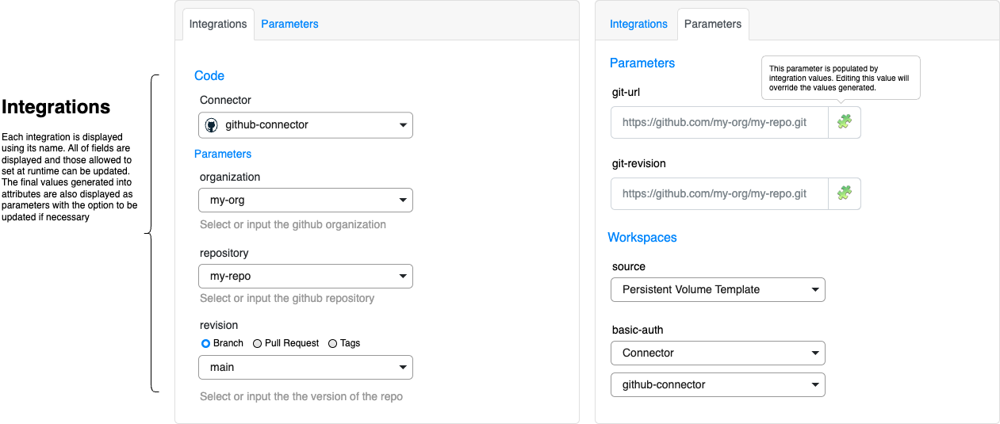
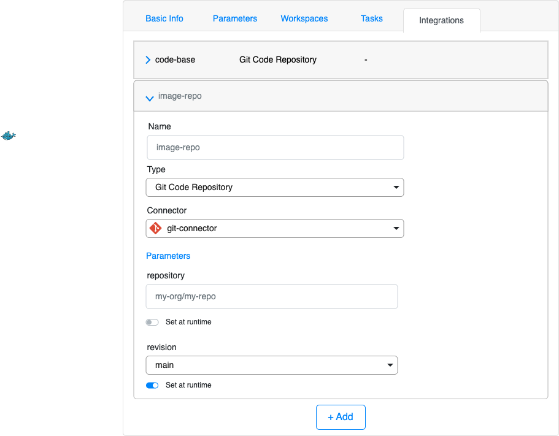
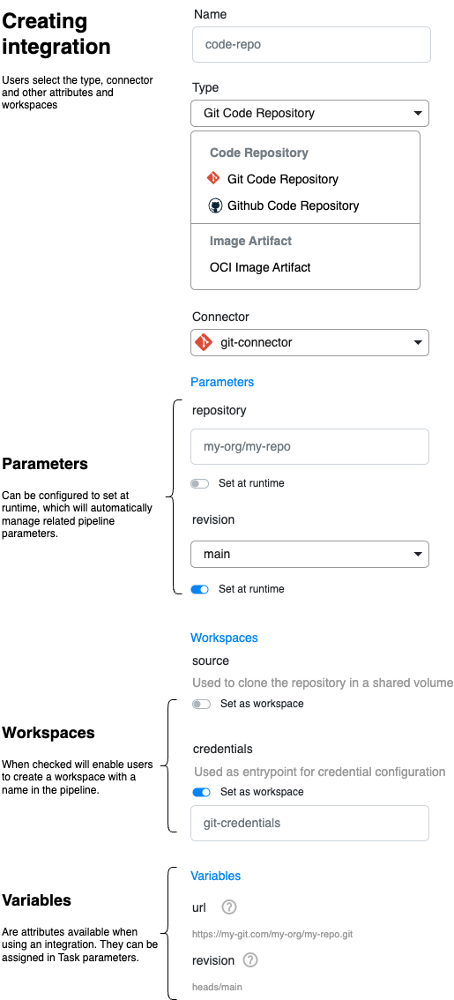
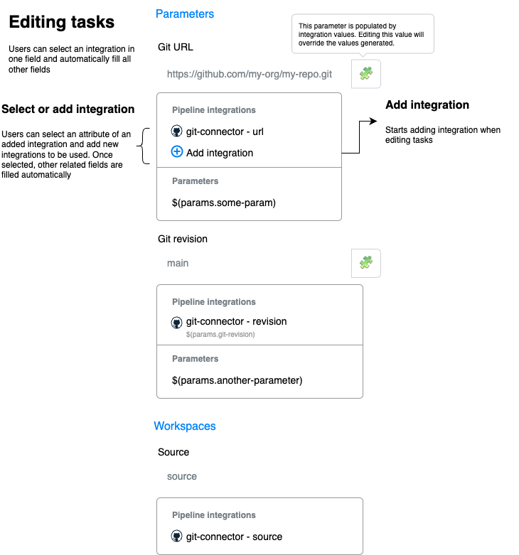

# Pipeline Connector Integration Behavior Specification

## Overview

The Alauda DevOps Pipelines system supports connector integration for pipeline orchestration and execution. This specification defines how external connectors integrate with pipeline workflows to provide resource browsing, selection, and configuration capabilities.

Connectors enable users to browse and select resources from external systems (git repositories, OCI registries, artifact repositories, etc.) during pipeline configuration and execution, eliminating manual URL entry and reducing configuration errors.

## Core Concepts


### Resource Interfaces

Standardized abstractions that define common resource types and their attributes to be used in a pipeline or task:
- **Git Repository**: Source code repositories with URL and revision attributes.
- **OCI Artifact**: Container images and artifacts with URL and version attributes.
- **Maven Artifact**: Maven dependencies with repository, group, artifact, and version attributes.

These base implementations can be *implemented* with additional interfaces as needed, for example:

- **Git Code Repository**: Implements Git-specific parameters like repository and revision.
- **GitHub Code Repository**: Extends CodeBase with GitHub-specific attributes like organization and repository attributes.
- **OCI Artifact**: Extends OCI Artifact with detailed OCI-specific attributes and parameters.
- **Harbor Artifact**: Extends OCI Artifact with Harbor-specific attributes like project name.

### Task and Pipeline Integrations

Metadata on Tekton Tasks and Pipelines that declare which resource interfaces they support and how they map to interface attributes.


## Requirements

### Resource Categories

Categories are *soft contracts* for resource interfaces to implement. They mainly define `attributes` and `workspaces`:

- **Attributes** are considered as `outputs` of a resource interface.
- **Workspaces** are `volumes` offered by the implementation of a resource interface.

Inside categories they aim to guide resource interface developers on easily implement protocal or platform targeted resource that can be easily consumed by pipelines and tasks.


The system supports the following resource categories:

#### Git Code Repository

Represents a version of a code repository, used generally on CI pipelines for code building and validation.

**Attributes**:
- **URL**: The repository URL: `https://github.com/alauda/tektoncd-operator`
- **Revision**: The repository revision (branch, tag, or commit SHA): `heads/main`

**Workspaces**:
- **Source**: The cloned source code location
- **Credentials**: Authentication configuration

#### OCI Artifact

Represents a version of an artifact repository, used generally on CI pipelines as build output and on CD pipelines for artifact deployment.

**Attributes**:
- **Repository**: The repository url: `registry.example.com/project/repo`
- **Artifact Versions**: A list of fully qualified artifact versions `["registry.example.com/project/repo:version"]`
- **Version**: The artifact version (tag or digest): `["version1", "version2"]`

**Workspaces**:
- **Credentials**: Authentication configuration, i.e `config.json`


#### Maven Artifact

Represents a version of a Maven artifact, used generally on CI pipelines as build output and on CD pipelines for artifact deployment.

**Attributes**:
- **Repository**: The repository url: `https://repo.example.com/repostory/maven2`
- **Artifact group**: The artifact group: `com.example`
- **Artifact id**: The artifact id: `my-artifact`
- **Version**: The artifact version: `1.0.0`

**Workspaces**:
- **Settings**: Authentication configuration, i.e `settings.xml`


### Resource Interfaces


:::info
   Interface structures and examples are simplified for brevity. The detailed design is defined in the techinical specification
:::

The system supports multiple resource interfaces, which are composed by multiple parts:

1. **Category**: Describes the type of `Resource Category`, which implements the interface.
2. **Parameters**: Input data required to configure the interface when integrated into a pipeline or other resource.
3. **Attributes**: Output attributes of the resource interface that are generally calculated from the input parameters.
4. **Workspaces**: Describes offered `volumes` by the resource interface.


#### Parameters

Input data required to configure the interface when integrated into a pipeline or other resource. These parameters may influence and provide values to the output attributes values and API calls.

Parameters follows Tekton parameter types and can be of the following data types:

- **string**: A string value
- **array**: An array of string values
- **object**: An object with string keys and string values

Parameters can use `descriptors` to provide additional information to the user interface, such as custom UI elements, labels, descriptions, field groups, and validation rules.


**Example**:

```yaml
params:
- name: repository
  type: string
  descriptors:
  - `x.ui.type`: `input`
  - `x.ui.label`: `Repository`
  - `x.ui.description`: `Repository URL`
  - `x.ui.validation`: `required`
```

#### Attributes

Output attributes of the resource interface that can also be used as parameters with an optional default value or a static value. Attributes can be mapped to parameters and be consumed through them.

Attributes also follow Tekton parameter types such as `string`, `array`, **without support for `object` type**, which will be planned in the future.

Expressions are how parameters can be used to form a final value, i.e `$(params.repository)/$(params.path)`. Expression can use parameter values and connector attributes to form a value.

They also can be `consumed` by pipeline tasks directly as task parameters, and accordingly may be elevated as a task/pipeline parameter.

Attributes may explicitely mark dependency on parameters.

**Example**:

```yaml
attributes:
- name: url
  type: string
  expression: "$(connector.url)/$(params.repository).git"
  dependsOn:
  - params.repository
```

#### Workspaces

Describes offered `volumes` by the resource interface. workspaces of the resource interface. Workspaces are used to provide additional context or data to the interface. Workspaces can be used as `volumes`

Workspaces are not required, but are offered as a quick way to setup and run pipelines and tasks. Like attributes, workspaces can use values from parameters and connectors.

**Example**:

```yaml
workspaces:
- name: git-credentials
  value:
    csi:
      driver: connectors-csi
      readOnly: true
      volumeAttributes:
        connector.name: "$(connector.name)"
        connector.namespace: "$(connector.namespace)"
        configuration.names: "gitconfig"
        token.expiration: 30m
```

#### APIs

Describes API calls that can be made to the connector to validate or retrieve additional information. APIs can use values from parameters and connector attributes in its definition.

Example of use cases:

- Validate if a repository exists
- List available revisions
- List available tags
- List available artifacts


APIs are optional, and can be accessed to fetch or manipulate data. The related `ConnectorClass` should implement all the APIs declared by the interface.


#### Expandability

The system can support additional resource interfaces by fetching existing Resource Interface from the platform API, thus enabling Platform Builders
to extend the platform with additional resource interfaces and connectors.

### Resource Interface Implementations

Below are current resource interface implementations:

#### Git Code Repository

**Category**: **Git Code Repository**

Represents a version of a git code repository, used generally on CI pipelines for code building and validation.

Its main purpose is to provide access to a git repository and its revision, enabling the platform to integrate any repository
that can be accessed via git protocol.

```yaml
category: Git Code Repository
params:
- name: repository
  type: string
  descriptors: [...]
- name: revision
  type: string
  descriptors: [...]

attributes:
- name: url
  type: string
  expression: "$(connector.url)/$(params.repository).git"
- name: revision
  type: string
  expression: "$(params.revision)"
workspaces:
- name: workspace
  value:
    volumeClaimTemplate:
        spec:
          accessModes:
            - ReadWriteMany
          resources:
            requests:
              storage: 1Gi
- name: basic-auth
  value:
    csi:
      driver: connectors-csi
      readOnly: true
      volumeAttributes:
        connector.name: "$(connector.name)"
        connector.namespace: "$(connector.namespace)"
        configuration.names: "gitconfig"
        token.expiration: 30m

apis:
- name: validate
  path: /api/v1/validate?url=$(attributes.url) # API to validate if the repo exists
  verb: POST
- name: revisions
  path: /api/v1/revisions?url=$(attributes.url) # API to list available revisions
  verb: GET
```


#### OCI Image Artifact

Represents a version of an OCI artifact, used generally on CI pipelines as build output and on CD pipelines for artifact deployment.

```yaml
category: OCI Artifact
params:
- name: repository
  type: string
  descriptors: [...]
- name: versions
  type: array
  descriptors: [...]

attributes:
- name: repository-address
  type: string
  expression: "$(connector.registry)/$(params.repository)"
  dependsOn:
  - params.repository
- name: artifact-versions
  type: array
  expression:
  - "$(connector.registry)/$(params.repository):$(params.versions[*])"
  dependsOn:
  - params.repository
  - params.versions
- name: versions
  type: array
  expression:
  - "$(params.versions[*])"
  dependsOn:
  - params.versions

workspaces:
- name: registry-creds
  value:
    csi:
      driver: connectors-csi
      readOnly: true
      volumeAttributes:
        connector.name: "$(connector.name)"
        connector.namespace: "$(connector.namespace)"
        configuration.names: "config"
        token.expiration: 60m
```

#### Maven Artifact

Represents a version of a Maven artifact, used generally on CI pipelines as build output and on CD pipelines for artifact deployment.

```yaml
category: Maven Artifact
params:
- name: artifact
  type: object
  properties:
    group: string
    id: string
  descriptors: [...]
- name: version
  type: string
  descriptors: [...]

attributes:
- name: repository
  type: string
  expression: "connector.url"
- name: artifact-group
  type: string
  expression: "$(params.artifact.group)"
  dependsOn:
  - params.artifact
- name: artifact-id
  type: string
  expression: "$(params.artifact.id)"
  dependsOn:
  - params.artifact
- name: version
  type: string
  expression: "$(params.version)"
  repository: string

workspaces:
- name: maven-settings
  value:
    csi:
      driver: connectors-csi
      readOnly: true
      volumeAttributes:
        connector.name: "$(connector.name)"
        connector.namespace: "$(connector.namespace)"
        configuration.names: "settings"
        token.expiration: 60m

apis:
- name: versions
  path: /api/v1/versions?url=$(attributes.url)&group=$(attributes.group)&id=$(attributes.id)
  verb: GET
```


### Task and Pipeline Integration

#### Schema

**Goals**:

- Allows `Tasks` and `Pipelines` to declare support for one or more resource interfaces
- Support selecting integrations data when running a `Task` or `Pipeline`
- Support mapping between integrations attributes and workspaces into parameters and workspaces.
- Allows preset values for integration data, with options for fixed or runtime overritable values
- Support YAML and attribute based writing forms
- Unify integration metadata for Tasks and Pipelines


**Structure**:

Integration metadata structure has the following fields:

- **name**: Name of the integration, used to reference the integration in the task/pipeline
- **interface**: References the resource interface **category OR name**
  - **category**: Category of the resource interface
  - **name**: Name of the resource interface
- **connectorRef**: Reference to a connector to use, optional
  - **name**: Name of the connector
  - **namespace**: Optional namespace for the connector, defaults to the same namespace as the task/pipeline
  - **setAtRuntime**: Optional flag to indicate that the connector reference is set or updated at runtime. If set, the connector reference is used as a default value.
- **params**: List of parameters with optional fixed values
  - **name**: Name of the parameter
  - **value**: Optional fixed value for the parameter
  - **setAtRuntime**: Optional flag to indicate that the parameter value is set at runtime. If set, the parameter value is used as a default value.
- **attributes**: List attributes with mapping to parameters or other fields using `refPath`
- **workspaces**: List of workspaces witg mapping to workspaces


Example:

```yaml
name: repo
interface:
  category: Git Code Repository
  # or
  name: GitHub Code Repository
connectorRef:
  name: github
  namespace: my-namespace
params:
- name: repository
  value: "org/repo"
  setAtRuntime: false
- name: revision
  value: "main"
  setAtRuntime: true
attributes:
- name: url
  refPath:
  - "params.repository"
  - "tasks.git-clone.params.url"
workspaces:
- name: source
  workspace: "workspaces.source"
```

**Specification into Task/Pipeline**:

Uses resources' `metadata.annotations` to record the integration metadata using the following method:


**YAML/JSON**:

All integration data is recorded in a single annotation as an array of `IntegrationDefinition`, using YAML or JSON format.

```yaml
metadata:
  annotations:
    integrations.tekton.dev/integrations: |
      - name: repo
        interface:
          name: Git Code Repository
        connectorRef:
          name: github
          namespace: my-namespace
        params:
        - name: repository
          value: "org/repo"

        attributes:
        - name: url
          refPath:
          - "params.repository"
        workspaces:
        - name: source
          workspace: "workspaces.source"
```


#### Scenarios

**Interface as category**:

When declaring reusable `Tasks` and `Pipelines`, the interface is often not known, given flexibility to users to use any connector that implements the interface, therefore the `interface` field is declared as a category.

When using an interface as category, the `params` fields are unknown, therefore should be left empty and ignored, using only the `attributes` and `workspaces` mappings.
During runtime, the UI should display all the available parameters for the interface, and allow the user to set values for them.

```yaml
name: repo
interface:
  category: Git Code Repository
attributes:
- name: url
  refPath:
  - "params.repository"
  - "tasks.git-clone.params.url"
workspaces:
- name: source
  workspace: "workspaces.source"
```

**Interface as name**:

When declaring a `Task` or `Pipeline` that is interface specific, i.e. `Github CLI`, the interface is known, therefore the `interface` field is declared as a specific name.

When using an interface as name, the `params` fields are known, therefore can be used to set fixed values or to indicate that the value is set at runtime.
Likewise, all the interface attributes are known, and can be mapped to parameters, task parameters, or workspaces.


#### Validation

- Interface must be a valid resource interface. The system ignores unknown interfaces.
- Parameter mappings must reference existing task parameters
- Workspace mappings must reference existing task workspaces
- One Interface attribute can be mapped to multiple task parameters
- One task parameter can only map one interface attribute


#### Examples


**Git code repository clone task:**

**Category typed**

```yaml
apiVersion: tekton.dev/v1
kind: Task
metadata:
  name: git-clone
  annotations:
    ### YAML
    integrations.tekton.dev/integrations: |
      - name: code-repo
        interface:
          category: Git Code Repository
        connectorRef:
          setAtRuntime: true
        attributes:
        - name: url
          refPath:
          - params.git-url
        - name: revision
          refPath:
          - params.revision
        workspaces:
        - name: source
          workspace: workspaces.source-code
        - name: credentials
          workspace: workspaces.basic-credentials
spec:
  params:
    - name: git-url
      type: string
    - name: revision
      type: string
  workspaces:
    - name: source-code
    - name: basic-credentials
```


**Pipeline with multiple integrations**

**Category typed**

```yaml
apiVersion: tekton.dev/v1
kind: Pipeline
metadata:
  name: build-maven-container
  annotations:
    integrations.tekton.dev/integrations: |
      - name: codebase
        interface:
          category: Git Code Repository
        connectorRef:
          setAtRuntime: true
        attributes:
        - name: url
          refPath:
          - params.git-url
        - name: revision
          refPath:
          - params.revision
        workspaces:
        - name: source
          workspace: workspaces.source-code
        - name: credentials
          workspace: workspaces.credentials
      - name: maven
        interface:
          category: Maven Artifact
        attributes:
        - name: repository
          refPath:
          - params.maven-repository
        workspaces:
        - name: settings
          workspace: workspaces.maven-settings
      - name: image
        interface:
          category: OCI Artifact
        attributes:
        - name: url
          refPath:
          - params.container-repository
        workspaces:
        - name: credentials
          workspace: workspaces.container-credentials
specs:
  params:
  # git params
  - name: git-url
    type: string
  - name: revision
    type: string
  # maven params
  - name: maven-mirror
    type: string
    default: https://repo1.maven.org/maven2/
  - name: maven-repository
    type: string
  - name: maven-artifact
    type: object
    properties:
      group:
       type: string
      id:
       type: string
  - name: maven-version
    type: string
  # oci repository params
  - name: oci-repository
    type: string
  - name: oci-tags
    type: arrays
  workspaces:
  - name: source
  - name: git-credentials
  - name: maven-settings
  - name: container-credentials
```


**Github CLI Task**

**Name typed**

```yaml
apiVersion: tekton.dev/v1
kind: Task
metadata:
  name: github-cli
  annotations:
    ### YAML
    integrations.tekton.dev/integrations: |
      - name: github
        interface:
          name: Github Code Repository
        params:
        - name: organization
          setAtRuntime: true
        - name: repository
          setAtRuntime: true
        attributes:
        - name: organization
          refPath:
          - params.organization
        - name: repository
          refPath:
          - params.repository
        workspaces:
        - name: credentials
          workspace: workspaces.credentials
spec:
  params:
    - name: organization
      type: string
    - name: repository
      type: string
    - name: command
      type: array
      default:
      - "repo"
      - "view"
  workspaces:
    - name: credentials
```


### Running Tasks and Pipelines

:::tip

   Both have the exact same behavior, so the explanation and examples below applies to both.
:::

When executing a `Task`/`Pipeline`, or creating a `TaskRun`/`PipelineRun`, the following is expected:

1. Integrations, if available, are displayed with all values filled in and should require any pending parameter values before changing parameters and workspaces.
2. Next, the parameters and calculated values are still visible, users can change them if needed, with a warning.
3. Like parameters, Workspaces can be customized or updated as necessary.
4. Users submit / run the `Task`/`Pipeline`.


`<Previous Steps> -> Integrations -> Parameters and Workspaces -> <Run>`





#### Detailed Behavior

When executing a `Task`/`Pipeline`, the system resolves integration attributes and parameters as follows:

**Integration Type and Connector Resolution**:
1. When using `category` typed integrations, the system will use the interface implemented by the selected connector to resolve the used interface type, populating parameters, attributes and workspaces.
2. When using `name` typed integrations, the system will use the interface named and should validate against the type provided by the connector to resolve the used interface type. When mismatch, the system should display an error and allow changing the connector, or prevent execution.
3. Connectors can be pre-selected and stored in the integration definition. Once selected, the system will display the connector and disable changes unless a conflict is detected (see 2).


Once a connector and integration type is resolved, the system will display further details on the interface like parameters, attributes, and workspaces.

**Parameters**:
- Parameters can be filled when allowed, and its values can be used to fetch data for other parameters. This dependency and value resolution should be described by descriptors.
- Descriptors are used to enhance user experience and can make use of integration APIs to fetch data.
- Parameter values should always be able to be manually input using primary input types even if data is fetched successfully.
- When all values are filled, the system will resolve all attributes and workspaces.


**Fallback Behavior**:

When connectors or interfaces are unavailable:
- System displays manual parameter entry forms
- Provides clear error messages and recovery guidance
- Execution can proceed with manual parameter values


### Composing Pipelines

Integrations can be added and managed on pipelines during composition. There are two main entrypoints to add integrations to a pipeline:
- Directly on the pipeline definition
- When adding a task to the pipeline

Both methods will end on adding the integration to the pipeline definition.
When adding thorugh editing a task, the flow will continue and automatically assign the integration attributes and workspaces to the task.

**Adding Integration**:
1. User selects interface type from available options. The list is segmented by category. Users can select categories or specific interfaces.
2. System presents compatible connectors for selection based on the interface type selected.
3. If the user selects a connector, the parameters list is presented.
4. When available, the parameters can be displayed with inputs to set or select a value, and set value at runtime.
   Runtime values will use the inputed value as a default overridable value. Parameters use the same descriptors to display enhanced components.
5. When configuring parameter values to be set at runtime, the system will parse the affected attributes and will automatically add pipeline parameters to the pipeline using the the format `<integration-name>-<attribute-name>`.
   **In case conflicts arise, a suffix will be added to the parmeter name**, i.e `coderepo-url-1`.
6. Workspace assignments are suggested and configured. Users can change the workspace name or opt out the use of the workspace.
7. A list of attributes is presented to the user, without any user interaction.
8. Integration is validated and added to the pipeline.

**Important:** After adding the integration, the system may automatically populate pipeline parameters and workspaces.
These are controlled exclusively by the integration and any changes will be overwritten when editing the pipeline. Future version may consider allowing customizations.


**Editing Integration**:
- Interface types cannot be changed. Changing of interface types during editing will be considered in future versions.
- Connector reference can be changed if compatible. If changing connector types resulting in change of interface type, the system will clean the parameter values.
- Parameter values and setting at runtime values can be changed. When changed, the system will automatically update related pipeline fields, like `params`, or `tasks` parameters.
- Workspace assignments can be changed. When changed, the system will automatically update pipeline `workspaces`.
- The list of attributes is presented to the user, without any user interaction.
- Integration is validated and added to the pipeline.


**Deletion**:
- When attempting to remove an integration, the system will warn about affected parameters, workspaces and tasks parameters.
- Removing integrations will remove all related parameters and workspaces and may leave the pipeline in an invalid state.


**Integration Validation**:
- Integration names must be unique within a pipeline
- ConnectorRef must reference an existing connector resource, but is not required at creation time.
- Each connector can implement multiple interfaces
- When creating an integration without referencing a Connector, the system will only list workspaces and attributes to be used in the Pipeline. The Connector should be selected before the pipeline can be executed.
- Interface must be supported by the referenced connector
- Attribute mappings must conform to interface specification, and be of compatible types, following Tekton parameter value conventions.
- Workspace references must exist in pipeline workspace declarations.
- When users manually update the workspace name or attribute related parameter names, the system will override and update the name automatically.
- If users manually override parameter values referenced by integrations attributes, the system will override the manual values.
This is controlled by adding `refPath` into each attribute.
- Attribute `refPath` are validated against the task parameters. If the task is changed or removed, the integration will be marked as invalid and should be fixed.
- When users desire to manually override task paramters, the reference `refPath` must be removed.
- When users desire to manually change the workspace name, the reference `workspace` must be removed or changed to a different workspace.


**Adding Integration**

:::tip
  When adding an integration the interface type can use dynamic forms to display data-driven components and improve user experience.
:::






#### Editing Tasks in Pipelines

**When editing task parameters in a pipeline, the following is expected:**
- The system will recommend all existing compatible integration attributes when the task supports integration definitions.
  The list may contain attributes from multiple integrations. Once an integration attribute is selected, all other related attributes will be automatically configured in the task parameters and workspaces as described by the task integration scheme.
  If other parameters are non-empty, the system will offer to override the existing values, which can be accepted or rejected by the user.
- Once a task parameter or workspace is referenced by an integration attribute, the user field will be disabled with an option for editing and tooltip warning. Once edited, the field will be deattached from the integration attribute and will not be automatically updated.
- The system will also allow users to add new integrations to the pipeline. When adding thorugh this method, the Integration data will be pre-populated with the task integration scheme.
  After adding the integration, the task parameters and workspaces will be automatically configured as described above.





## Error Handling and Edge Cases

### Connector Unavailability

**Symptoms**: Connector API calls fail or timeout

**Behavior**:

- Resource browsing falls back to manual entry
- Cached values are displayed if available
- Clear error messages indicate connector status
- Pipeline execution continues with manual parameters

**Recovery**: System automatically retries connector access and restores browsing capabilities when available

### Invalid Resource References

**Symptoms**: Selected resources no longer exist or are inaccessible

**Behavior**:

- Validation errors are displayed during pipeline execution
- Execution is blocked until valid resources are selected or manual entry is provided
- Error messages include specific resolution guidance

**Recovery**: Users can select alternative resources or update configuration

### Integration Configuration Conflicts

**Symptoms**: Multiple integrations attempt to control the same parameters

**Behavior**:

- Validation prevents conflicting parameter mappings
- Clear error messages identify conflicting integrations
- Suggestions provided for resolving conflicts

**Recovery**: Users must resolve conflicts by updating integration configurations or parameter mappings

### Permission and Access Issues

**Symptoms**: Users lack access to connectors or external resources

**Behavior**:

- RBAC controls limit connector visibility
- Authentication errors are clearly communicated
- Fallback to manual configuration when appropriate

**Recovery**: System administrators can adjust permissions or users can use alternative connectors


## Future Considerations

:::note
   The following sections are not yet implemented, but are part of the future plans.
:::

### Object support in attributes

Attributes can be of type object instead of simple values. This will allow for more complex data structures to be passed to tasks.

### Human Readable Integration Scheme

Besides the YAML format, integrations can also be declared using human-readable annotations.

Different attributes are defined into different annotations using `<prefix>/<name>.<key>=value` format, and `<prefix>/<name>.<key>.<name>.<field>=value` for internal fields.

```yaml
metadata:
  annotations:
    integrations.tekton.dev/repo.interface: Git Code Repository
    integrations.tekton.dev/repo.params.repository: org/repo
    integrations.tekton.dev/repo.attributes.url.refPath: "params.repository,tasks.git-clone.params.url"
    integrations.tekton.dev/repo.workspaces.source.workspace: workspaces.source
```


### Composing Pipelines

**Editing of interface types**:

- When editing an integration, the user can change the interface type as long as the attributes are compatible. The system will clean the parameter values and will display new parameters based on the new interface type.


## Related Components

### Connector Framework
- Provides base connector implementation patterns
- Handles authentication and credential management
- Implements resource interface specifications
- Manages connector lifecycle and health monitoring

### Pipeline Orchestration Engine
- Processes integration configurations during pipeline creation
- Resolves integration variables during execution
- Validates resource availability and accessibility
- Manages integration state and error recovery

### User Interface Components
- Integration configuration wizards and forms
- Resource browsing and selection interfaces
- Parameter mapping and validation displays
- Error reporting and recovery guidance

### Validation and Admission Controllers
- Webhook validation for integration configurations
- RBAC enforcement for connector access
- Resource quota and limit enforcement
- Security policy validation and compliance

---

**Related Documentation**:
- [TEP-0004: Pipeline Connector Integration](../../teps/0004_pipeline_connector_integration.md) - Original proposal and decision record
