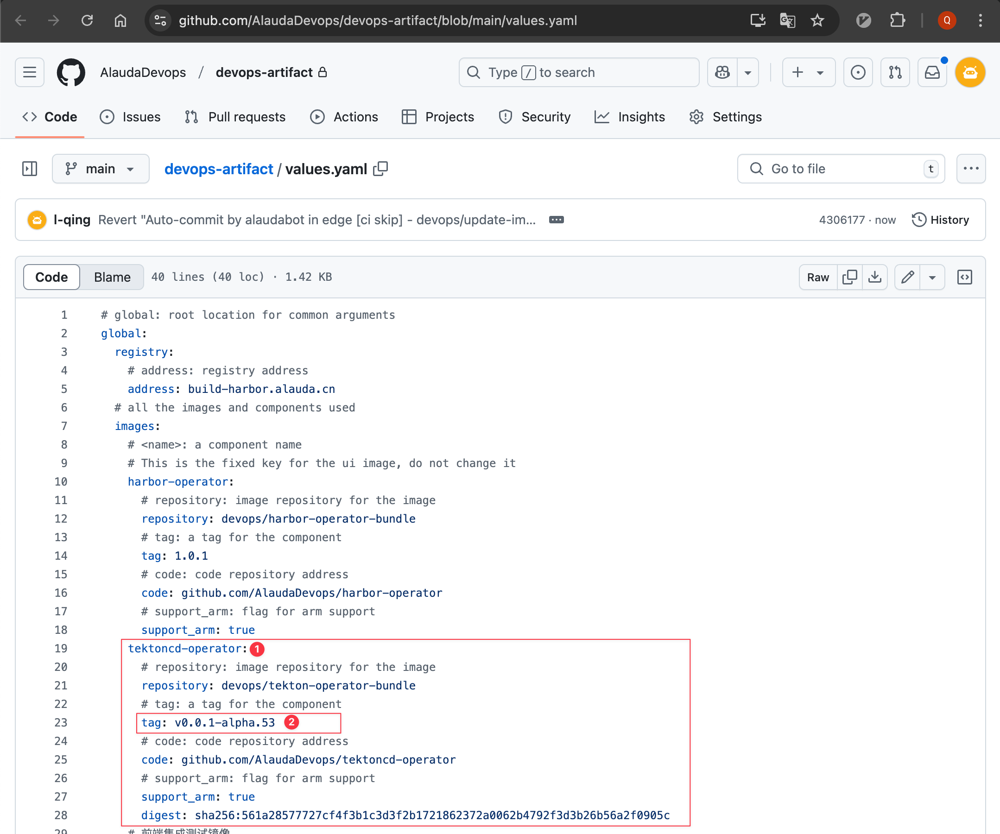
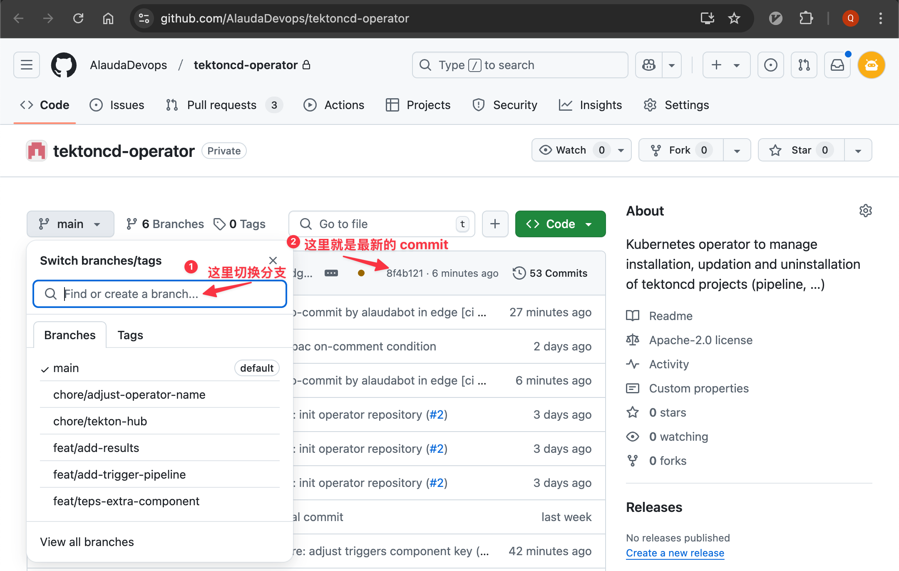
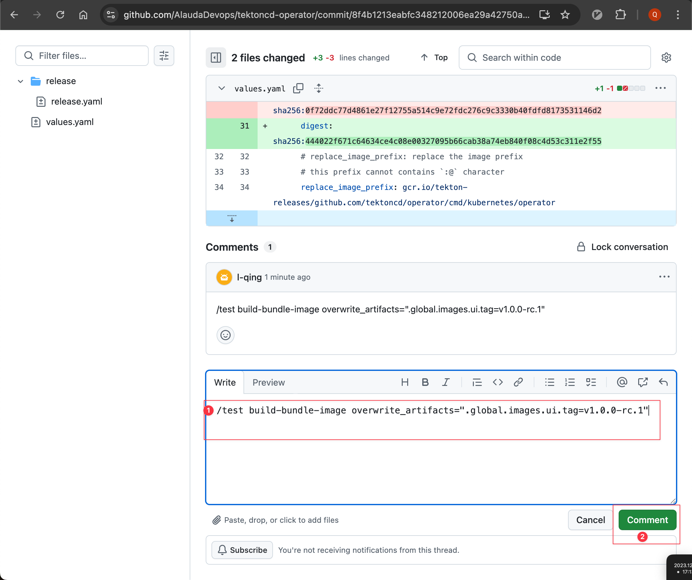
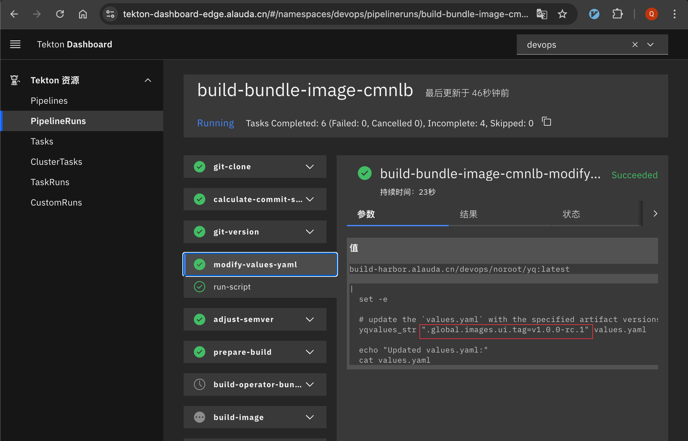
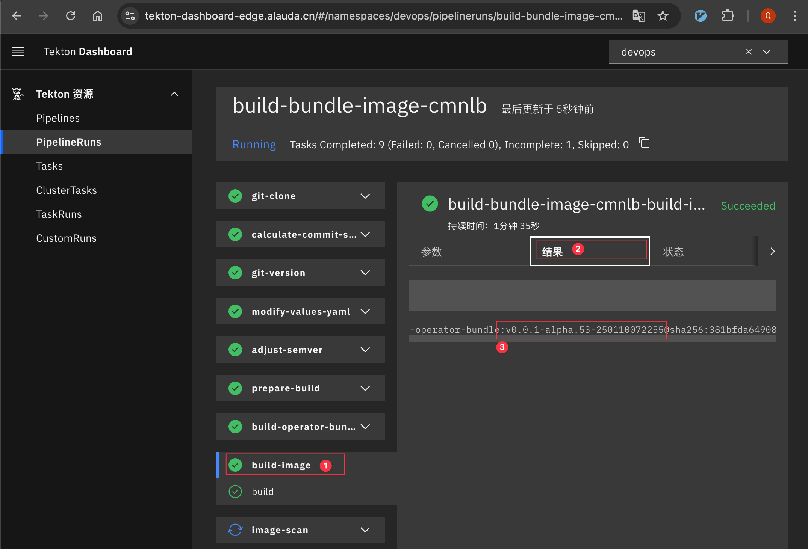

# Update Frontend Images

## Background

The Tekton-Operator plugin not only includes community components, but also our platform's frontend images which provide UI capabilities.

Frontend components must be associated with the `Tekton-Operator` plugin to be used correctly by users.

Therefore, it's essential to explain how to submit tests and update frontend components.

## Main Branch (`main`, `release-*`)

When the frontend component [pipeline-v2-frontend](https://github.com/AlaudaDevops/pipeline-v2-frontend) builds on a main/release-* branch, its pipeline publishes a `values.yaml` (carrying `global.images.ui.{repository,tag,digest}`) to the alauda-pipelines manifests feed at `<feed>/pipeline-v2-frontend/<branch>/values.yaml`.

The `Tekton-Operator` then pulls that image through its **generic** component sync — no `ui`-specific handling. Running `make update-components` (CI: comment `/update-components`, which opens an auto-PR) downloads the frontend feed and merges it into the operator's `values.yaml` as `global.images.pipeline-v2-frontend_ui`. Because the frontend entry in `components.yaml` has `releases: []`, it is image-only and renders nothing into `.ko/`.

Merging the updated `values.yaml` triggers the `Tekton Operator Bundle` pipeline to build the latest `bundle` image, which carries the latest frontend image upon deployment.

The `bundle` artifact built from the main branch will also be automatically updated in the corresponding branch of the [devops-artifact](https://github.com/AlaudaDevops/devops-artifact) repository in its [`values.yaml`](https://github.com/AlaudaDevops/devops-artifact/blob/main/values.yaml).

For example, the latest version here is `v0.0.1-alpha.53`


## PR Branch

If the frontend component's PR branch artifacts are also expected to generate a temporary `bundle` artifact with the latest `Tekton-Operator` plugin for testing, it currently requires manually triggering the pipeline that builds the `bundle` artifact in the `Tekton-Operator`.

The specific steps are as follows:

- 1. Obtain the latest Tag of the frontend artifacts, for example, `v1.0.0-rc.1`

- 2. Find the latest `commit` in the [`Tekton Operator`](https://github.com/AlaudaDevops/tektoncd-operator) related branch
  - If the frontend PR is initiated against the target branch `main`, then the latest commit of the `main` branch needs to be found. Similarly, if it is a PR against `release-*`, the latest commit of the `release-*` branch must be located.
  - 

- 3. In the `commit` comment, add a comment like the following to trigger the `bundle` artifact pipeline. Use `to-build-bundle-image` to refresh only the UI image and quickly generate a bundle without rebuilding any operator images, pinning explicit tags for all required operator artifacts:

  

  ```shell
  /test to-build-bundle-image overwrite_artifacts=".global.images.pipeline-v2-frontend_ui.tag=v1.0.0-rc.1,.global.images.operator.tag=v4.6.0-g6caa198,.global.images.proxy-webhook.tag=v4.6.0-g6caa198,.global.images.webhook.tag=v4.6.0-g6caa198,.global.images.tkn.tag=v4.6.0-g6caa198"
  ```

  Where:

  - `/test` is the command prefix for `pac`
  - `to-build-bundle-image` is the name of the `PipelineRun` pipeline
  - `branch:main` is the executing branch of the pipeline
    - If the default branch is `main`, this can be omitted
    - If it is a `release-*` branch, it must be specified here
  - `overwrite_artifacts` is an execution parameter for `pac`, which can influence the execution parameters in the `PipelineRun`.
  - `".global.images.pipeline-v2-frontend_ui.tag=v1.0.0-rc.1"` is the parameter value for `overwrite_artifacts`.
    - `.global.images.pipeline-v2-frontend_ui.tag` is the `key` for the frontend image in `values.yaml`
    - `v1.0.0-rc.1` is the tag of the latest frontend artifact to be replaced
  - Use the `to-build-bundle-image` example only when you need to refresh the UI image; this pipeline skips building operator images, so you must pin the operator-related tags explicitly as shown above.
  - You can obtain the operator-related tags by running `make download-release-from-nexus` locally to fetch the latest `values.yaml`, or download the latest release file directly from `https://build-nexus.alauda.cn/repository/alauda/devops/tektoncd-releases/tektoncd-operator/main/values/release.yaml` and reuse the existing operator image tags.

- 4. Check the execution status of the pipeline in the [`Tekton-Dashboard`](https://tekton-dashboard-edge.alauda.cn/#/namespaces/devops/pipelineruns) and wait for it to finish.
  - Pay attention to the `modify-values-yaml` Task in the execution phase of the pipeline, to see if the Tag of the frontend image in `values.yaml` is correctly updated.

    

  - Obtain the image Tag of the built `bundle` artifact from the results of `build-image`.

    

    The artifact here is: `v0.0.1-alpha.53-250110072255`, where the latter part is a timestamp.

## Related Scenario: Custom Operator Bundle Self-Testing

If you also need to validate local `.ko` changes or a custom operator image together with frontend updates, use:

- [Build a Custom Bundle for Self-Testing](../custom-bundle-self-test/index.md)
