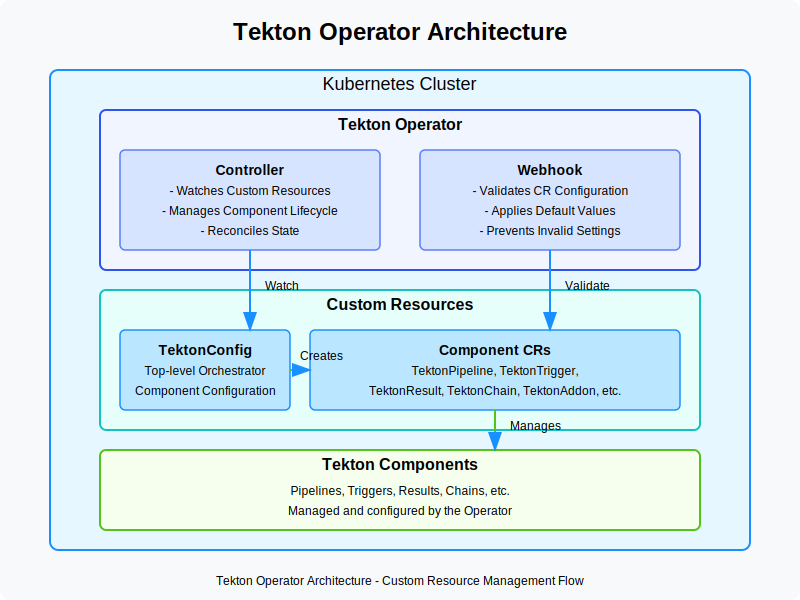

# Architecture

## Tekton Operator Architecture Overview

Tekton Operator is a Kubernetes extension that installs, upgrades, and manages TektonCD components on any Kubernetes cluster. It follows the Kubernetes Operator pattern to provide lifecycle management for Tekton components.

## Core Components

### 1. Custom Resource Definitions (CRDs)

Tekton Operator defines several custom resources to manage different Tekton components:

- **TektonConfig**: Top-level resource that orchestrates the installation of other components
- **TektonPipeline**: Manages the Tekton Pipelines component
- **TektonTrigger**: Manages the Tekton Triggers component
- **TektonResult**: Manages the Tekton Results component
- **TektonChain**: Manages the Tekton Chains component
- **OpenShiftPipelinesAsCode**: Manages the Pipelines as Code component

### 2. Controller

The operator controller watches for changes to these custom resources and reconciles the actual state with the desired state:

- Detects changes in custom resources
- Installs or upgrades corresponding Tekton components
- Manages dependencies between components
- Handles configuration changes
- Performs health checks and error recovery

### 3. Webhook

The webhook component provides validation and defaulting for the custom resources:

- Validates custom resource configurations
- Sets default values where necessary
- Prevents invalid configurations

## Workflow

1. **Installation of Operator**
   - Operator can be installed via Operator Hub, release files, or from source code
   - Creates necessary CRDs and RBAC permissions

2. **Resource Creation**
   - User creates a TektonConfig resource (or individual component resources)
   - Defines the desired state and configuration

3. **Component Installation**
   - Operator detects the custom resource
   - Installs the specified Tekton components
   - Configures them according to specifications

4. **Lifecycle Management**
   - Manages updates and upgrades
   - Handles configuration changes
   - Recovers from failures

## Deployment Architecture

### Basic Components

1. **Operator Deployment**
   - Contains the controller and webhook
   - Requires cluster-level permissions
   - Watches for custom resources

2. **Custom Resources**
   - Define the desired state
   - Store configuration
   - Represent Tekton components

### Component Relationships

The TektonConfig resource orchestrates the creation of other resources:

1. **Dependency Management**
   - Ensures components are installed in the correct order
   - Manages shared resources
   - Handles component interdependencies

2. **Configuration Propagation**
   - Passes common settings to component-specific resources
   - Ensures consistency across components

## Security Architecture

1. **RBAC Permissions**
   - Operator requires cluster-level permissions
   - Components use namespace-level permissions
   - Follows principle of least privilege

2. **Resource Isolation**
   - Components can be installed in different namespaces
   - Supports multi-tenant deployments

## Extensibility Design

1. **Configuration Options**
   - Extensive configuration options for each component
   - Support for custom settings and profiles

## References

- [Tekton Operator Documentation](https://tekton.dev/docs/operator/)
- [Kubernetes Operator Pattern](https://kubernetes.io/docs/concepts/extend-kubernetes/operator/)
- [Tekton Components](https://tekton.dev/docs/)
