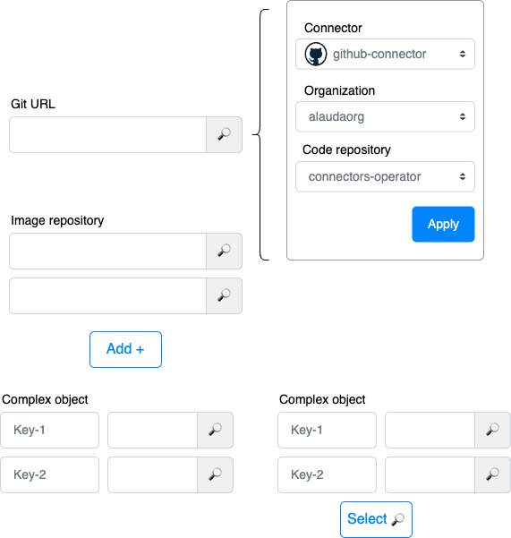
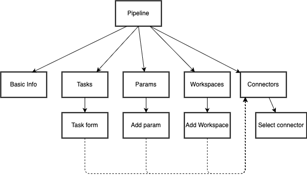
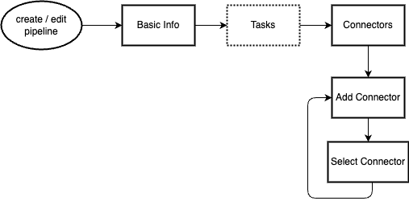
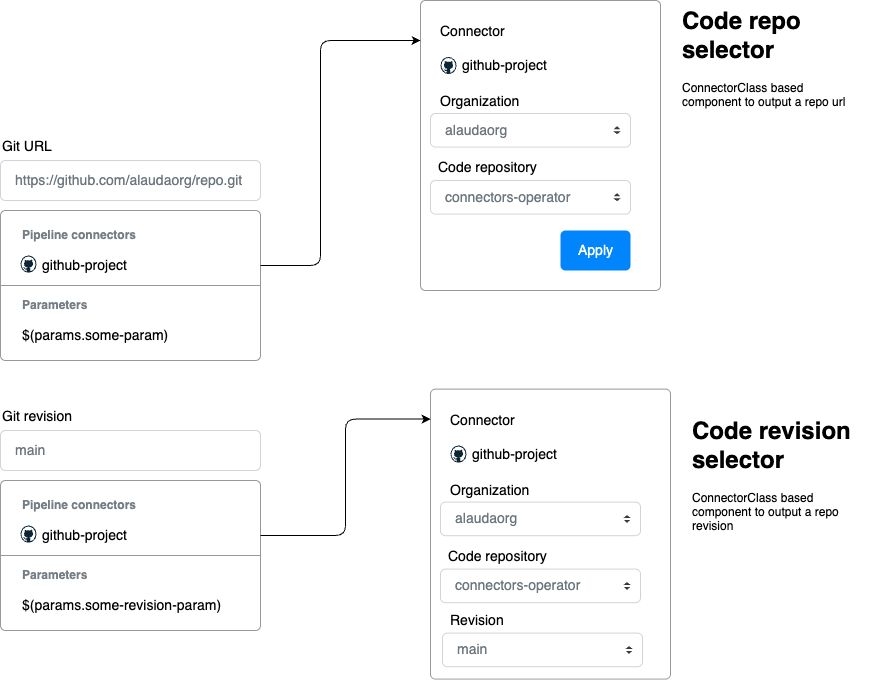
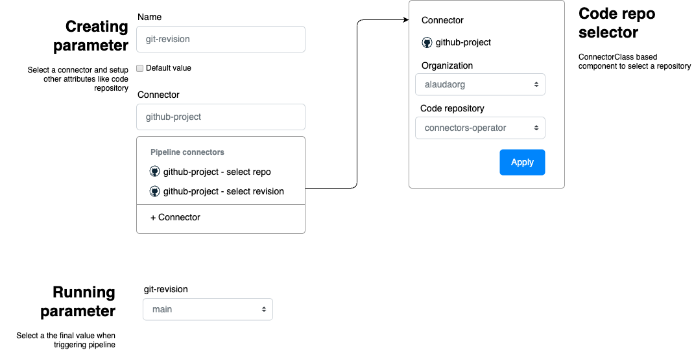
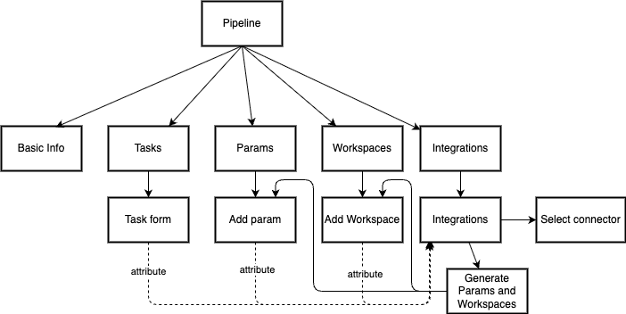
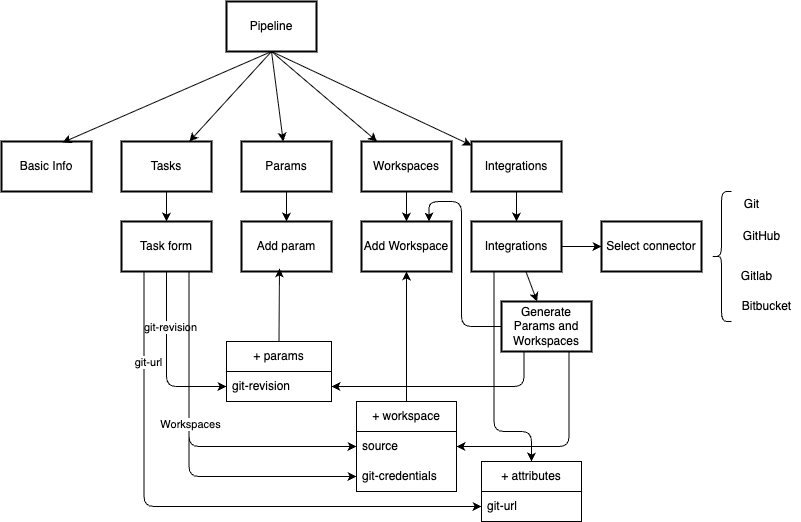
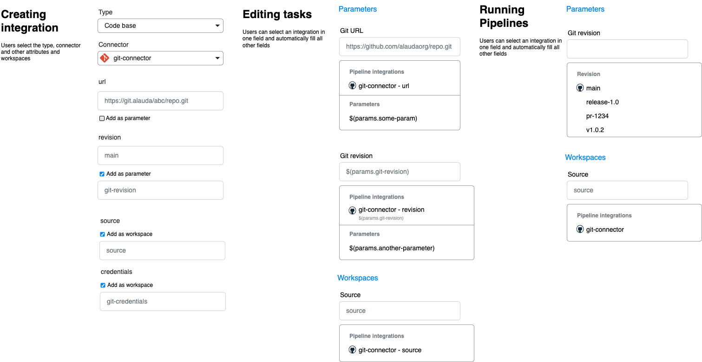
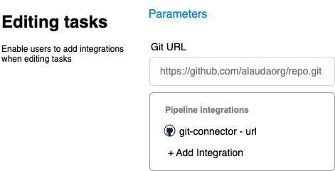
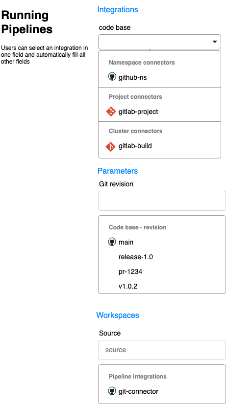

# TEP-0004: Pipeline Orchestration and Execution with Connector Integration

## Record of changes

| Order | Change of content | Reason for change | Change of time | Change of executor | Approved by |
| :---- | :---------------- | :---------------- | -------------- | :----------------- | :---------- |
| 1     | Initial version   | Initial proposal  | 2025-09-22     | daniel@alauda.io   |             |

## Summary

This proposal aims to enhance Pipeline orchestration and execution by integrating external resources through connectors. Currently, users must manually enter URLs and configure workspaces when orchestrating pipelines, and repeatedly provide version details like git revisions and OCI tags when executing pipelines. This proposal introduces mechanisms to browse, select, and integrate external resources from connectors into pipeline workflows, making the process more intuitive and less error-prone.

## Motivation

### Current Challenges

When orchestrating pipelines, users face several pain points:

1. **Manual Resource Entry**: Users cannot easily browse and add external resources like git repositories, OCI repositories, and other external services. They must manually enter URLs and set up workspaces, which is error-prone and time-consuming.

2. **Repetitive Execution Configuration**: Every time users run a pipeline, they must manually enter version details like `git revision` and target `OCI tag` and set up workspaces.

3. **Split Attributes**: Attributes from the same remote resource are often split into different parameters. For example, the `git-clone` task requires separate `url` and `revision` parameters, plus workspace configurations for credentials and source code.

4. **Complex Workspace Selection**: The current workspace selection process lists all available options but provides little guidance on which connector type is appropriate for each workspace.

### Goals

- Provide mechanisms for users to orchestrate pipelines with assistance from resources accessible through connectors
- Make it easy for users to run pipelines by browsing and selecting necessary resources from external tools
- Enable users to quickly set up workspaces for their pipelines with relevant connectors
- Maintain the flexibility of current orchestration and pipeline execution experience while adding connector capabilities
- Create guidance and best practices for integrating connectors in other platform functionality and modules

### Non-Goals

- **Create resource management UI and functionality in the platform**: All integrated tools have their own management UI and functionality to be leveraged
- **Offer ready-to-use UI modules for connector integration**: All connectors are different and have different needs. It is not feasible to create a one-size-fits-all solution
- Modifying core Tekton APIs or resource definitions
- Supporting connector types not already defined in the platform

## Proposal

### Design Options

This proposal presents three design options for integrating connectors with pipeline orchestration:

#### Option 1: Dynamic Form with Custom UI Components

Create custom UI components that can browse and select resources from external tools.

**Implementation**:
- Each connector implements its own UI component
- Components handle specific resource types (git revisions, OCI tags, Maven artifacts, etc.)
- Direct integration with connector APIs for dynamic data fetching




**Pros**:
- Traveled road with existing experience and patterns
- Keeps current flexibility while adding new data fetching capabilities
- Can be implemented incrementally

**Cons**:
- Requires multiple custom components for each connector type
- Each attribute must be set up individually, requiring repeated selections
- Component dependency issues for nested resources (e.g., organization → repository → revision)
- High maintenance overhead as connector APIs change

#### Option 2: Auto Complete with Connectors as Data Source

Leverage current auto-complete functionality while adding connectors as pipeline attributes.

**Implementation**:
- Add `Connectors` as first-class pipeline attributes alongside `Parameters` and `Workspaces`
- Suggest connector attributes based on parameter context
- Enhance task forms with connector attribute suggestions

**Flow**


**Adding Connectors**


**Task form**




**Parameter form**




**Pros**:
- Maintains current flexibility and familiar patterns
- Creates clear relationship between connectors and pipeline parameters
- Incremental implementation possible
- Reuses existing auto-complete infrastructure

**Cons**:
- Still requires individual setup of each attribute
- Connectors must expose standardized attributes
- Limited improvement for pipeline templates

#### Option 3: Resource Abstractions with Connector Integration (Recommended)

Create rich abstractions to represent remote resources, with connectors as data sources.

**Implementation**:
- Define resource interfaces (CodeBase, OCIArtifact, MavenArtifact, etc.)
- Connectors implement these interfaces
- Pipeline integrations reference these abstractions
- Automatic parameter and workspace generation

**Pros**:
- Most intuitive user experience
- Reduces error-prone repetitive selections
- Unified resource handling across split attributes
- Expandable through declarative syntax
- Excellent support for pipeline templates

**Cons**:
- Requires new abstraction layer
- Higher initial implementation complexity
- New concepts for users to learn

### Recommended Approach: Resource Abstractions

We recommend **Option 3: Resource Abstractions** as it provides the best long-term solution for the identified problems.

#### Resource Interface Definitions

**CodeBase Interface**:
```yaml
attributes:
  url: string        # Repository URL
  revision: string   # Branch, tag, commit SHA
workspaces:
  source: workspace     # Cloned source code location
  credentials: workspace # Authentication (optional)
```

**OCIArtifact Interface**:
```yaml
attributes:
  url: string        # Artifact repository URL
  version: string    # Tag or digest
workspaces:
  credentials: workspace # Authentication (optional)
```

**MavenArtifact Interface**:
```yaml
attributes:
  url: string        # Repository URL
  group: string      # Artifact group ID
  id: string         # Artifact ID
  version: string    # Artifact version
workspaces:
  credentials: workspace # Authentication (optional)
```

#### Pipeline Integration Workflow

1. **Add Integration**: Users select a resource interface (e.g., CodeBase) and choose a compatible connector
2. **Configure Resource**: Connector-specific forms collect necessary information
3. **Parameter Mapping**: Users decide which attributes become static values vs. runtime parameters
4. **Workspace Assignment**: Compatible workspaces are suggested and can be auto-assigned
5. **Task Integration**: When adding tasks, compatible integrations are suggested for parameters and workspaces



**Example: Adding a CodeBase Integration**



#### Task Annotation System

Tasks declare their integration requirements through annotations:

```yaml
apiVersion: tekton.dev/v1beta1
kind: Task
metadata:
  name: git-clone
  annotations:
    integrations.tekton.dev/interface: CodeBase
    integrations.tekton.dev/params.git-url: CodeBase.url
    integrations.tekton.dev/params.revision: CodeBase.revision
    integrations.tekton.dev/workspaces.source: CodeBase.source
    integrations.tekton.dev/workspaces.credentials: CodeBase.credentials
spec:
  params:
    - name: git-url
      type: string
    - name: revision
      type: string
  workspaces:
    - name: source
    - name: credentials
```

## Design Details

### Pipeline Specification Changes

Pipelines will include a new `integrations` section:

```yaml
apiVersion: tekton.dev/v1beta1
kind: Pipeline
spec:
  integrations:
  - name: app-codebase
    interface: CodeBase
    connectorRef:
      name: github-connector
    attributes:
    - name: url
      value: "https://github.com/myorg/myapp.git"
      refPath:
      - $.spec.tasks[@.name == "git-clone"].params[@.name == "url"].value
      # or
      - .spec.tasks.git-clone.params.url.value
    - name: revision
      param: git-revision  # Links to pipeline parameter
      refPath:
      - $.spec.tasks[@.name == "git-clone"].params[@.name == "revision"].value
      # or
      - .spec.tasks.git-clone.params.revision.value
    workspaces:
    - name: source
      workspace: shared-workspace
    - name: credentials
      workspace: git-credentials
  params:
  - name: git-revision
    type: string
  workspaces:
  - name: shared-workspace
  - name: git-credentials
  tasks:
  - name: clone
    taskRef:
      name: git-clone
    params:
    - name: git-url
      value: $(integrations.app-codebase.url)
    - name: revision
      value: $(integrations.app-codebase.revision)
    workspaces:
    - name: source
      workspace: shared-workspace
    - name: credentials
      workspace: git-credentials
```

Once the user adds the `git-clone` task, the UI will suggest the `url` attribute in the `code-base` integration when editing the `url` parameter. Once the user
confirms the `url` attribute, the pipeline will be automatically updated to include the `refPath` and auto-fill the `revision` and workspaces. Whenever users change the value of an `attribute`, the UI will automatically update the corresponding value in the task params using the `refPath`.
If users want to remove this relationship and avoid automatic update, the `refPath` can be removed. When using YAML editor, only validation will be provided.

The API needs to provide validation logic to ensure users manually update the corresponding values when attached to an `attribute` through `refPath`.


**Selecting connector when running**

To make integrations useful when generating Pipelines as templates, connectors can set to empty references inside the Integration. When running the pipeline, users can select the desired connector.
After selecting all connectors the other parameters can be populated with the corresponding values.





**Adding integration when editing a task**

Most users will start by editing tasks instead of adding integration, so the UI should suggest the available integrations based on the task interface and suggest
adding a new integration. Click on the New integration option will launch a new form to add the integration.



**Selecting connector when running a pipeline**

Possible scenarios:

- Running a Pipeline
- Creating a Trigger
- Creating a TriggerTemplate




### Connector API Requirements

Connectors implementing resource interfaces must provide:

1. **Resource Validation**: Verify resource existence and accessibility
2. **Attribute Listing**: List available values (branches, tags, versions, etc.)
3. **Authentication Support**: Handle credentials and configuration

### User Experience Flow

1. **Pipeline Creation**:
   - User adds integration by selecting interface type
   - Compatible connectors are presented for selection
   - Connector-specific configuration form is displayed
   - Attributes and workspaces are configured

2. **Task Configuration**:
   - When editing task parameters, integration attributes are suggested
   - Selecting an integration attribute auto-fills related parameters and workspaces
   - Reference paths maintain synchronization between integration and task values

3. **Pipeline Execution**:
   - Runtime values are collected for parameterized attributes
   - Connector provides available options (branches, tags, etc.)
   - Default values from integration configuration are pre-filled


### Edge Cases and Considerations


**What if a task name is changed or deleted?**

- Using the graphical UI, the name will  automatically be updated across the pipeline, adopting current behavior already present like `runAfter`.
- Using YAML editor, a validation error will be displayed indicating the task in `refPath` does not exist.
- Using CLI or API, the same validation will be done and an error will be displayed.


**What if a parameter name is changed or deleted?**

- Graphical and YAML editor: A validation error message is displayed stating that the parameter was not found.
- Using CLI or API: The same validation will be done and an error will be displayed.

**What if an integration is removed?**

- The pipeline falls back to normal behavior, just like it is now.
- Users can add the integration again and it will automatically update the pipeline.


## Implementation Plan

### Phase 1: Foundation (Milestone 1)
- Define resource interface specifications
- Implement integration schema and validation
- Create basic UI for adding integrations to pipelines

### Phase 2: Core Interfaces (Milestone 2)
- Implement CodeBase interface
- Update git-related tasks with integration annotations
- Connector API extensions for CodeBase support

### Phase 3: Extended Interfaces (Milestone 3)
- Implement OCIArtifact and MavenArtifact interfaces
- Update relevant tasks with integration annotations
- Enhanced UI for task parameter suggestions

### Phase 4: Optimization (Milestone 4)
- Pipeline template improvements
- Advanced connector integration features
- Performance optimizations and UX refinements

## Test Plan

### Unit Tests
- Resource interface validation
- Integration schema validation
- Parameter and workspace resolution logic

### Integration Tests
- End-to-end pipeline creation with integrations
- Task parameter auto-filling functionality
- Connector API integration validation

### User Experience Tests
- Usability testing for integration creation workflow
- Performance testing for large-scale connector interactions
- Compatibility testing with existing pipeline definitions

## Security Considerations

### Connector Access Control
- Connectors must authenticate with external services securely
- Workspace credentials are handled through existing Tekton security mechanisms
- Integration configurations should not expose sensitive data in pipeline definitions

### Resource Validation
- All external resource references must be validated before pipeline execution
- Connector APIs should implement rate limiting and timeout protections
- Integration definitions should support namespace-scoped access controls

## Alternatives Considered

### Alternative 1: Extend Existing Parameter Types
Instead of creating integrations, extend existing parameter types with connector annotations. This was rejected because it doesn't solve the split attributes problem and adds complexity to the core Tekton parameter system.

### Alternative 2: Connector-Specific Pipeline Resources
Create new Tekton resource types for each connector type. This was rejected because it would require significant changes to core Tekton APIs and wouldn't provide the abstraction benefits of the interface approach.

### Alternative 3: Pipeline-as-Code Integration
Integrate connector selection directly into pipeline-as-code workflows. This was considered complementary rather than alternative, as it could be implemented on top of the resource abstraction approach.

## References

- [Tekton Pipeline Specification](https://tekton.dev/docs/pipelines/pipelines/)
- [Tekton Workspace Documentation](https://tekton.dev/docs/pipelines/workspaces/)
- [Connector Integration Architecture](../design/pipeline-integration/)