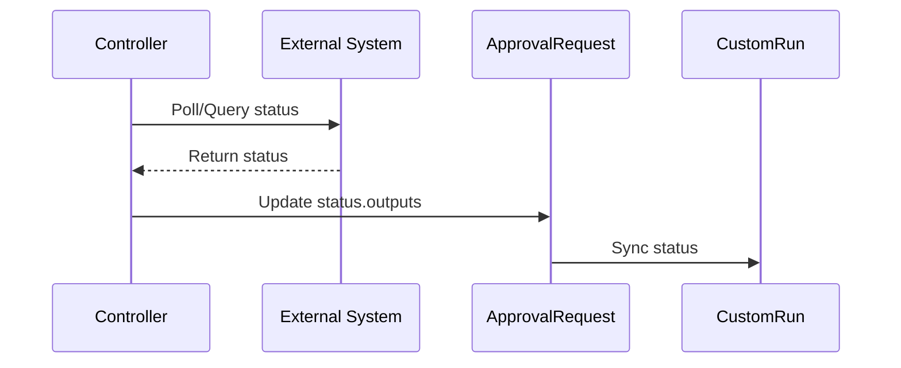
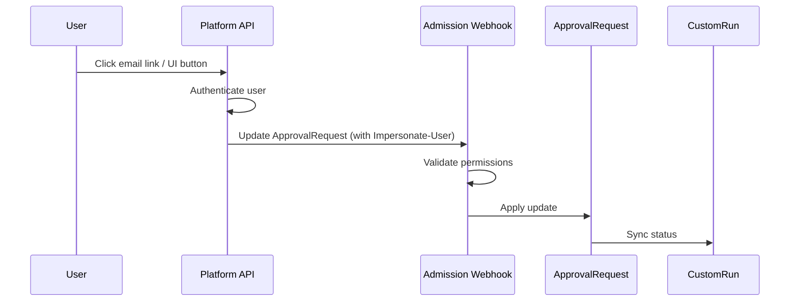

# TEP-0006: Approval Capabilities Research

## Summary

This document surveys the current mainstream approaches to implementing approval capabilities within the Tekton ecosystem. Based on our research of competitor products and community solutions (such as Harness, Azure DevOps, Automatiko, and custom approval applications), it focuses on comparing OpenShift Pipelines' `ApprovalTask` with our planned `ApprovalRequest` (external system-driven) model. The document analyzes the differences, reusability, and evolution paths of these two approval types, and proposes a combined platform solution: continuing to use `ApprovalTask` for manual approvals while introducing a new `ApprovalRequest` CRD for external system integration, leveraging the `Params` structure to carry flexible parameters.

## Motivation

### Background

* Existing projects have two distinct types of approval requirements: "manual confirmation" and "integration with external approval systems (JIRA, email, arbitrary APIs)," with significant differences in functional characteristics and security requirements.
* OpenShift Pipelines 1.20's `ApprovalTask` addresses the core flow of manual approvals but lacks the capability to handle external system callbacks and state synchronization.
* Competitors (Harness, Azure DevOps, etc.) generally provide rich approval configurations and extensibility for external systems. We need to bridge these gaps on top of Tekton.

### Goals

* Clearly define the boundaries between manual approval and external system approval to avoid uncontrolled complexity in controllers and CRDs.
* Reuse the Tekton `CustomRun` workflow to ensure pipelines can naturally block and resume during approval stages.
* Implement extensibility for approval parameters and state through the `Params` structure, facilitating the addition of new approval types and third-party integrations.
* Establish a unified model foundation for future UI, notifications, and audit capabilities.

### Non-goals

* This document does not discuss native approval support in Tekton core (e.g., directly extending `PipelineRun`).
* This document does not cover business scenarios following approval, such as deployment windows or delayed execution.

## Research

### Industry Solutions

#### Harness Pipeline Approval

**Capability Coverage**
- Built-in `Harness Approval` supports single/multiple approvers, disallowing pipeline executors, custom approval messages, approval input forms, auto-approval time windows, and other configurations. It sends two types of notifications ("Approval Required" and "Approved or Rejected") through the notification channels of the approver's user groups (currently does not support PagerDuty).

    <details>
    <summary>Harness Manual Approval Configuration Example</summary>

    ```yaml
    - stage:
        name: Manual Stage
        identifier: Manual_Stage
        description: ""
        type: Approval
        spec:
          execution:
            steps:
              - step:
                  name: Approval
                  identifier: approval
                  type: HarnessApproval
                  timeout: 1d
                  spec:
                    approvalMessage: |-
                      Please review the following information
                      and approve the pipeline progression
                    includePipelineExecutionHistory: true
                    approvers:
                      minimumCount: 1
                      disallowPipelineExecutor: false
                      userGroups:
                        - docs
                    approverInputs:
                      - name: myvar
                        defaultValue: myvalue
                    isAutoRejectEnabled: false
        failureStrategies: []
    ```
    </details>

    <details>
    <summary>Harness Auto-Approval Configuration Example (Time Window Based)</summary>

    ```yaml
    pipeline:
      name: HarnessAutoApprovalRuntime
      identifier: HarnessAutoApprovalRuntime
      projectIdentifier: ServiceV2_Ramya
      orgIdentifier: Ng_Pipelines_K8s_Organisations
      tags: {}
      stages:
        - stage:
            name: AutoApproval
            identifier: AutoApproval
            description: ""
            type: Approval
            spec:
              execution:
                steps:
                  - step:
                      type: ShellScript
                      name: ShellScript_1
                      identifier: ShellScript_1
                      spec:
                        shell: Bash
                        onDelegate: true
                        source:
                          type: Inline
                          spec:
                            script: |-

                              # Define the desired time zone (e.g., "America/New_York")
                              desired_timezone="Asia/Calcutta"
                              current_time=$(date "+%H:%M")  # Get the current time
                              formatted_time=$(TZ=$desired_timezone date --date="next week $current_time" "+%Y-%m-%d %I:%M %p")

                              echo "Formatted time in $desired_timezone: $formatted_time"
                        environmentVariables: []
                        outputVariables:
                          - name: time
                            type: String
                            value: formatted_time
                          - name: timeZone
                            type: String
                            value: desired_timezone
                      timeout: 10m
                  - step:
                      name: autoapproval
                      identifier: autoapproval
                      type: HarnessApproval
                      timeout: 1d
                      spec:
                        approvalMessage: |-
                          Please review the following information
                          and approve the pipeline progression
                        includePipelineExecutionHistory: true
                        approvers:
                          minimumCount: 1
                          disallowPipelineExecutor: false
                          userGroups:
                            - account._account_all_users
                        isAutoRejectEnabled: false
                        approverInputs: []
                        autoApproval:
                          action: APPROVE
                          scheduledDeadline:
                            timeZone: <+pipeline.stages.AutoApproval.spec.execution.steps.ShellScript_1.output.outputVariables.timeZone>
                            time: <+pipeline.stages.AutoApproval.spec.execution.steps.ShellScript_1.output.outputVariables.time>
                          comments: Auto approved by Harness via Harness Approval step
            tags: {}
            variables:
              - name: zone
                type: String
                description: ""
                required: false
                value: Asia/Kolkata
              - name: time
                type: String
                description: ""
                required: false
                value: 2023-12-20 09:24 AM
    ```
    </details>

- Supports configurable approval messages, displaying previous stage execution details, auto-rejecting old executions, disallowing specific email/executor approvals, and allowing approvers to fill in custom inputs (supporting default values, required fields, regex/enum constraints). Approvers and user groups support expression-based combinations.
- The commercial version additionally supports Jira/ServiceNow approval steps, directly reading external ticket status.
  - Jira approval can be used as an independent stage (integrating `Create/Approval/Update` three steps) or as a standalone step, specifying projects and Issue Keys based on Jira Connector, supporting both Conditions and JEXL to define approval/rejection conditions.
  - During the waiting phase, Jira approval polls the Jira ticket status according to `Retry Interval`, and can be manually refreshed instantly via the Refresh button in the execution interface (requires enabling the `CDS_REFRESH_IN_JIRA_SERVICENOW_APPROVALS` feature). It supports expression references to Issue fields (e.g., `<+issue.Status>`), but only covers Option/Array/Any/Number/Date/String type fields.

<details>
<summary>Harness Jira Approval Stage Configuration Example</summary>

```yaml
pipeline:
  name: Jira
  identifier: Jira
  projectIdentifier: CD_Docs
  orgIdentifier: default
  tags: {}
  stages:
    - stage:
        name: Jira Stage
        identifier: Jira_Stage
        description: ""
        type: Approval
        spec:
          execution:
            steps:
              - step:
                  name: Jira Create
                identifier: Jira_Create
                type: JiraCreate
                timeout: 5m
                spec:
                  connectorRef: Jira
                  projectKey: TJI
                  issueType: Bug
                  fields:
                    - name: Summary
                      value: test for doc
            - step:
                type: JiraUpdate
                name: JiraUpdate_1
                identifier: JiraUpdate_1
                spec:
                  connectorRef: Jira
                  issueKey: <+pipeline.stages.Jira_Stage.spec.execution.steps.Jira_Create.issue.key>
                  transitionTo:
                    transitionName: ""
                    status: In Progress
                  fields: []
                timeout: 10m
            - step:
                type: JiraUpdate
                name: JiraUpdate_2
                identifier: JiraUpdate_2
                spec:
                  connectorRef: Jira
                  issueKey: <+execution.steps.JiraUpdate_1.spec.issueKey>
                  transitionTo:
                    transitionName: ""
                    status: Will Not Fix
                  fields: []
                timeout: 10m
      tags: {}
```

</details>

- Provides `Custom Approval`, allowing scripts to run in pipelines and determining pass/reject based on output variables, enabling integration with any approval system that has an API.
  - Custom Approval supports executing scripts on Delegates, periodically running scripts according to `Retry Interval` to fetch external status, and determining approval results by combining `Script Timeout`, script output variables, JEXL expressions, and Harness variables. After approval completes, output variables can be referenced by subsequent steps, and manual refresh is available in the execution interface (requires enabling the `CDS_REFRESH_IN_JIRA_SERVICENOW_APPROVALS` feature).

<details>
<summary>Harness Custom Approval Configuration Example (Script Output Based)</summary>

```yaml
pipeline:
  name: Example
  identifier: Example
  projectIdentifier: myproject
  orgIdentifier: default
  tags: {}
  stages:
    - stage:
        name: test1
        identifier: test1
        description: ""
        type: Approval
        spec:
          execution:
            steps:
              - step:
                  type: CustomApproval
                  name: custom approval
                  identifier: custapprove
                  timeout: 1d
                  spec:
                    shell: Bash
                    source:
                      type: Inline
                      spec:
                        script: test="Approved"
                    environmentVariables: []
                    outputVariables:
                      - name: approved
                        type: String
                        value: <+output.outputVariables.approved>
                    retryInterval: 1m
                    timeoutAction:
                      type: MarkAsFailed
                    scriptTimeout: 1m
                    onDelegate: true
              - step:
                  type: ShellScript
                  name: vars
                  identifier: vars
                  spec:
                    shell: Bash
                    onDelegate: true
                    source:
                      type: Inline
                      spec:
                        script: |-
                          echo "output var: "<+steps.custapprove.output.outputVariables.approved>
                  timeout: 10m
```

</details>

**Advantages**
- Detailed configuration interface; users can combine complex strategies without writing YAML.
- Unified approval experience: console, notifications, and history are centralized in the same UI.
- Custom approval scripts run on Harness Delegates, facilitating access to internal systems.
- Manual approval provides advanced features such as approver inputs, expression-driven auto-approval/rejection, and service account API approvals, covering scenarios like deployment windows and approval handoffs.

**Limitations**
- Custom approvals require users to maintain scripts and parsing logic, with high debugging costs.
- Features like Jira/ServiceNow are restricted by account version and cannot be reused in open-source solutions.
- Jira manual refresh functionality depends on feature flags.
- Custom Approval scripts need to handle errors and security isolation themselves, with complex script output/input variable configuration requiring extensive documentation guidance.
- Advanced manual approval capabilities (disallowing executors, disallowing emails, approval inputs, notification policies, etc.) have a broad configuration surface and rely on expressions, requiring operations teams to establish clear best practices to avoid misconfigurations.

#### Azure DevOps Approval

**Capability Coverage**
- YAML Pipeline provides the `ManualValidation@1` task: configurable approvers, email notifications, approval instructions, automatic handling after timeout (reject or continue), allowing/disallowing approvers to approve their own runs, etc. The task runs in an agentless job.

    <details>
    <summary>Azure DevOps Manual Approval Configuration Example</summary>

    ```yaml
    jobs:
      - job: waitForValidation
        displayName: Wait for external validation
        pool: server
        timeoutInMinutes: 4320 # job times out in 3 days
        steps:
        - task: ManualValidation@1
          timeoutInMinutes: 1440 # task times out in 1 day
          inputs:
            notifyUsers: |
              test@test.com,
              example@example.com
            instructions: 'Please validate the build configuration and resume'
            onTimeout: 'resume'
          # approvers: # string. Approvers. 
          # allowApproversToApproveTheirOwnRuns: true # boolean. Allow approvers to approve their own run. Default: true.
          # instructions: # string. Instructions. 
          # onTimeout: 'reject' # 'reject' | 'resume'. On timeout. Default: reject.
    ```

    </details>

- Release Pipeline supports stage-level pre/post approvals, Manual Intervention steps, and "delayed deployment" settings after approval, meeting scenarios like deployment windows and approval handoffs.
- Resources such as environments and service connections support Approvals & Checks (manual approval, Business Hours, Invoke REST/Azure Function, Invoke REST API, Azure Monitor, Exclusive lock, etc.), which can be combined with policies like deferred approval, timeout control, and exclusive locks.
- Invoke REST API / Azure Function checks can integrate with external approval systems in synchronous or asynchronous mode: Azure DevOps pushes check payloads, and external systems asynchronously calculate and return approval results via callbacks (Post Event), supporting mid-process status updates to achieve true external approval loops.

**Advantages**
- Approval entry points are deeply integrated with Azure DevOps UI: pipeline lists, execution details, and stage cards all display pending approval information.
- Approvers and notification channels are integrated with the enterprise account system, and email notifications include context such as remaining time and approval information.
- Approvals & Checks provide various automated checks that can be combined with manual approvals to achieve state control before and after deployment.

**Limitations**
- Manual approval experience still relies on Azure DevOps UI; approving through other channels requires using REST API or custom implementations.
- The `ManualValidation` task has a fixed format and cannot accept complex approval forms; it needs to be combined with Checks or Release Pipeline to cover advanced strategies.
- Implementing Checks requires developing and operating Azure Function/REST services, with additional investment needed for asynchronous callbacks and secret management.

#### ChatOps (Prow, Pipeline as Code, etc.)

**Capability Coverage**
- Trigger pipeline control through commands like `/approve`, `/test`, `/cancel` in PR comments; OWNER/Policy defines who can execute which commands.
- Pipeline as Code supports custom command annotations for extending additional actions; ChatOps bots can also map commands to approval scripts.
- Common practice combines with IM tools like Slack/DingTalk/Feishu, using bot menus to implement simple "approve/reject" actions.

**Advantages**
- Approval/triggering is tightly coupled with code review scenarios, with operations and audit records centralized in the repository.
- Users can complete approval-style control in chat/PR without switching platforms.
- Permissions are inherited from repository/organization settings, with low learning costs.

**Limitations**
- Commands are essentially trigger/rerun/cancel actions and do not provide a unified CR and state machine for "waiting for approval results."
- Difficult to integrate external approval systems or complex approval stages; mainly for CI workflow control.
- Approval results are scattered in comments or chat records, lacking structured auditing and timeout strategies.

### Tekton Community Solutions

#### OpenShift Pipelines ApprovalTask

**Capability Coverage**
- OpenShift Pipelines introduced `ApprovalTask` (technical preview) starting from version 1.15, compatible with CustomRun, supporting single/multiple approver approval, timeout, Webhook authentication, and other capabilities.
- Implements manual approval through `CustomRun` + independent `ApprovalTask` CR; users can directly modify the `ApprovalTask` resource to complete approval or rejection.
- Controller responsibilities include: automatically creating/maintaining `ApprovalTask`, initializing approval configurations based on `spec.params`, monitoring state changes and updating CustomRun when approval is passed/rejected, while handling timeout, parameter validation, label/annotation propagation, and other common logic.

**Advantages**
- `ApprovalTask` uses standard Kubernetes CRD, convenient for kubectl/CLI operations; Admission Webhook controls approval permissions.
- Simple controller pattern: CustomRun creation → controller generates/syncs ApprovalTask → state written back to CustomRun.
- Has certain extension examples and can serve as a foundation for our self-developed capabilities.
- Authentication method: Admission Webhook determines whether the patch operator is in `spec.approvers` to decide whether to allow modifications, naturally supporting `kubectl`/CLI approval.

**Limitations**
- Official implementation only focuses on manual approval, lacking a unified integration solution for external systems (Jira, email, etc.).

#### Automatiko - ApprovalTask

**Capability Coverage**
- Provides `ApprovalTask` Custom Task, combining its own process engine, email notifications, approval forms, and Tekton Dashboard plugins to connect approval UI, notifications, and write-back.
- More complex approval processes can be configured through the Automatiko engine, supporting features such as approval lists, approval details, and email interactions.

**Advantages**
- Provides a relatively complete reference implementation, validating the integration path of Tekton + external process engine.
- Embeds email, forms, and Dashboard extensions to provide users with a near-production approval experience.

**Limitations**
- Requires deploying Automatiko service; approval data and availability depend on external components, with high operations and integration costs.
- Integration with our platform's UI/to-do system still requires additional development, and CR Schema differs from platform expectations.

#### Custom Approval Application (manual-tekton-approval-task)

**Capability Coverage**
- Dynamically builds and deploys temporary approval applications (including OAuth/callback logic) during pipeline execution, providing approval pages and writing back Tekton status after approval completes.
- Typically includes steps such as building approval images, deploying Pods, exposing access endpoints, listening for approval results, and cleaning up resources.

**Advantages**
- Demonstrates the ability to build custom approval experiences in a pure Tekton environment and integrate with enterprise SSO.
- Highly extensible; users can write their own approval interfaces and logic according to their needs.

**Limitations**
- Long approval cycles require Pods/services to run continuously, lacking high availability and resource control strategies.
- Security, authentication, cleanup, scaling, etc., all need to be handled independently, with high maintenance costs.
- Lacks a unified input/output structure, making it difficult to integrate with platform to-do and audit systems.

### Summary of External System Approval Requirements

* Scenarios like JIRA and email typically require:
  * Controllers automatically create external resources (e.g., JIRA Issue) and record their identifiers.
  * Asynchronously observe external status and write back; approval processes may last for extended periods.
  * No "approver" concept, or approvers are maintained by the external system.
* Existing `ApprovalTask` is difficult to directly reuse:
  * The state machine lacks an intermediate stage for "synchronizing external state."
  * Status field structure is fixed, making it difficult to carry the rich context required by external systems.
  * Admission Webhook is based on the assumption that "the operator is the approver," which is not applicable to system account synchronization.

## Proposal

### Overview

Based on our research, we propose a dual-track approach: continuing to use `ApprovalTask` for manual approvals while introducing a new `ApprovalRequest` CRD for external system integration. This approach clearly separates the boundaries between the two approval types while providing a unified approval experience at the platform level.

### Manual Approval: Continue with ApprovalTask

* Continue to use OpenShift's `ApprovalTask` + `CustomRun` combination, preserving the good CLI/UI operation experience.
* The platform can render the `ApprovalTask` list and approver progress in the UI, and ensure policies such as disallowing executor approval and multi-person thresholds take effect through webhooks.
* If enhancement is needed, more policies can be added in Admission (such as approver domain restrictions, approval history snapshots, etc.) without changing the CR structure.
* **Enhanced capabilities to match competitors:**
  * **Disallowing pipeline executor approval**: Extract the creator information from the `PipelineRun`'s annotations (e.g., platform-specific annotations like `cpaas.io/creator`), pass it to the `ApprovalTask`, and add a new parameter `disallowPipelineExecutor: true`. The Admission webhook can then validate that the approver is not the pipeline creator.
  * **Automatic timeout handling**: The controller synchronizes the `timeout` value from `CustomRun.spec.timeout` to the `ApprovalTask` and introduces a new parameter `timeoutAction` with options `approve` or `reject`. When the approval exceeds the timeout period, the controller automatically updates the approval status based on the configured action. For example:
    <details>
    <summary>ApprovalTask Timeout Handling Example</summary>

    ```yaml
    apiVersion: tekton.dev/v1beta1
    kind: CustomRun
    metadata:
      name: manual-approval
    spec:
      timeout: 24h  # This timeout is synchronized to ApprovalTask
      customRef:
        apiVersion: openshift-pipelines.org/v1alpha1
        kind: ApprovalTask
      params:
        - name: disallowPipelineExecutor
          value: "true"
        - name: timeoutAction
          value: "reject"  # or "approve"
        - name: approvers
          value:
            - admin
            - group:g-v9mfs
        - name: numberOfApprovalsRequired
          value: "2"
        - name: description
          value: "Approve deployment to production"
    ```
    </details>
* Not recommended to continue with approaches like `manual-tekton-approval-task` that "create temporary Pods + custom UI at runtime," because: approval processes typically last for extended periods and require cross-replica high availability, while Pod lifecycles are difficult to guarantee stability and resource management.

### External System Approval: Introduce ApprovalRequest CRD

**Usage in Pipeline:**

When users declare an approval task in a Pipeline, they can reference `ApprovalRequest` as a custom task. The Tekton pipeline runtime automatically creates a `CustomRun` to execute this task, and the `ApprovalRequest` controller then creates and manages the corresponding `ApprovalRequest` resource.

<details>
<summary>ApprovalRequest Pipeline Usage Example</summary>

```yaml
apiVersion: tekton.dev/v1
kind: Pipeline
metadata:
  name: deploy-with-approval
  namespace: default
spec:
  tasks:
    - name: build
      taskRef:
        name: build-image
    - name: approval-gate
      runAfter:
        - build
      taskRef:
        apiVersion: approval.alaudadevops.io/v1alpha1
        kind: ApprovalRequest
      timeout: "3h"
      params:
        - name: type
          value: jira
        - name: jiraProject
          value: DEVOPS
        - name: issueType
          value: Task
    - name: deploy
      runAfter:
        - approval-gate
      taskRef:
        name: deploy-to-production
```
</details>

**Resource Transformation Flow:**

1. When a `PipelineRun` is created, Tekton creates a `CustomRun` for the `approval-gate` task:
   <details>
   <summary>CustomRun Resource Example</summary>

   ```yaml
   apiVersion: tekton.dev/v1beta1
   kind: CustomRun
   metadata:
     name: deploy-with-approval-run-abc123-approval-gate
     namespace: default
   spec:
     timeout: 3h
     customRef:
       apiVersion: approval.alaudadevops.io/v1alpha1
       kind: ApprovalRequest
     params:
       - name: type
         value: jira
       - name: jiraProject
         value: DEVOPS
       - name: issueType
         value: Task
   ```
   </details>

   > Note: The `type` parameter is used to identify the approval executor and will be extracted to `spec.type` in the `ApprovalRequest` resource.

2. The ApprovalRequest controller watches `CustomRun` resources and creates a corresponding `ApprovalRequest`:
   <details>
   <summary>ApprovalRequest Resource Example</summary>

   ```yaml
   apiVersion: approval.alaudadevops.io/v1alpha1
   kind: ApprovalRequest
   metadata:
     name: deploy-with-approval-run-abc123-approval-gate
     namespace: default
     labels:
       approval.alaudadevops.io/type: jira
     ownerReferences:
       - apiVersion: tekton.dev/v1beta1
         kind: CustomRun
         name: deploy-with-approval-run-abc123-approval-gate
   spec:
     type: jira
     params:
       - name: jiraProject
         value: DEVOPS
       - name: issueType
         value: Task
   status:
     phase: Approved
     conditions:
       - type: Succeeded
         status: "True"
         reason: JiraIssueCompleted
         message: "Jira issue DEVOPS-456 is completed"
         lastTransitionTime: "2025-11-04T10:30:00Z"
     approvalSummary:
       finalDecision: Approved
       approvalsRequired: 1
       approvalsReceived: 1
       decidedAt: "2025-11-04T10:30:00Z"
       approverResponses:
         - name: user@example.com
           type: User
           response: Approved
           respondedAt: "2025-11-04T10:30:00Z"
     outputs:
       - name: externalState
         value:
           issueKey: DEVOPS-456
           issueStatus: Done
           issueUrl: https://jira.example.com/browse/DEVOPS-456
   ```
   </details>

3. Once the approval is completed, the controller updates the `CustomRun` status, allowing the Pipeline to proceed to the next task.

**Additional Approval Type Examples:**

<details>
<summary>Scheduled Auto-Approval (Time-Based Auto-Approve/Reject)</summary>

Similar to Harness's auto-approval feature, our framework supports scheduled automatic approval at a specific time. This is useful for deployment windows or time-based release gates.

```yaml
apiVersion: tekton.dev/v1
kind: Pipeline
metadata:
  name: scheduled-deployment
spec:
  tasks:
    - name: build
      taskRef:
        name: build-image

    - name: scheduled-approval
      runAfter: [build]
      taskRef:
        apiVersion: approval.alaudadevops.io/v1alpha1
        kind: ApprovalRequest
      timeout: "24h"
      params:
        - name: type
          value: scheduled-auto-approval
        - name: scheduledTime
          value: "2025-11-05T02:00:00Z"  # UTC time
        - name: timeZone
          value: "Asia/Shanghai"  # Optional: convert to local time for display
        - name: action
          value: "approve"  # approve | reject
        - name: allowManualOverride
          value: "true"  # Allow manual approval before scheduled time
        - name: approvers
          value:
            - admin
            - ops-team

    - name: deploy
      runAfter: [scheduled-approval]
      taskRef:
        name: deploy-to-production
```

**Controller behavior**:
- Before `scheduledTime`: Status remains `Pending`
- If `allowManualOverride: true`: Approvers can manually approve/reject before scheduled time
- At `scheduledTime`: Automatically executes the specified `action` (approve/reject)
- After scheduled action: Updates `phase` to `Approved` or `Rejected` accordingly

**Use cases**:
- **Deployment Windows**: Auto-approve deployments during maintenance windows (e.g., 2 AM daily)
- **Business Hours Gates**: Auto-reject deployments outside business hours
- **Delayed Releases**: Schedule production releases for specific times after staging validation
- **Timeout with Default Action**: Automatically approve if no manual decision is made within time limit

This approval type will be implemented as part of the custom approval framework in Phase 2, as it shares similar controller patterns (time-based polling and automatic decision-making).

</details>

**Design Goals:**

* Maintain the "Run responsible for triggering + status write-back" pattern with `CustomRun`, reusing existing controller structures.
* Use Tekton `Params` definitions for both `spec.params` and `status.outputs`, supporting three types: string, array, and object for extensibility.
* The `ApprovalRequest` resource is managed by controllers and should not be directly created by users; users should declare approval tasks in their Pipeline definitions.
* Adopt a multi-controller architecture (inspired by Tekton's ResolutionRequest pattern) for better extensibility and independent deployment of approval types.

**High-Level Flow:**

1. User defines an approval task in Pipeline with `taskRef.kind: ApprovalRequest` and `params`
2. Tekton creates a `CustomRun` when PipelineRun executes
3. Main controller watches CustomRun, creates `ApprovalRequest`, adds label to CustomRun
4. Type-specific controller watches ApprovalRequest with matching `spec.type`, executes approval logic
5. Type-specific controller updates `ApprovalRequest.status` when approval completes
6. Main controller syncs status back to CustomRun, allowing Pipeline to continue

For detailed architecture design, controller responsibilities, and execution patterns, see the [Design Details](#design-details) section below.

## Design Details

### Multi-Controller Architecture

Inspired by Tekton's [ResolutionRequest pattern](https://github.com/tektoncd/community/blob/main/teps/0060-remote-resource-resolution.md), we adopt a multi-controller architecture to support different approval types:

**Main Controller (ApprovalRequest Reconciler)**:
* Watches `CustomRun` resources with `customRef.kind: ApprovalRequest`
* Creates `ApprovalRequest` resources and adds `approval.alaudadevops.io/type` label to the CustomRun
* Extracts `type` parameter from CustomRun params to `ApprovalRequest.spec.type`
* Synchronizes status from `ApprovalRequest` back to `CustomRun`

**Type-Specific Controllers** (one per approval type):
* Each approval type has an independent controller (e.g., `jira-approval-controller`, `email-approval-controller`, `custom-script-approval-controller`)
* Watches `ApprovalRequest` resources with matching `spec.type`
* Implements type-specific approval logic
* Updates `ApprovalRequest.status` with approval results
* Can be deployed independently for better scalability and maintainability

**Benefits**:
* Clear separation of concerns
* Independent deployment and versioning for each approval type
* Easier to extend with new approval types without modifying core controllers
* Better resource utilization (only deploy controllers for needed approval types)

### Approval Execution Patterns

#### Pattern A: Automated Approval (Jira, Custom Script)

Controller-driven pattern where the controller actively polls or calls external systems:

<details>
<summary>Automated Approval Sequence</summary>


</details>

**Examples**:
* **Jira Approval**: Controller creates Jira issue, periodically polls issue status, updates ApprovalRequest when issue is resolved
* **Custom Script Approval**: Controller executes user-provided script on schedule, evaluates output against approval criteria

#### Pattern B: Interactive Approval (Email, Platform UI)

API-driven pattern where users interact with the platform to approve/reject:

<details>
<summary>Interactive Approval Sequence</summary>


</details>

**Examples**:
* **Email Approval**: User receives email with approval link, clicks link, platform authenticates user, API updates ApprovalRequest on behalf of user
* **Platform UI Approval**: User views pending approvals in platform UI, clicks approve/reject button, same flow as email

**Key Differences**:
* Pattern A: Controller has full control, no user interaction during approval process
* Pattern B: Requires API layer for user interaction, uses `Impersonate-User` for permission delegation

### Unified Approval Contract

1. **CustomRun Label Convention**: The main controller adds `approval.alaudadevops.io/type: <type-value>` label to CustomRun to facilitate quick identification of approval steps by backend/frontend. This label is not set by Tekton Pipeline itself.

2. **Parameter Convention**: The `type` parameter in CustomRun params is extracted to `ApprovalRequest.spec.type` to identify which type-specific controller should handle this approval. Other parameters in `spec.params` are approval-type-specific.

3. **Status Flow**: Status updates flow in one direction: `ApprovalRequest.status` → `CustomRun.status`. Type-specific controllers update `ApprovalRequest.status`, and the main controller syncs this to `CustomRun.status`.

4. **Events and Auditing**: Approval controllers should send Kubernetes Events during key state transitions (e.g., approval created, approved, rejected, timeout) for observability and user notification.

5. **Security and Authentication**:
   * **Pattern A (Automated)**: Type-specific controller runs with service account that has permission to update ApprovalRequest resources
   * **Pattern B (Interactive)**: Platform API authenticates users, then uses `Impersonate-User` header when calling Kubernetes API to update ApprovalRequest, ensuring the operation is performed with the user's identity and permissions
   * Admission Webhook validates that updates to approval decision fields come from authorized sources (either the type-specific controller's service account or an authenticated user via API)

6. **Rejection Handling**: The `continueOnRejection` parameter controls how approval rejection affects the Pipeline execution.

### Rejection Handling: continueOnRejection Parameter

Approval rejection can be handled in two ways, controlled by the `continueOnRejection` parameter:

#### Default Behavior: Fail on Rejection (continueOnRejection: false)

By default, when an approval is rejected, the `CustomRun` is marked as **Failed**, causing the Pipeline to stop. This aligns with OpenShift Pipelines' `ApprovalTask` behavior and matches user expectations for most approval scenarios.

<details>
<summary>Default Rejection Behavior Example</summary>

```yaml
apiVersion: tekton.dev/v1
kind: Pipeline
metadata:
  name: deploy-pipeline
spec:
  tasks:
    - name: build
      taskRef:
        name: build-image

    - name: production-approval
      runAfter: [build]
      taskRef:
        apiVersion: approval.alaudadevops.io/v1alpha1
        kind: ApprovalRequest
      params:
        - name: type
          value: manual
        - name: continueOnRejection
          value: "false"  # Default value (can be omitted)

    - name: deploy-to-production
      runAfter: [production-approval]
      taskRef:
        name: deploy
      # This task will NOT run if approval is rejected
```

**Behavior when rejected**:
- `ApprovalRequest.status.phase` → `Rejected`
- `CustomRun.status.conditions[type=Succeeded].status` → `False`
- `CustomRun.status.conditions[type=Succeeded].reason` → `ApprovalRejected`
- Pipeline execution stops; `deploy-to-production` task is skipped

</details>

**Why this is the default**:

1. **Security and Safety First**: Approval gates are designed to prevent unauthorized changes. If approval is rejected, the safest behavior is to stop the Pipeline, preventing accidental deployments or dangerous operations.

2. **Aligns with User Mental Model**: Most users expect "approval rejected = Pipeline should stop". This matches the behavior of mainstream CI/CD platforms:
   - OpenShift Pipelines `ApprovalTask` marks CustomRun as Failed on rejection
   - Harness approval rejection fails the stage by default
   - Azure DevOps approval rejection stops the Pipeline

3. **Simplicity**: Users don't need to add `when` conditions to every subsequent task to prevent execution after rejection. The Pipeline definition remains clean and less error-prone.

4. **Clear Audit Trail**: The Pipeline failure with `reason: ApprovalRejected` provides a clear signal in the audit log that the failure was due to a deliberate rejection, not a system error.

#### Advanced Behavior: Continue on Rejection (continueOnRejection: true)

For advanced scenarios requiring conditional branching based on approval results, set `continueOnRejection: true`. In this mode, the `CustomRun` succeeds regardless of approval decision, and the result is written to `CustomRun.status.results`, allowing downstream tasks to use `when` expressions for conditional execution.

<details>
<summary>Continue on Rejection Example: Conditional Deployment</summary>

```yaml
apiVersion: tekton.dev/v1
kind: Pipeline
metadata:
  name: conditional-deploy-pipeline
spec:
  tasks:
    - name: build
      taskRef:
        name: build-image

    - name: production-approval
      runAfter: [build]
      taskRef:
        apiVersion: approval.alaudadevops.io/v1alpha1
        kind: ApprovalRequest
      params:
        - name: type
          value: manual
        - name: continueOnRejection
          value: "true"  # Enable conditional branching

    - name: deploy-to-production
      runAfter: [production-approval]
      when:
        - input: $(tasks.production-approval.results.decision)
          operator: in
          values: ["true"]
      taskRef:
        name: deploy
      params:
        - name: environment
          value: production

    - name: deploy-to-staging
      runAfter: [production-approval]
      when:
        - input: $(tasks.production-approval.results.decision)
          operator: in
          values: ["false"]
      taskRef:
        name: deploy
      params:
        - name: environment
          value: staging
```

**Behavior when rejected**:
- `ApprovalRequest.status.phase` → `Rejected`
- `CustomRun.status.conditions[type=Succeeded].status` → `True` ✅
- `CustomRun.status.results`:
  ```yaml
  - name: decision
    value: "false"
  - name: finalDecision
    value: "Rejected"
  ```
- Pipeline continues; tasks use `when` conditions to determine execution path

</details>

<details>
<summary>Continue on Rejection Example: Cleanup on Rejection</summary>

```yaml
apiVersion: tekton.dev/v1
kind: Pipeline
metadata:
  name: deploy-with-cleanup
spec:
  tasks:
    - name: create-preview-environment
      taskRef:
        name: create-env

    - name: preview-approval
      runAfter: [create-preview-environment]
      taskRef:
        apiVersion: approval.alaudadevops.io/v1alpha1
        kind: ApprovalRequest
      params:
        - name: type
          value: manual
        - name: continueOnRejection
          value: "true"

    - name: promote-to-production
      runAfter: [preview-approval]
      when:
        - input: $(tasks.preview-approval.results.decision)
          operator: in
          values: ["true"]
      taskRef:
        name: promote

    - name: cleanup-preview-environment
      runAfter: [preview-approval]
      when:
        - input: $(tasks.preview-approval.results.decision)
          operator: in
          values: ["false"]
      taskRef:
        name: cleanup-env
```

</details>

**Use cases for continueOnRejection: true**:

1. **Conditional Deployment Paths**: Deploy to production if approved, otherwise deploy to staging
2. **Cleanup on Rejection**: Clean up temporary resources (preview environments, test data) when approval is rejected
3. **Approval Chains**: Multiple approval stages where later approvals depend on earlier decisions
4. **Notification on Rejection**: Send notifications or create tickets when approval is rejected

**CustomRun Results Format** (when `continueOnRejection: true`):

```yaml
status:
  results:
    - name: decision
      value: "true"  # or "false"
    - name: finalDecision
      value: "Approved"  # or "Rejected"
    - name: decidedAt
      value: "2025-11-04T10:30:00Z"
    - name: approverNames
      value: "admin,user1,user2"  # Comma-separated list
```

### ApprovalRequest Status Design

The `ApprovalRequest.status` structure is designed to support both single-approver and multi-approver scenarios while remaining flexible for different approval types.

#### Status Structure

<details>
<summary>ApprovalRequest Status Structure Example</summary>

```yaml
status:
  # Phase represents the overall approval state
  # Main controller uses this field to update CustomRun status
  phase: Pending  # Pending | Approved | Rejected | Timeout | Failed

  # Conditions follow Kubernetes standard conventions
  conditions:
    - type: Succeeded
      status: Unknown  # True | False | Unknown
      reason: Pending
      message: "Waiting for approval (1/3 approvals received)"
      lastTransitionTime: "2025-11-04T10:00:00Z"

  # Approval summary information - cross-type generic
  approvalSummary:
    # Final decision (set when phase is Approved/Rejected)
    finalDecision: ""  # Approved | Rejected

    # Approval policy and progress (primarily for multi-approver scenarios)
    approvalsRequired: 3  # Number of approvals required
    approvalsReceived: 1  # Number of approvals received
    rejectionsReceived: 0  # Number of rejections received

    # Decision timestamp
    decidedAt: ""  # Timestamp of final decision

    # Approver response list (supports multi-approver scenarios)
    approverResponses:
      - name: admin
        type: User  # User | Group
        response: Approved  # Approved | Rejected | Pending
        message: "LGTM"
        respondedAt: "2025-11-04T10:05:00Z"

      - name: developers
        type: Group
        response: Pending
        # Group type can expand member responses
        groupMembers:
          - name: user1
            response: Pending
          - name: user2
            response: Pending

      - name: user1
        type: User
        response: Pending

  # Type-specific status information - using Params format for flexibility
  # Different approval types can store their specific state here
  outputs:
    - name: externalState
      value:
        issueKey: DEVOPS-456
        issueStatus: In Progress
        issueUrl: https://jira.example.com/browse/DEVOPS-456

    - name: syncMetadata
      value:
        lastSyncTime: "2025-11-04T10:05:00Z"
        syncCount: "3"
        nextSyncTime: "2025-11-04T10:10:00Z"
```
</details>

#### Status Components

**1. Phase Field**

The `phase` field drives CustomRun status updates by the main controller:

| Phase | CustomRun Status | Description |
|-------|-----------------|-------------|
| `Pending` | Running | Approval is in progress, waiting for decision |
| `Approved` | Succeeded | Approval has been granted |
| `Rejected` | Failed | Approval has been rejected |
| `Timeout` | Failed | Approval timed out without decision |
| `Failed` | Failed | Approval process encountered an error |

**2. Approval Summary**

The `approvalSummary` structure is generic across all approval types:

- **Single-Approver Scenarios**: `approvalsRequired=1`, `approverResponses` contains one entry
- **Multi-Approver Scenarios**: `approvalsRequired=N`, `approverResponses` tracks each approver's response
- **Automated Approvals** (Jira, script): `approverResponses` may be empty or contain system name
- **Group Support**: Groups can expand to show individual member responses

**3. Type-Specific Outputs**

The `outputs` field uses Tekton Params format for maximum flexibility. Different approval types store their specific state here:

**Manual Approval**:
<details>
<summary>Manual Approval Outputs Example</summary>

```yaml
outputs:
  - name: notificationsSent
    value:
      email: "5"
      slack: "2"
```
</details>

**Jira Approval**:
<details>
<summary>Jira Approval Outputs Example</summary>

```yaml
outputs:
  - name: externalState
    value:
      issueKey: DEVOPS-456
      issueStatus: In Progress
      issueUrl: https://jira.example.com/browse/DEVOPS-456
      assignee: user@example.com
  - name: watchers
    value:
      - watcher1@example.com
      - watcher2@example.com
  - name: syncMetadata
    value:
      lastSyncTime: "2025-11-04T10:05:00Z"
      nextPollTime: "2025-11-04T10:10:00Z"
      pollCount: "3"
```
</details>

**Email Approval**:
<details>
<summary>Email Approval Outputs Example</summary>

```yaml
outputs:
  - name: emailsSent
    value: "5"
  - name: emailResponses
    value: |
      [
        {
          "email": "admin@example.com",
          "tokenHash": "abc123",
          "clickedAt": "2025-11-04T10:05:00Z"
        }
      ]
```
</details>

**Custom Script Approval**:
<details>
<summary>Custom Script Approval Outputs Example</summary>

```yaml
outputs:
  - name: lastExecution
    value:
      executionId: "2"
      executedAt: "2025-11-04T10:05:00Z"
      exitCode: "0"
      output: "Condition met"
      result: approved
  - name: scriptExecutionHistory
    value: |
      [
        {
          "executionId": 1,
          "executedAt": "2025-11-04T10:00:00Z",
          "exitCode": 0,
          "output": "Checking condition...",
          "result": "not_ready"
        },
        {
          "executionId": 2,
          "executedAt": "2025-11-04T10:05:00Z",
          "exitCode": 0,
          "output": "Condition met",
          "result": "approved"
        }
      ]
```
</details>

**Scheduled Auto-Approval**:
<details>
<summary>Scheduled Auto-Approval Outputs Example</summary>

```yaml
# Before scheduled time (Pending state)
outputs:
  - name: scheduledExecution
    value:
      scheduledTime: "2025-11-05T02:00:00Z"
      scheduledAction: approve  # approve | reject
      timeZone: Asia/Shanghai
      allowManualOverride: "true"
  - name: scheduleStatus
    value:
      timeRemaining: "3h25m15s"
      lastCheckTime: "2025-11-04T22:34:45Z"
      nextCheckTime: "2025-11-04T22:35:45Z"

# After scheduled execution (Approved state)
outputs:
  - name: scheduledExecution
    value:
      scheduledTime: "2025-11-05T02:00:00Z"
      scheduledAction: approve
      timeZone: Asia/Shanghai
      allowManualOverride: "true"
  - name: executionInfo
    value:
      executionMode: scheduled-auto  # scheduled-auto | manual-override
      actualExecutionTime: "2025-11-05T02:00:00Z"
      executedBy: system  # or username if manual override

# If manual override occurred (Approved state)
outputs:
  - name: scheduledExecution
    value:
      scheduledTime: "2025-11-05T02:00:00Z"
      scheduledAction: approve
      timeZone: Asia/Shanghai
      allowManualOverride: "true"
  - name: executionInfo
    value:
      executionMode: manual-override
      actualExecutionTime: "2025-11-04T23:15:30Z"
      executedBy: admin
      overrideReason: "Emergency deployment required"
```
</details>

#### Main Controller Status Sync Logic

The main controller watches ApprovalRequest status changes and syncs to CustomRun based on the `phase` field:

- **Approved** → MarkCustomRunSucceeded
- **Rejected** → MarkCustomRunFailed
- **Timeout** → MarkCustomRunFailed
- **Failed** → MarkCustomRunFailed
- **Pending** → MarkCustomRunRunning

#### Type-Specific Controller Responsibilities

**Manual Approval Controller**:
- Collects user approvals via Admission Webhook updates to ApprovalRequest
- Aggregates approver responses and counts approvals/rejections
- Updates `approvalSummary` with progress
- Determines `phase` based on approval policy (reject-on-any-rejection, approve-on-threshold)

**Jira Approval Controller**:
- Polls Jira issue status periodically
- Updates `outputs` with Jira issue details (issueKey, issueStatus, issueUrl, etc.)
- Maps Jira issue status to approval decision (Done → Approved, Rejected → Rejected)
- Updates `approvalSummary` with approver information from Jira assignee
- Determines `phase` based on issue status

**Email Approval Controller**:
- Sends approval emails to configured approvers
- Tracks email responses via unique tokens
- Updates `outputs` with email delivery and response status
- Supports multi-approver scenarios
- Determines `phase` based on collected responses

**Custom Script Approval Controller**:
- Executes user-provided scripts on schedule
- Captures script output and exit code
- Evaluates approval conditions based on script results
- Updates `outputs` with execution history
- Determines `phase` based on script evaluation results

**Scheduled Auto-Approval Controller**:
- Monitors time until `scheduledTime` is reached
- Updates `outputs.scheduleStatus` with time remaining for UI display
- If `allowManualOverride: true`, allows manual approval/rejection via Admission Webhook before scheduled time
- At scheduled time, automatically updates `phase` to `Approved` or `Rejected` based on `scheduledAction` parameter
- Records execution mode (`scheduled-auto` or `manual-override`) and executor in `outputs.executionInfo`
- Supports timezone conversion for user-friendly time display

#### Extensibility

The status structure supports future extensions:

**Approval Policies**:
```yaml
approvalSummary:
  policy:
    strategy: threshold  # threshold | unanimous | first-reject
    threshold: 3
```

**Conditional Approvals**:
```yaml
approvalSummary:
  conditionalApprovals:
    - condition: "environment == production"
      approvalsRequired: 5
    - condition: "environment == staging"
      approvalsRequired: 2
```

**Approval Chains** (staged approvals):
```yaml
approvalSummary:
  approvalChain:
    - stage: L1
      completed: true
      approvers: [user1, user2]
    - stage: L2
      completed: false
      approvers: [manager1]
```

### Common External Approval Framework

To simplify the development of type-specific approval controllers, we provide a common framework:

* **Shared CRD**: `ApprovalRequest` provides a generic structure with `spec.type` and `spec.params`, allowing all approval types to share a single CRD schema.

* **Controller Base Library**: Provides reusable components that type-specific controllers can leverage:
  * Parameter validation and extraction
  * Polling/scheduling mechanisms (for Pattern A controllers)
  * Status synchronization helpers
  * Timeout and retry logic
  * Event generation utilities
  * Type-specific controllers implement a simple interface (e.g., `Prepare`, `Observe`, `Finalize`)

* **Platform API Layer** (for Pattern B approvals):
  * Provides REST endpoints for interactive approvals (email links, UI buttons)
  * Handles user authentication (OAuth, OIDC, etc.)
  * Uses Kubernetes `Impersonate-User` to update ApprovalRequest with user identity
  * Example endpoints:
    <details>
    <summary>Platform API Endpoint Examples</summary>

    ```
    POST /api/v1/approvals/{approval-id}/approve
    POST /api/v1/approvals/{approval-id}/reject
    ```
    </details>

* **Instant Sync Support**: Controllers can support user-triggered instant checks by watching for `approval.alaudadevops.io/force-sync` annotation on `CustomRun`, which the main controller propagates to `ApprovalRequest`.

* **Extension Guide**: Documentation for creating custom approval types, including:
  * How to implement a new type-specific controller
  * Reference implementations (Jira, email, custom script)
  * Testing utilities and sample test cases
  * Deployment and RBAC configuration

### Unified Experience

* Although split into two tracks, a unified approval to-do and history audit view can still be provided:
  * For manual approvals, directly read `ApprovalTask`;
  * For external approvals, read `ApprovalRequest`;
  * The platform layer then performs unified aggregation.
* In the future, we can evaluate adding notification configurations, approval action snapshots, and other capabilities on `ApprovalRequest` to complement `ApprovalTask`.

### Notification Capabilities

To improve user experience, the approval system should notify relevant stakeholders when approval events occur (e.g., approval pending, approved, rejected, timeout).

**Design Principles**:

* **Global Configuration**: Notification channel credentials and settings (SMTP server, internal notification service, etc.) are managed in a global ConfigMap, avoiding duplication in every Pipeline definition.

* **Dynamic Notification Target Extraction**: The Main Controller extracts notification targets from different sources depending on approval type:
  * **Manual Approval**: Extract approvers from `spec.approvers`
  * **Slack Approval**: Extract Slack webhook URL from `spec.params` (cannot be globally configured)

* **User Information Resolution**: A `UserResolver` component translates usernames/group names to actual contact information (email, phone, etc.) by querying from LDAP, User CRDs, or platform APIs.

* **Unified Trigger Point**: The Main Controller triggers notifications when `ApprovalRequest.status.phase` changes, ensuring all approval types benefit from consistent notification behavior.

* **Pluggable Notification Channels**: Support multiple channels (Email, Slack, Internal Notifications, Webhooks, etc.) with configurable enable/disable flags.

This design keeps notifications decoupled from approval logic while providing flexible configuration for different deployment scenarios.

## Design Evaluation

### Flexibility and Extensibility

Harness' Jira and Custom Approval both heavily rely on composable conditional expressions: users can use the built-in "field + operator + value" condition panel or directly write JEXL to arbitrarily combine ticket fields, script outputs, and context variables. This "expression-driven" model greatly enhances the extensibility of approval scenarios, allowing various judgment logics to be covered through simple conditions without requiring custom code. When designing `ApprovalRequest`, we also need to retain similar flexibility: on one hand, define predictable parameters and status fields on the CRD/controller side; on the other hand, expose expressions or rule engines externally, allowing users to control approval pass judgment without modifying code.

Furthermore, Harness' three types of approvals (Harness, Custom, Jira/ServiceNow) share a unified approval model: approval messages, candidate approvers, thresholds, blacklists, auto-approval, approval inputs, expression-based judgments, manual refresh, API-driven capabilities can all be used across types, with only the "data source" differing (manual forms, script outputs, third-party tickets). This unified contract enables consistency in UI/notifications/approval history and reduces the cost for users to switch approval methods. When we split `ApprovalTask` (manual) and `ApprovalRequest` (external systems), we should also strive to reuse the same set of fields and policies to ensure that frontend, API, and notification modules only need to recognize the "approval contract" once to adapt to different types.

### Risks and Mitigations

* **Model Split Risk**: Need to encapsulate well at the platform level to ensure consistent user experience; documentation and training need to clearly explain the differences between the two approval types.
* **External System Reliability**: Callbacks from JIRA, email, etc., may experience delays or failures; the controller needs to have retry, timeout, and alerting mechanisms.
* **Parameter Specification**: Naming of `Params` keys needs to establish conventions (e.g., `approval.alaudadevops.io/*` prefix) to avoid conflicts.
* **Security Boundaries**: Admission Webhook and controller must distinguish between manual and system operations to prevent unauthorized modification of approval results.

### User Experience

* Unified approval to-do and audit views across both approval types.
* Clear separation of concerns between approval types while maintaining platform-level integration.

### Performance

* Minimal overhead for manual approvals using standard Kubernetes watch mechanisms.
* External approval polling can be optimized through configurable intervals and instant sync capabilities.
* Controller can scale horizontally to handle large numbers of concurrent approvals.

## Complete Workflow Example: Custom Script Approval

This section demonstrates a complete end-to-end workflow for custom script approval, validating our architecture design.

### Scenario

User wants to check application readiness before proceeding with deployment:
- Execute readiness check script every 10 seconds
- Timeout after 10 minutes
- Approve if `readyReplicas >= 3`
- Reject if `failedReplicas > 0`

### Script Output Convention

Users declare output variables in params and set them in the script. The controller uses a wrapper script to capture these variables:

**User declares output variables**:
<details>
<summary>Output Variables Parameter Example</summary>

```yaml
params:
  - name: outputVariables
    value:
      - readyReplicas
      - failedReplicas
```
</details>

**User sets and exports variables in script**:
<details>
<summary>User Script Export Example</summary>

```bash
#!/bin/bash
readyReplicas=$(kubectl get deployment myapp -o json | jq -r '.status.readyReplicas // 0')
failedReplicas=$(kubectl get deployment myapp -o json | jq -r '.status.unavailableReplicas // 0')

# Export is required so controller can capture these variables
export readyReplicas
export failedReplicas
```
</details>

**Controller execution**:
1. Controller saves user script to a temporary file
2. Controller generates a wrapper script that sources the user script and outputs declared variables
3. Controller executes the wrapper script and captures stdout
4. Controller parses `key=value` output and stores in `status.outputs.scriptOutputs`
5. CEL expressions reference values as `outputs.scriptOutputs.readyReplicas`

**Generated wrapper script example**:
<details>
<summary>Wrapper Script Generation Example</summary>

```bash
#!/bin/bash
set -e

# Source user script (variables must be exported)
source /tmp/user-script.sh

# Output declared variables in key=value format
# Controller dynamically generates these lines based on outputVariables param
echo "readyReplicas=${readyReplicas:-}"
echo "failedReplicas=${failedReplicas:-}"
```
</details>

**Why export is required**:
- While `source` executes the script in the same shell process, requiring `export` makes the contract explicit
- It ensures compatibility if the implementation changes in the future
- It follows shell scripting best practices and aligns with Harness's approach
- Variables must be exported to be visible in the shell environment

### 1. Pipeline Definition

<details>
<summary>Custom Script Pipeline Definition Example</summary>

```yaml
apiVersion: tekton.dev/v1
kind: Pipeline
metadata:
  name: deploy-with-readiness-check
spec:
  tasks:
    - name: deploy-app
      taskRef:
        name: kubectl-deploy

    - name: readiness-approval
      runAfter: [deploy-app]
      taskRef:
        apiVersion: approval.alaudadevops.io/v1alpha1
        kind: ApprovalRequest
      timeout: "10m"
      params:
        - name: type
          value: custom-script
        - name: retryInterval
          value: "10s"
        - name: scriptTimeout
          value: "1m"
        - name: outputVariables
          value:
            - readyReplicas
            - failedReplicas
        - name: script
          value: |
            #!/bin/bash
            DEPLOY_STATUS=$(kubectl get deployment myapp -o json)
            readyReplicas=$(echo $DEPLOY_STATUS | jq -r '.status.readyReplicas // 0')
            failedReplicas=$(echo $DEPLOY_STATUS | jq -r '.status.unavailableReplicas // 0')
            export readyReplicas failedReplicas
        - name: approvalCriteria
          value: "outputs.scriptOutputs.readyReplicas >= 3"
        - name: rejectionCriteria
          value: "outputs.scriptOutputs.failedReplicas > 0"

    - name: run-tests
      runAfter: [readiness-approval]
      taskRef:
        name: integration-tests
```
</details>

### 2. Resource Flow

**Step 1: Tekton creates CustomRun**

<details>
<summary>CustomRun Example for Custom Script Approval</summary>

```yaml
apiVersion: tekton.dev/v1beta1
kind: CustomRun
metadata:
  name: deploy-run-abc123-readiness-approval
spec:
  timeout: 10m
  customRef:
    apiVersion: approval.alaudadevops.io/v1alpha1
    kind: ApprovalRequest
  params:
    - name: type
      value: custom-script
    - name: retryInterval
      value: "10s"
    - name: outputVariables
      value:
        - readyReplicas
        - failedReplicas
    - name: script
      value: |
        #!/bin/bash
        DEPLOY_STATUS=$(kubectl get deployment myapp -o json)
        readyReplicas=$(echo $DEPLOY_STATUS | jq -r '.status.readyReplicas // 0')
        failedReplicas=$(echo $DEPLOY_STATUS | jq -r '.status.unavailableReplicas // 0')
        export readyReplicas failedReplicas
    - name: approvalCriteria
      value: "outputs.scriptOutputs.readyReplicas >= 3"
    - name: rejectionCriteria
      value: "outputs.scriptOutputs.failedReplicas > 0"
```
</details>

**Step 2: Main Controller creates ApprovalRequest**

<details>
<summary>ApprovalRequest Example for Custom Script Type</summary>

```yaml
apiVersion: approval.alaudadevops.io/v1alpha1
kind: ApprovalRequest
metadata:
  name: deploy-run-abc123-readiness-approval
  labels:
    approval.alaudadevops.io/type: custom-script
  ownerReferences:
    - apiVersion: tekton.dev/v1beta1
      kind: CustomRun
      name: deploy-run-abc123-readiness-approval
spec:
  type: custom-script
  params:
    - name: retryInterval
      value: "10s"
    - name: outputVariables
      value:
        - readyReplicas
        - failedReplicas
    - name: script
      value: |
        #!/bin/bash
        DEPLOY_STATUS=$(kubectl get deployment myapp -o json)
        readyReplicas=$(echo $DEPLOY_STATUS | jq -r '.status.readyReplicas // 0')
        failedReplicas=$(echo $DEPLOY_STATUS | jq -r '.status.unavailableReplicas // 0')
        export readyReplicas failedReplicas
    - name: approvalCriteria
      value: "outputs.scriptOutputs.readyReplicas >= 3"
    - name: rejectionCriteria
      value: "outputs.scriptOutputs.failedReplicas > 0"
status:
  phase: Pending
```
</details>

**Step 3: Custom-Script Controller executes periodically**

*Execution #1 (T+5s):*

<details>
<summary>Execution #1 Status Example</summary>

```yaml
status:
  phase: Pending
  conditions:
    - type: Succeeded
      status: Unknown
      reason: Evaluating
      message: "Execution #1: readyReplicas=1, criteria not met"
  outputs:
    - name: scriptOutputs
      value:
        readyReplicas: "1"
        failedReplicas: "0"
    - name: criteriaEvaluation
      value:
        approvalCriteria: "false"
        rejectionCriteria: "false"
    - name: syncMetadata
      value:
        lastSyncTime: "2025-11-04T10:00:05Z"
        nextSyncTime: "2025-11-04T10:00:15Z"
        executionCount: "1"
```
</details>

*Execution #4 (T+35s) - Approval criteria met:*

<details>
<summary>Execution #4 Approval Status Example</summary>

```yaml
status:
  phase: Approved  # ✅ Criteria met
  conditions:
    - type: Succeeded
      status: "True"
      reason: ApprovalCriteriaMet
      message: "Approval criteria met: readyReplicas(3) >= 3"
  approvalSummary:
    finalDecision: Approved
    approvalsRequired: 1
    approvalsReceived: 1
    decidedAt: "2025-11-04T10:00:35Z"
    approverResponses:
      - name: script-executor
        type: User
        response: Approved
        message: "Readiness condition met"
        respondedAt: "2025-11-04T10:00:35Z"
  outputs:
    - name: scriptOutputs
      value:
        readyReplicas: "3"  # ✅ Meets criteria
        failedReplicas: "0"
    - name: criteriaEvaluation
      value:
        approvalCriteria: "true"  # ✅ 3 >= 3
        rejectionCriteria: "false"
```
</details>

**Step 4: Main Controller syncs to CustomRun**

<details>
<summary>CustomRun Status After Approval Example</summary>

```yaml
apiVersion: tekton.dev/v1beta1
kind: CustomRun
metadata:
  name: deploy-run-abc123-readiness-approval
status:
  conditions:
    - type: Succeeded
      status: "True"  # ✅ CustomRun succeeds
      reason: ApprovalSucceeded
      message: "Approval criteria met: readyReplicas(3) >= 3"
  completionTime: "2025-11-04T10:00:35Z"
```
</details>

**Step 5: Pipeline continues to run-tests task**

### 3. Rejection Scenario

If script outputs `failedReplicas=2`:

<details>
<summary>Rejection Scenario Status Example</summary>

```yaml
status:
  phase: Rejected  # ❌ Rejection criteria met
  conditions:
    - type: Succeeded
      status: "False"
      reason: RejectionCriteriaMet
      message: "Rejection criteria met: failedReplicas(2) > 0"
  approvalSummary:
    finalDecision: Rejected
    rejectionsReceived: 1
    approverResponses:
      - name: script-executor
        type: User
        response: Rejected
        message: "Deployment failed: 2 replicas unavailable"
  outputs:
    - name: scriptOutputs
      value:
        readyReplicas: "1"
        failedReplicas: "2"  # ❌ Triggers rejection
    - name: criteriaEvaluation
      value:
        approvalCriteria: "false"
        rejectionCriteria: "true"  # ❌ 2 > 0
```
</details>

CustomRun is marked as Failed, and Pipeline stops.

### 4. Timeout Scenario

If criteria not met within 10 minutes:

<details>
<summary>Timeout Scenario Status Example</summary>

```yaml
status:
  phase: Timeout  # ⏱️ Timed out
  conditions:
    - type: Succeeded
      status: "False"
      reason: ApprovalTimeout
      message: "Approval timed out after 10m without meeting criteria"
  approvalSummary:
    finalDecision: Rejected
  outputs:
    - name: syncMetadata
      value:
        executionCount: "60"
        totalDuration: "10m0s"
```
</details>

### Key Takeaways

**Script Output Convention**:
- Users declare output variables in `outputVariables` param (e.g., `[readyReplicas, failedReplicas]`)
- Users set and **export** these variables in the script
- Controller generates wrapper script that sources user script and captures declared variables
- Controller parses wrapper output and stores in `outputs.scriptOutputs`
- CEL expressions reference as `outputs.scriptOutputs.readyReplicas`

**Why export is required**: Export makes the contract explicit, ensures forward compatibility, and follows shell best practices (aligned with Harness approach)

**Status Flow**:
1. Custom-Script Controller generates wrapper script with user script + output variable capture
2. Executes wrapper script periodically and parses output into `outputs.scriptOutputs`
3. Evaluates CEL expressions against outputs
4. Updates `phase` when criteria met/rejected/timeout
5. Main Controller syncs `phase` to CustomRun status

**Design Validation**:
- ✅ Multi-controller architecture works as designed
- ✅ `phase` field drives CustomRun status updates
- ✅ `outputs` stores type-specific data flexibly
- ✅ Periodic execution via `retryInterval` parameter
- ✅ Declarative output variables (inspired by Harness) - clean and reliable
- ✅ Wrapper script pattern captures variables without user manually echoing
- ✅ CEL expressions evaluate against script outputs

## Implementation Plan

### Phase 1: Manual Approval Foundation (OpenShift ApprovalTask)

**Goal**: Establish the basic approval flow based on OpenShift Pipelines' `ApprovalTask`, validate platform integration points.

**Tasks**:
- Review OpenShift Pipelines 1.20+ `ApprovalTask` implementation and CustomRun integration
- Integrate `ApprovalTask` into platform: UI display, approver management, approval history
- Implement enhanced Admission webhook policies:
  - Disallow pipeline executor approval (based on `PipelineRun` annotations)
  - Validate approver permissions and group membership
  - Enforce approval thresholds and policies
- Add timeout handling capabilities:
  - Synchronize CustomRun timeout to ApprovalTask
  - Support `timeoutAction` parameter (approve/reject on timeout)
- Test end-to-end manual approval flow: creation, approval/rejection, status sync, timeout scenarios

**Deliverables**:
- Working manual approval flow using `ApprovalTask` + `CustomRun`
- Platform UI integration for viewing and managing manual approvals
- Enhanced Admission webhook with policy validation
- Documentation for manual approval usage and configuration

### Phase 2: ApprovalRequest Framework (Custom Script Approval)

**Goal**: Design and implement the `ApprovalRequest` CRD and controller framework, validate extensibility using custom script approval as the first implementation.

**Tasks**:
- Design `ApprovalRequest` CRD (v1alpha1):
  - Define `spec.type`, `spec.params` structure using Tekton Params format
  - Define `status.phase`, `status.approvalSummary`, `status.outputs` structure
  - OpenAPI validation and CRD documentation
- Implement multi-controller architecture:
  - Main Controller: watches CustomRun, creates ApprovalRequest, syncs status
  - Controller base library: parameter validation, polling framework, status helpers, event generation
- Implement **custom-script-approval-controller** as reference implementation:
  - Periodic script execution with configurable `retryInterval`
  - Declarative output variables using wrapper script pattern
  - CEL expression evaluation for approval/rejection criteria
  - Timeout and error handling
- Implement **scheduled-auto-approval-controller** as an additional validation:
  - Time-based automatic approval/rejection (similar to Harness auto-approval)
  - Support `scheduledTime`, `timeZone`, `action` parameters
  - Allow manual override before scheduled time (optional)
  - Shares similar controller patterns with custom script (time-based polling)
  - Relatively simple implementation, validates framework flexibility
- Validate complete workflow:
  - Pipeline definition → CustomRun → ApprovalRequest → script execution → status sync
  - Test approval, rejection, and timeout scenarios
  - Verify status structure supports required data
  - Test scheduled approval scenarios (deployment windows, business hours gates)

**Deliverables**:
- `ApprovalRequest` CRD with comprehensive status structure
- Multi-controller framework with reusable base library
- Working custom script approval implementation
- Working scheduled auto-approval implementation
- Reference documentation for creating new approval type controllers
- Integration tests validating the complete approval flow

### Phase 3: External System Integration (Jira, etc.)

**Goal**: Extend the `ApprovalRequest` framework to support additional approval types, validating framework flexibility.

**Tasks**:
- Implement **jira-approval-controller**:
  - Create Jira issues via Jira API (using connectors/secrets)
  - Periodic polling of issue status
  - Map Jira issue states to approval decisions
  - Store Jira-specific metadata in `status.outputs` (issueKey, issueUrl, etc.)
- Implement additional approval types as needed:
  - ServiceNow approval (similar pattern to Jira)
  - Other ticketing systems
- Add instant sync support:
  - Watch for `force-sync` annotation on CustomRun/ApprovalRequest
  - Trigger immediate status check instead of waiting for next poll
- Enhance observability:
  - Kubernetes Events for state transitions
  - Metrics for approval success/failure rates, duration, etc.

**Deliverables**:
- Working Jira approval integration
- Validated framework extensibility (multiple approval types using same CRD)
- Instant sync capability for user-triggered checks
- Observability features (events, metrics)

### Phase 4: API Layer for Interactive Approvals (Email, Slack)

**Goal**: Provide REST API capabilities to support Pattern B (interactive) approval types like email and Slack notifications.

**Tasks**:
- Design and implement Platform API layer:
  - REST endpoints: `POST /api/v1/approvals/{id}/approve`, `POST /api/v1/approvals/{id}/reject`
  - User authentication integration (OAuth, OIDC, etc.)
  - `Impersonate-User` header support for delegated approval operations
  - Permission validation in coordination with Admission webhook
- Implement **email-approval-controller**:
  - Send approval emails with unique tokens/links
  - Email link points to Platform API endpoint
  - Track email delivery and response status in `status.outputs`
  - Support multi-approver scenarios
- Implement **slack-approval-controller** (similar pattern):
  - Send Slack messages with approval buttons
  - Handle button clicks via Slack webhook → Platform API
  - Track responses and update ApprovalRequest
- Enhance Admission webhook:
  - Validate API-driven approval updates
  - Ensure approver identity matches authenticated user
  - Enforce approval policies (disallow specific users, group requirements, etc.)

**Deliverables**:
- Platform API layer with authentication and authorization
- Working email approval implementation
- Working Slack approval implementation (optional)
- Enhanced Admission webhook supporting both manual and API-driven approvals
- Unified approval to-do and audit view at platform level

### Phase 5: Notification Capabilities

**Goal**: Add notification capabilities to inform relevant stakeholders of approval events, improving user experience and system observability.

**Tasks**:
- Design notification architecture:
  - Global notification configuration (ConfigMap) for channel credentials (SMTP, internal notification service, etc.)
  - UserResolver component to translate usernames/groups to contact information (email, phone, etc.)
  - Support multiple user information sources: LDAP, User CRDs, platform APIs
- Implement Notification Manager in Main Controller:
  - Trigger notifications on ApprovalRequest phase changes (Pending, Approved, Rejected, Timeout)
  - Extract notification targets dynamically from approval context:
    - Manual approval: from `spec.approvers`
    - Slack approval: from webhook URL in `spec.params`
  - Support configurable notification rules (which events notify which roles)
- Implement pluggable notification channels:
  - Email notifications
  - Internal system notifications (similar to OpenShift Console)
  - Webhook notifications
  - Optional: Slack, DingTalk, WeCom integrations
- Add notification templates and customization support
- Ensure notifications are asynchronous and failures do not block approval flow

**Deliverables**:
- Notification Manager with UserResolver component
- Global notification configuration framework
- At least two working notification channels (e.g., Email and Internal)
- Notification templates and configuration documentation
- Observability metrics for notification delivery status

### Test Plan

* **Unit Tests**: Parameter validation, state machine transitions, timeout handling, retry logic.
* **Integration Tests**: CustomRun creation and status synchronization, external system integration, webhook validation.
* **End-to-End Tests**: Complete approval flows for both manual and external system approvals, timeout and failure scenarios, multi-approver scenarios.

### Infrastructure Needed

* Admission Webhook deployment for approval validation.
* Controller deployment with appropriate RBAC permissions.
* External system connectors (JIRA, email, etc.) for integration testing.

## References

- [Harness Manual Approval Step](https://developer.harness.io/docs/platform/approvals/adding-harness-approval-stages/)
- [Harness Jira Approval](https://developer.harness.io/docs/platform/approvals/adding-jira-approval-stages)
- [Harness ServiceNow Approval](https://developer.harness.io/docs/platform/approvals/service-now-approvals)
- [Harness Custom Approval](https://developer.harness.io/docs/platform/approvals/custom-approvals)
- [Azure DevOps Manual Validation](https://learn.microsoft.com/en-us/azure/devops/pipelines/tasks/reference/manual-validation-v1)
- [Azure DevOps Release Approvals](https://learn.microsoft.com/en-us/azure/devops/pipelines/release/approvals)
- [Red Hat OpenShift Pipelines Manual Approval Gate](https://docs.redhat.com/en/documentation/red_hat_openshift_pipelines/1.20/html/creating_cicd_pipelines/using-manual-approval)
- [Automatiko Approval Task](https://github.com/automatiko-io/automatiko-approval-task)
- [Manual Tekton Approval Task](https://github.com/MoOyeg/manual-tekton-approval-task)
- [TEP-0060: Remote Resource Resolution](https://github.com/tektoncd/community/blob/main/teps/0060-remote-resource-resolution.md)
