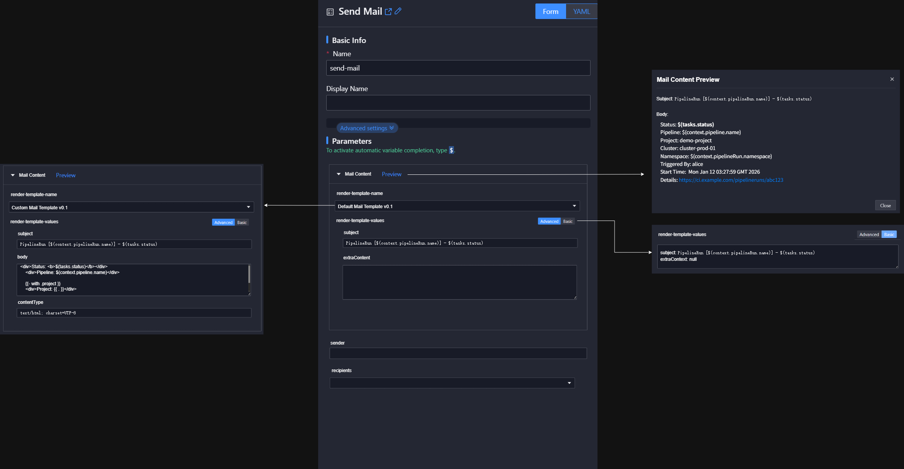

# TEP-0009: Send Mail Task

## Summary

This proposal defines a Send Mail Task with template rendering via a mutating webhook, default templates, extended variables, and UI preview support. It enables rich mail notifications without requiring users to grant additional Kubernetes access in pipelines.

## Motivation

Mail notifications are a common pipeline requirement, but collecting pipeline metadata inside a TaskRun requires extra RBAC or kubeconfig. That adds friction and conflicts with the goal of a simple, reusable Task. Centralizing template rendering in tektoncd-enhancement and providing default templates improves usability while keeping configuration flexible.

### Goals

- Provide a Send Mail Task that is ready to use with minimal configuration.
- Render templates via a mutating webhook to avoid extra RBAC or kubeconfig in TaskRuns.
- Offer default templates and extended variables for richer mail content.
- Support a Preview workflow so users can see rendered results before execution.
- Keep the Task flexible for custom templates and SMTP configuration.

### Non-goals

- Implement rendering at TaskRun execution time or evaluate Tekton variables during gotemplate rendering.
- Require users to query pipeline metadata from within TaskRun scripts.
- Depend on ACP global-cluster notification mechanisms for mail delivery.

## Proposal

### Form Interaction

Group mail-related parameters in the form and provide a Preview feature so users can see the rendered template.

- Users must choose a template first.
  - `Default Mail Template`: the default template, which shows common pipeline info such as pipeline name, execution result, and details link.
  - `Custom Mail Template`: a custom template where users can define template content, subject, content type, and more.
- After a template is selected, the `render-template-values` param automatically shows supported parameters for user configuration.
  - `Default Mail Template` works out of the box and provides rich information without extra parameters.
  - `Custom Mail Template` pre-fills some common parameters for reference.
  - The string `render-template-values` param is actually YAML. Users can switch to `Basic` mode and edit the YAML directly.
- After filling the nested form for `render-template-values`, users can click `Preview` to see the rendered email.
  - The frontend sends a dry-run request, then uses the response `body` and `subject` params. Render the HTML in `body` and display it on the page.
  - Security note: treat `body`, `subject`, and any template-rendering text as untrusted input. If rendering HTML, sanitize it (or use a sandboxed iframe) to prevent script execution, inline event handlers, or URL-based injection.

Core params

- Template-related params. Users only need to select/fill the template in the form. The template is fetched and rendered via [Mutating Webhook](#mutating-webhook-intercept-taskrun-creation).
  - `render-template-name`: the name of the template to use.
  - `render-template-namespace` (advanced config, hidden in the UI form): the namespace of the template to use. Default is `kube-public`. If we later support project- or namespace-scoped templates, this parameter can be used.
  - `render-template-values`: the values to render the template. The content is YAML data used as variables for template rendering.
- Email-content params. They are not shown in the form and are auto-generated by the template. We do not recommend users specify these directly. If users need to customize email content, we recommend using `Custom Mail Template`, which allows gotemplate and injected [extended variables](#extended-variables) for more flexibility.
  - `subject`: the subject of the email.
  - `body`: the body of the email.
  - `content-type`: the content type of the email.



### Mutating Webhook: Intercept TaskRun Creation {#mutating-webhook-intercept-taskrun-creation}

Add a Mutating Admission Webhook.

- Intercept target: only TaskRuns that include the `render-template-name` param.
  - Avoid impacting other TaskRuns as much as possible. The most time-consuming webhook step is the HTTP request, so only handle TaskRuns that need it.
  - We cannot filter by TaskRun labels. TaskRun inherits Task labels during Tekton reconcile, and those labels are not available during the mutating webhook phase.
  - `matchConditions` is enabled by default since k8s 1.28. ACP v4.0 supports 1.31, 1.30, 1.29, and 1.28, so this field can be used in ACP v4.0.
- failurePolicy: Ignore
  - A webhook failure only affects the send-mail TaskRun. Returning failure would fail the PipelineRun, so set failurePolicy to Ignore.
  - When the webhook fails, because params like `body` and `subject` are not automatically populated, the email will fail to send.
  - If the webhook fails during tektoncd-enhancement processing, a `tekton.alaudadevops.io/template-render-error` annotation is added to the TaskRun. The Task uses the Kubernetes Downward API mechanism to pass this info into the env, and the script reads the env to display the error on the page, helping users troubleshoot. For more details, see [Template Rendering](#template-rendering)

Here is the content of the MutatingWebhookConfiguration:

```yaml
apiVersion: admissionregistration.k8s.io/v1
kind: MutatingWebhookConfiguration
metadata:
  name: template-body-injector
webhooks:
- name: template-body-injector.mycompany.com
  admissionReviewVersions: ["v1"]
  # Allow dryRun; webhook validation does not affect the API server.
  sideEffects: None
  # Ignore failures if the webhook execution fails.
  failurePolicy: Ignore
  # Match all TaskRun versions.
  matchPolicy: Equivalent
  # Match TaskRun CREATE events.
  rules:
  - operations: ["CREATE"]
    apiGroups: ["tekton.dev"]
    apiVersions: ["v1"]
    resources: ["taskruns"]
    scope: "Namespaced"
  # Only match TaskRuns that include render-template-name to avoid impacting others.
  matchConditions:
  - name: has-template-param
    expression: "object.spec.params.exists(p, p.name == 'render-template-name' && has(p.value) && p.value != '')"

  clientConfig:
    service:
      namespace: tekton-pipelines
      name: tektoncd-enhancement-webhook
      path: /mutate-taskrun
      port: 443
    caBundle: <...>
```

### Variables Available in Templates

#### Tekton Built-in Variables

Common variables available in templates:

1. Pipeline name: `$(context.pipeline.name)`
2. PipelineRun name: `$(context.pipelineRun.name)`
3. PipelineRun namespace: `$(context.pipelineRun.namespace)`
4. Overall status of tasks in the Pipeline: `$(tasks.status)` (only available in finally tasks)
5. Status of a specific task in the Pipeline: `$(tasks.<pipelineTaskName>.status)`
6. Result of a specific task in the Pipeline: `$(tasks.<taskName>.results.<resultName>)`

Tekton has many other [built-in variables](https://tekton.dev/docs/pipelines/variables/) that can be used in mail templates.

#### Extended Variables {#extended-variables}

Although Tekton provides many built-in variables, mail templates still need additional common variables. For template usage, see [Default Mail Template](#default-mail-template), for example `{{.detailsURL}}` in `body.tpl`.

- `detailsURL`: link to the pipeline details page
  - Source: read the `platformURL` field from the `global-info` ConfigMap in `kube-public`, then append `/console-acp/workspace/<project>~<cluster>~<namespace>/pipeline/pipelineRuns/detail/<pipelineRunName>`.
  - Compatibility: the frontend currently hard-codes the path prefix. When the frontend changes, update this logic accordingly.
  - tektoncd-enhancement will expose the detailsURL assembly via configuration so users can quickly adjust it to their needs (e.g., change `detailsURL` to an approval link) without modifying templates one by one.
  - If users need to link to the Task details page within a PipelineRun, they can append `?tab=task_overview&id=<taskRunName>` to the URL.
- `platformURL`: link to the platform
  - Source: the `platformURL` field from the `global-info` ConfigMap in `kube-public`
  - Users can use this variable to build links themselves
  - However, we cannot use `platformURL` in the default template to assemble the pipeline access URL directly. If the access URL changes in the future, we would not be able to update the default template content automatically. The default template should use `detailsURL` instead. This moves the link assembly logic to the Mutating Webhook stage, so we can update the value in new versions.
- `startsAt`: pipeline start time
  - Source: `metadata.creationTimestamp` of the PipelineRun
  - ACP provides the `cpaas.io/updated-at` annotation, but it is not clearly defined and can be mistaken for TaskRun update time. Use a new annotation instead.
- `creator`: pipeline trigger user
  - Reuse the existing annotation: `cpaas.io/creator`
  - This is the account name. Getting the display name would require calling the User CR in the global cluster, which is out of scope for this phase.
- `project`: pipeline project name
  - Source: query the namespace annotation `cpaas.io/project` by `metadata.namespace` of the PipelineRun
  - This is the project name. Getting the display name would require calling the Project CR in the global cluster, which is out of scope for this phase.
- `cluster`: pipeline cluster name
  - Source: query the namespace annotation `cpaas.io/cluster` by `metadata.namespace` of the PipelineRun
  - This is the cluster name. Getting the display name would require calling the Cluster CR in the global cluster, which is out of scope for this phase.

Most of these parameters can be obtained from the PipelineRun, but getting PipelineRun info inside a TaskRun script requires Kubernetes credentials. This would force users to configure RBAC or mount credentials, which conflicts with our design principles.
Therefore, tektoncd-enhancement provides these variables via template parameters.

Since users may run the Send Mail Task directly in a TaskRun (e.g., scheduled emails), the variables above should also support the direct TaskRun scenario. This allows users to customize mail content as needed.

### Fetch Templates

Templates are stored in ConfigMaps in the `kube-public` namespace. In theory, all users can access this namespace (mention special cases in product docs later).
Templates are shipped with the catalog and replace old versions on upgrade, similar to the previous overview template.

A Task cannot mount this ConfigMap directly because it is in a different namespace.
Also, querying the ConfigMap via kubectl in a TaskRun requires extra RBAC resources or kubeconfig, which adds user overhead.

So, templates are fetched during the mutating webhook phase. tektoncd-enhancement uses the `render-template-name` param to fetch the ConfigMap.

### Default Templates

Provide two default templates:

1. `Default Mail Template`: a ready-to-use template with basic pipeline information, requiring no extra parameters.
2. `Custom Mail Template`: an empty template where users define `body`, `subject`, and `content-type` directly.

The template engine is [gotemplate](https://pkg.go.dev/text/template).

The ConfigMap contains three params:

1. `subject.tpl`: mail subject
2. `body.tpl`: mail body
3. `content-type.tpl`: mail content type

All support gotemplate syntax. The param name is the key without the `.tpl` suffix.

There are two types of template params:

- Params that start with `values`
  - Source: configured by the user in `render-template-values`
  - Example: `{{.values.extraContent}}`
  - A dynamic nested form should be defined in the ConfigMap so users can fill `render-template-values`.
  - All params can contain gotemplate syntax, and the server renders them again. Values params can reference non-values params, but **values params cannot reference each other**.
- Other params
  - Source: injected automatically by tektoncd-enhancement
  - Example: `{{.detailsURL}}`
  - For supported variables, see [Extended Variables](#extended-variables).

The template also supports native Tekton params such as `$(tasks.status)`.
These params are injected at execution time, so they remain after template rendering.

> Limitation: Tekton array-type results cannot be iterated directly.
> Alternative: In tektoncd-enhancement extended variables, support fetching results from predecessor tasks to make iteration easier for users.

Provide documentation on template configuration to guide users on custom templates.

Assume the cluster already has many pipelines using the default template. If users want to adjust the template used by those pipelines, the most convenient approach is to modify the default template directly.
Therefore, we will set the `operator.tekton.dev/resource-policy: keep` annotation on the default template so the resource is no longer managed by TektonInstallerSet. This prevents user changes from being overwritten.
If we need to adjust the template in later iterations, we should bump the template version and mark it with the `tekton.alaudadevops.io/template-version` annotation.

#### Default Mail Template {#default-mail-template}

User-configurable variables:

1. `subject`: mail subject, default `PipelineRun [$(context.pipelineRun.name)] - $(tasks.status)`
2. `extraContent`: extra content to append to the email
3. `timeFormat` (advanced config, hidden in the UI form): time format, default `Mon Jan _2 15:04:05 MST 2006` (Unix time format)
4. `timeZone` (advanced config, hidden in the UI form): time zone, default is the tektoncd-enhancement time zone. If users need to change the time zone in the template, they can adjust the tektoncd-enhancement time zone via tektonconfig.

Here is the ConfigMap of the default template:

```yaml
apiVersion: v1
kind: ConfigMap
metadata:
  name: default-mail-template-0.1
  namespace: kube-public
  labels:
    # The template engine used by this template, with room for future engines.
    tekton.alaudadevops.io/template-engine: gotemplate
    # The template type, with room for future types, such as webhook.
    tekton.alaudadevops.io/template-type: mail
  annotations:
    # Used by tektoncd-operator to deploy the ConfigMap to metadata.namespace instead of the TektonInstallerSet namespace.
    operator.tekton.dev/preserve-namespace: "true"
    # Detach this resource from TektonInstallerSet management
    operator.tekton.dev/resource-policy: keep
    # Mark this template as a system-provided default.
    tekton.alaudadevops.io/source: system
    # Display name for the template.
    tekton.alaudadevops.io/template-display-name: "Default Mail Template v0.1"
    # Version of the template.
    tekton.alaudadevops.io/template-version: "0.1"
    # Define the nested dynamic form so users can fill render-template-values.
    # The exact syntax will be added once the frontend decides. Required params are listed below.
    style.tekton.dev/descriptors: ""
data:
  subject.tpl: "{{ .values.subject }}"
  body.tpl: |
    {{- $timeFormat := or .values.timeFormat "Mon Jan _2 15:04:05 MST 2006" -}}
    {{- $timeZone := or .values.timeZone .timeZone -}}

    <div>
      Status:
      <span style="color: {{- if or (eq .status "Succeeded") (eq .status "Completed") -}}green{{- else if eq .status "Failed" -}}red{{- else -}}gray{{- end -}};">
        {{ .status }}
      </span>
    </div>

    <div>Pipeline: $(context.pipeline.name)</div>

    {{- with .project }}
    <div>Project: {{ . }}</div>
    {{- end }}

    {{- with .cluster }}
    <div>Cluster: {{ . }}</div>
    {{- end }}

    <div>Namespace: $(context.pipelineRun.namespace)</div>

    {{- with .creator }}
    <div>Triggered By: {{ . }}</div>
    {{- end }}

    <div>Start Time: {{ dateFormatWithZone .startsAt $timeFormat $timeZone }}</div>

    {{- with .detailsURL }}
    <div>Details: <a href="{{ . }}" target="_blank" rel="noopener noreferrer">{{ . }}</a></div>
    {{- end }}

    {{- with .extraContent }}
    {{ . }}
    {{- end }}

  content-type.tpl: "text/html; charset=UTF-8"
```

Rendered result:

```html
subject: PipelineRun [$(context.pipelineRun.name)] - $(tasks.status)

body:
<div>Status: <b>$(tasks.status)</b></div>
<div>Pipeline: $(context.pipeline.name)</div>
<div>Project: demo-project</div>
<div>Cluster: cluster-prod-01</div>
<div>Namespace: $(context.pipelineRun.namespace)</div>
<div>Triggered By: alice</div>
<div>Start Time: 2026-01-20 20:05:12</div>
<div>Details: <a href="https://ci.example.com/pipelineruns/abc123" target="_blank" rel="noopener noreferrer">https://ci.example.com/pipelineruns/abc123</a></div>
```

Note: although [Extended Variables](#extended-variables) can be used directly in a standalone TaskRun (not as a Task in a Pipeline), the Default Mail Template does not adapt to this scenario.
Because the Default Mail Template is designed to send pipeline run results, including the current TaskRun info in the Default Mail Template is not very meaningful. Users should use [Extended Variables](#extended-variables) to compose mail content themselves.

#### Custom Mail Template

User-configurable variables:

1. `subject`: mail subject
2. `body`: mail content
3. `contentType`: mail content type

You may add default values for these variables in the dynamic form for user reference.

```yaml
apiVersion: v1
kind: ConfigMap
metadata:
  name: custom-mail-template-0.1
  namespace: kube-public
  labels:
    tekton.alaudadevops.io/template-engine: gotemplate
    tekton.alaudadevops.io/template-type: mail
  annotations:
    operator.tekton.dev/preserve-namespace: "true"
    operator.tekton.dev/resource-policy: keep
    tekton.alaudadevops.io/source: system
    tekton.alaudadevops.io/template-display-name: "Custom Mail Template v0.1"
    tekton.alaudadevops.io/template-version: "0.1"
    style.tekton.dev/descriptors: ""
data:
  subject.tpl: "{{ .values.subject }}"
  body.tpl: "{{ .values.body }}"
  content-type.tpl: "{{ .values.contentType }}"
```

### Template Rendering {#template-rendering}

After tektoncd-enhancement receives the webhook request:

1. Read `render-template-name`, `render-template-namespace` and `render-template-values` params from the TaskRun.
2. Fetch the template specified by `render-template-name` and `render-template-namespace`.
3. Generate extended variables (for example, `detailsURL`). For supported variables, see [Extended Variables](#extended-variables).
4. Render `render-template-values` with extended variables (because `render-template-values` also supports gotemplate).
5. Render all `tpl` entries in the template ConfigMap data using the rendered `render-template-values` and the extended variables.
6. Append the rendered results to the TaskRun as params (param names are the ConfigMap data keys without the `.tpl` suffix), overwriting duplicates.

tektoncd-enhancement must also support dry-run. Some extended variables may not be available in dry-run mode, so provide temporary values for display.

If template rendering fails, a `tekton.alaudadevops.io/template-render-error` annotation is added to the TaskRun. The Task uses the Kubernetes Downward API mechanism to pass this info into the env, and the script reads the env to display the error on the page, helping users troubleshoot.

```yaml
apiVersion: tekton.dev/v1
kind: Task
metadata:
  name: send-mail
spec:
  steps:
    - name: send-mail
      image: sendmail:latest
      env:
      - name: TEMPLATE_RENDER_ERROR
        valueFrom:
          fieldRef:
            fieldPath: metadata.annotations['tekton.alaudadevops.io/template-render-error']
      script: |
        if [ ! -z "$TEMPLATE_RENDER_ERROR" ]; then
          echo "Template render error: $TEMPLATE_RENDER_ERROR"
          exit 1
        fi
```

### Parameter Quick Selection

Some Send Mail Task params can reuse ACP configuration or be managed centrally to reduce pipeline authoring effort and maintenance cost.

#### Recipients

When implementing the approver dropdown, the frontend already investigated an API that can return users based on the current user's permissions, including email addresses.

Reuse the same mechanism from the approval Task.

#### SMTP Server Address and Credentials

The `Administrator > System Settings > Servers` page supports configuring SMTP server address and credentials, stored in the `platform-email-server` Secret in `cpaas-system` on the global cluster.

Although the global cluster distributes tokens to business clusters, accessing the global cluster from business clusters is not recommended.

Also, most users do not have access to Secrets under `cpaas-system`, so they cannot use the dynamic form configuration API to fetch the SMTP server address.

Consider using connector capabilities in the future to share configuration and credentials across the cluster:

- Add a general connector type to manage credentials (for example, mail or webhook servers) and mount them directly into Tasks.
- The connector could reuse ACP configuration, though cross-cluster access remains an issue.

#### Sender

Sender info is usually maintained with the SMTP server configuration:

- The `platform-email-server` Secret in ACP contains sender configuration.
- The `msmtp` config file contains sender information.

If a connector is used for SMTP server config, sender info can be fetched from the connector as well.

> Note: the sender dropdown should not include the current user's email address to avoid misleading users.

### Send Mail Task Design

ACP has a [mail/webhook sending mechanism](https://confluence.alauda.cn/pages/viewpage.action?pageId=161393668). Sending a NotificationMessage to the global cluster allows use of the mail server configured in ACP. The [Subscribed feature in devops v3](https://confluence.alauda.cn/pages/viewpage.action?pageId=168304440) uses this mechanism.
However, this depends heavily on ACP features and requires business clusters to call the global cluster, so it is not considered. We will implement email sending ourselves and reuse ACP configuration where possible.

The [sendmail](https://artifacthub.io/packages/tekton-task/tekton-catalog-tasks/sendmail) Task in ArtifactHub uses Python `smtplib` and provides only a few parameters, which is not flexible enough.

In our scenario, avoid heavy dependencies like Python and prefer shell-based implementation.

Provide an out-of-the-box experience while supporting flexible configuration.

#### CLI Choice

- ✅ [msmtp](https://marlam.de/msmtp/) (recommended): lightweight SMTP client; supports SMTP host/port, AUTH, STARTTLS/TLS, cert validation, and credentials.
- ✅ curl: supports SMTP/SMTPS, AUTH, STARTTLS, and MIME content (useful for temporary or scripted use).

##### msmtp (recommended)

A dedicated SMTP client designed to "send mail like sendmail".

Supports credential and TLS configuration via config file (STARTTLS and SMTPS).

```
# ~/.msmtprc
# Global defaults
defaults
auth           on
tls            on
# Certificate validation: strongly recommended to keep on
tls_certcheck  on

# ====== Account 1: 587 + STARTTLS (most common) ======
account work_starttls
host smtp.example.com
port 587

# STARTTLS: EHLO in plaintext, then upgrade to TLS
tls_starttls   on

# Username/sender (many SMTP servers require From to be the account or an authorized address)
user your_user@example.com
from your_user@example.com

# Password read from file (ideally mounted from Secret with 0400/0600 permissions)
# The file contains only the password
passwordeval "cat /tekton/secret/smtp_password"

# CA bundle
# Use a file path that points to the CA bundle
tls_trust_file /tekton/secret/ca-bundle.pem


# ====== Account 2: 465 + SMTPS (implicit TLS) ======
account work_smtps
host smtp.example.com
port 465

# SMTPS: TLS handshake on connect, so STARTTLS must be off
tls_starttls   off

user your_user@example.com
from your_user@example.com
passwordeval "cat /tekton/secret/smtp_password"

tls_trust_file /etc/ssl/certs/ca-certificates.crt


# ====== Select default account ======
account default : work_starttls
```

Send mail supports To/Cc/Bcc. Bcc can be provided via `msmtp -t`.

```shell
cat <<'EOF' | msmtp -t a@example.com b@example.com c@example.com d_bcc@example.com
From: "CI Bot" <your_user@example.com>
To: a@example.com, b@example.com
Cc: c@example.com
Subject: Confidential
Content-Type: text/plain; charset=UTF-8

This mail has a Bcc recipient, but no Bcc header.
EOF
```

Pros:

- Config file and multi-account support: ideal for sharing a Secret-mounted config.
- sendmail-compatible interface: `-t` parses To/Cc/Bcc from headers, which matches the "write an email and send it" workflow.
- Better credential management: passwords can live in Secret files instead of CLI args.
- Logs focus on SMTP flow (better for mail troubleshooting).

Cons:

- Requires installing msmtp in the image.

##### curl

```shell
cat > mail.txt <<'EOF'
From: "CI Bot" <your_user@example.com>
To: a@example.com, b@example.com
Cc: c@example.com
Subject: curl smtp test
Content-Type: text/plain; charset=UTF-8

hello from curl
EOF

curl --ssl-reqd \
  --url "smtp://smtp.example.com:587" \
  --user "your_user@example.com:YOUR_PASSWORD" \
  --mail-from "your_user@example.com" \
  --mail-rcpt "a@example.com" \
  --mail-rcpt "b@example.com" \
  --mail-rcpt "c@example.com" \
  --mail-rcpt "bcc_hidden@example.com" \
  --upload-file mail.txt
```

Credentials can be managed via a `.netrc` file.

```shell
cat > /tmp/smtp.netrc <<'EOF'
machine smtp.example.com
login your_user@example.com
password YOUR_PASSWORD
EOF

curl --netrc-file /tmp/smtp.netrc \
  --ssl-reqd --url "smtp://smtp.example.com:587" \
  --mail-from "your_user@example.com" \
  --mail-rcpt "to@example.com" \
  --upload-file mail.txt
```

Pros:

- Minimal dependencies: curl is available in many base images.
- Supports SMTP/SMTPS/STARTTLS, basic auth, and TLS-related flags.
- More flexible for proxy or tunneling scenarios via CLI options.

Cons:

- Weak config management: relies on CLI args instead of config files.

#### Task Definition

##### Params

* `render-template-name`: template name
* `render-template-values`: template values
* `sender`: sender
* `recipients`: recipients
* `subject`: subject
* `body`: body
* `content-type`: body content type, default `text/plain`, optional `text/html`
* `extra-header`: extra mail headers
* `smtp-host`: SMTP server host
* `smtp-port`: SMTP server port
* `extra-config`: extra settings for the `.msmtprc` file
* `pre-script`: script to run before sending mail
* `tls-trust-file`: CA cert path; when a ca-bundle workspace is provided, set `tls-trust-file` in `.msmtprc` (default CA file name is `ca-bundle.pem`)

##### Workspace

> By default, generate a `.msmtprc` file from params for convenience.
> If the msmtp-config workspace is provided, use its `.msmtprc` file first and ignore other params used to generate `.msmtprc`.

* source
* msmtp-config: `.msmtprc` file. If provided, use this file first and ignore other params used to generate `.msmtprc`.
* msmtp-password: SMTP password. If provided, set the `passwordeval` entry in `.msmtprc` automatically.
* ca-bundle: CA cert. If provided, set the `tls-trust-file` entry in `.msmtprc` automatically.

#### Recommended Task Configuration

Recommend using this Task as a finally task to avoid impacting the main flow.

Add when conditions for specific scenarios.

Use [Tekton variables](https://tekton.dev/docs/pipelines/variables/) to determine Task results and whether to send mail (the UI already supports auto-completion for these variables).

- `tasks.<pipelineTaskName>.status`: the execution status of the specified pipelineTask, only available in finally tasks. The status can be Succeeded, Failed, or None.
- `tasks.status`: an aggregate status of all pipelineTasks under the tasks section (excluding the finally section). Only available in finally tasks. Values can be Succeeded, Failed, Completed, or None.
- `tasks.<taskName>.results.<resultName>`: the value of the Task result.

Consider providing quick condition selection in the UI to auto-fill when conditions:

- Pipeline succeeds/completes (`tasks.status=Succeeded/Completed`)
- Pipeline fails (`tasks.status=Failed`)

Users can set the Task to `onError: continue` to avoid interrupting the main flow.

The UI does not support this yet; consider adding support.

## Implementation Plan

### tektoncd-enhancement

1. Intercept TaskRun creation requests.
2. Read the template from a ConfigMap based on the `render-template-name` param.
3. Provide extended variables.
4. Render the template using extended variables and `render-template-values`, then generate `body`, `subject`, and `content-type` params with Preview support.

### catalog

1. Maintain the default templates.
2. Add a `send-mail` Task.
3. Support quick selection for some Task parameters.

### Frontend

* Dynamic forms should support nested form configuration and read nested forms from ConfigMap.
* Provide `Preview` capability.
* Support `onError: continue` for Tasks.
* Provide auto-fill for when conditions.
