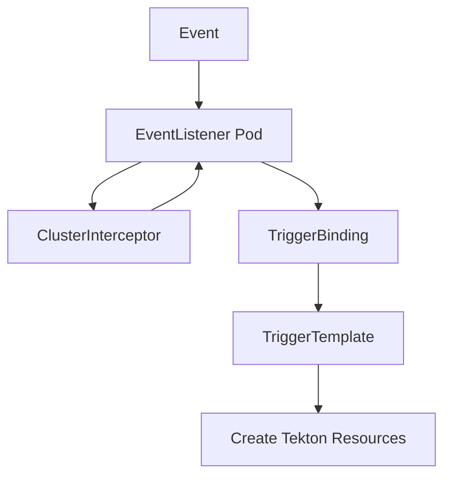
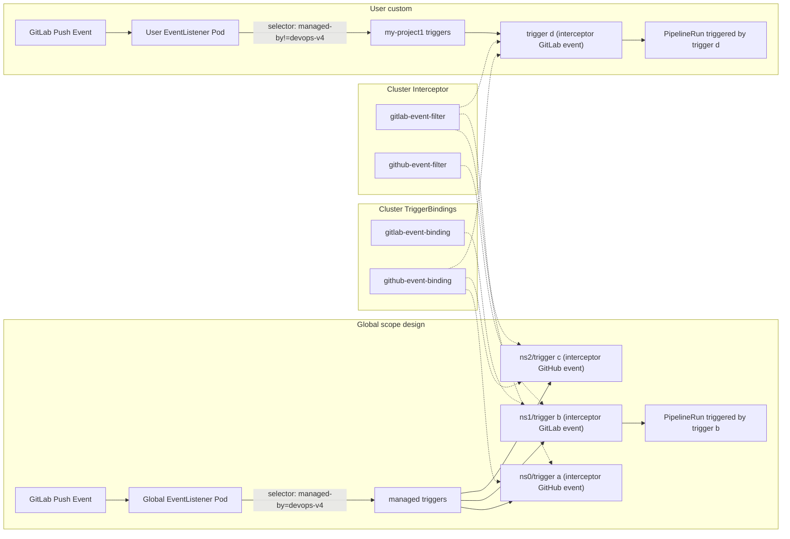
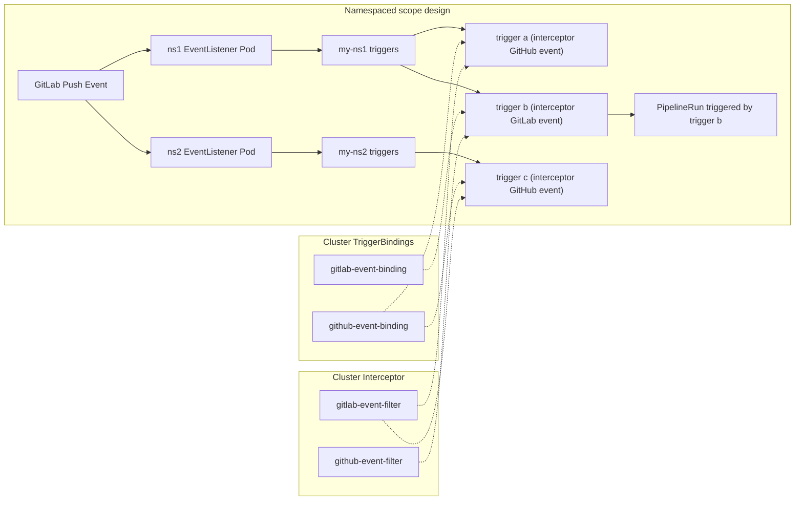
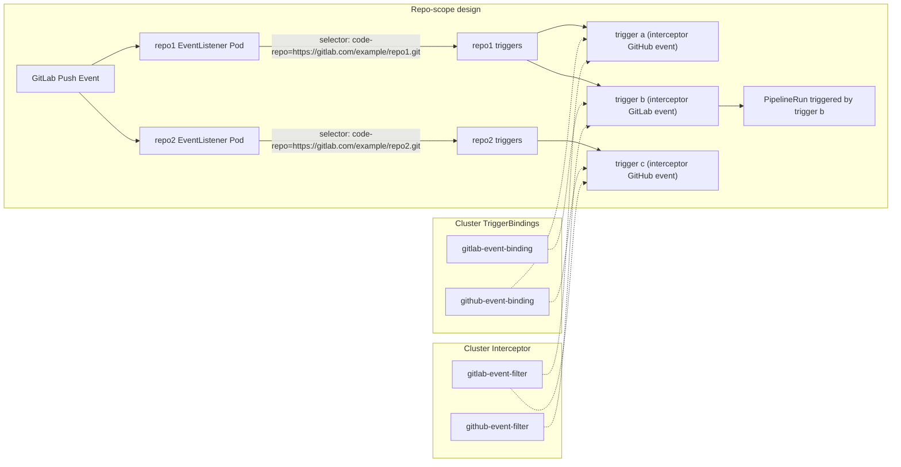
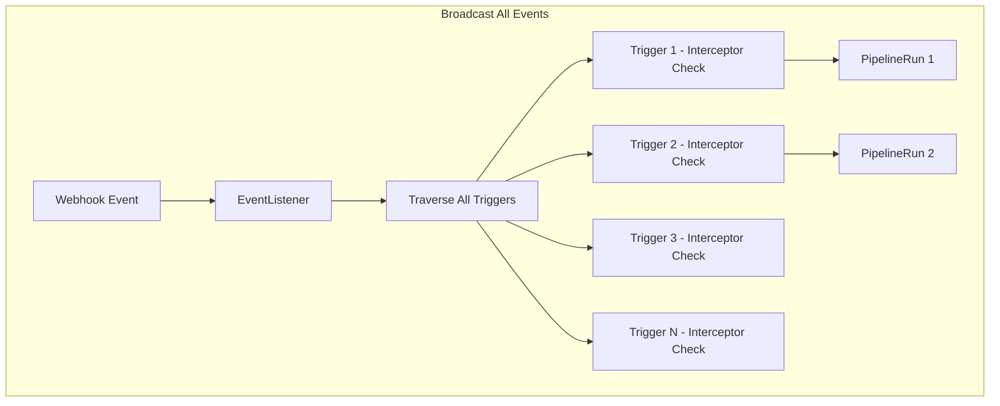
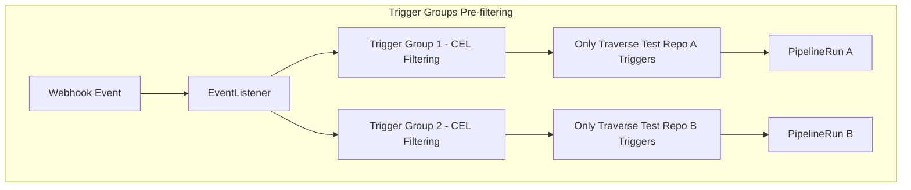

# TEP-0003: Tekton Triggers Webhook Design and Easy Configuration

## Summary

This proposal aims to provide a comprehensive design for `Tekton Triggers` webhook configuration, focusing on easy setup, multiple trigger management, and automated webhook registration. The design addresses common DevOps scenarios where multiple tools need to trigger pipelines through a unified webhook endpoint.

## Motivation

In DevOps environments, teams often use multiple tools (`GitHub`, `GitLab`, `Nexus`, `Harbor`, etc.) that need to trigger CI/CD pipelines. Currently, configuring triggers & webhooks for each tool creates complexity and maintenance overhead. This proposal addresses the need for:

- Unified webhook endpoints for multiple event sources
- Simplified trigger configuration and management
- Automated webhook registration capabilities
- Support for scheduled and custom triggers

### Goals

- Enable multiple triggers to use the same `EventListener` webhook endpoint
- Provide easy webhook URL configuration and discovery
- Implement automatic webhook registration for common tools
- Support scheduled triggers, binary triggers, and image triggers

### Non-Goals

- Modifying core `Tekton Triggers` functionality
- Supporting all possible webhook event types
- Implementing custom authentication mechanisms beyond standard webhook security

## Proposal

This proposal provides a comprehensive solution for trigger & webhook configuration in `Tekton Triggers`, addressing multiple aspects of trigger management from technical implementation to user experience. The solution leverages existing `Tekton Triggers` APIs while providing enhanced capabilities for multi-tool integration and automated management.

### Notes and Caveats

- The solution builds upon existing `Tekton Triggers` functionality without modifying core APIs
- Performance considerations are critical when multiple triggers share the same `EventListener`
- Authentication and authorization mechanisms need to be carefully designed for security
- Automatic webhook registration requires external tool APIs (e.g. `connector`)

## Design Details

### Multiple Triggers Using the Same EventListener

Taking common triggers/event sources as examples, if there are currently `nexus`/`harbor`/`gitlab`/`github`, and users want to configure their webhooks to point to the same `EventListener`, or use the same webhook address, how should this be implemented?

An `EventListener` can be configured with multiple triggers, for example:

```yaml
apiVersion: triggers.tekton.dev/v1beta1
kind: EventListener
metadata:
  name: multi-source-listener
spec:
  serviceAccountName: tekton-triggers-sa
  triggers:
    - name: harbor-trigger
      binding:
        ref: harbor-trigger-binding # `binding` is responsible for parsing values from event payload and binding them to params
      template:
        ref: harbor-trigger-template # `template` is responsible for defining how to execute `pipelineRun` based on params
    - name: nexus-trigger
      binding:
        ref: nexus-trigger-binding
      template:
        ref: nexus-trigger-template
    - name: github-trigger
      binding:
        ref: github-trigger-binding
      template:
        ref: github-trigger-template
    - name: gitlab-trigger
      binding:
        ref: gitlab-trigger-binding
      template:
        ref: gitlab-trigger-template
```

However, this alone is not enough, because these triggers cannot distinguish event sources and cannot filter out events from other types of tools. If you want events from specific tools to only trigger specified triggers, you need to implement this through proper `interceptor` configuration.

Currently, `tektoncd-triggers` has two types of interceptors: one is the built-in legacy interceptor in `tektoncd-triggers`, which [will be deprecated](https://tekton.dev/docs/triggers/interceptors/#overview) in the future, and the other is standalone independent interceptor services. We will use standalone interceptors in subsequent documentation.

### Interceptor Types

The following diagram illustrates how events flow through the `EventListener` and interact with `Interceptors` to create `Tekton Resources`:



`Tekton Triggers` supports two types of interceptors based on their scope:

#### ClusterInterceptor

`ClusterInterceptors` are cluster-scoped Custom Resource Definitions (CRD) that can be used across all namespaces in the cluster. They specify an external Kubernetes v1 Service running custom business logic that receives event payloads from `EventListeners` via HTTP requests and returns processed versions of the payload.

**Key Features:**
- Cluster-wide availability across all namespaces
- Typically installed by cluster administrators
- Provide common functionality for all users

**Built-in Examples:**
- `cel` - Common Expression Language interceptor for filtering and transformation
- `github` - GitHub webhook validation and event processing  
- `gitlab` - GitLab webhook validation and event processing
- `bitbucket` - Bitbucket webhook validation and event processing

#### Namespaced Interceptor

`Namespaced Interceptors` are namespace-scoped Custom Resource Definitions (CRD) that can only be used within their specific namespace. They function similarly to `ClusterInterceptors` but with restricted scope.

**Key Features:**
- Namespace-scoped resources using the `Interceptor` resource (not `ClusterInterceptor`)
- Created and managed by namespace users
- Ideal for custom functionality or sensitive operations

**Key Differences:**
- **Scope**: `ClusterInterceptors` are cluster-wide, `Namespaced Interceptors` are namespace-specific
- **Access**: `ClusterInterceptors` can be referenced from any namespace, `Namespaced Interceptors` only from their own namespace
- **Management**: `ClusterInterceptors` are managed by cluster admins, `Namespaced Interceptors` by namespace users
- **Use Cases**: Use `ClusterInterceptors` for common functionality, `Namespaced Interceptors` for custom or sensitive operations
- **Resource Type**: `ClusterInterceptors` use `ClusterInterceptor` CRD, `Namespaced Interceptors` use `Interceptor` CRD


### Interceptor Configuration

`Interceptors` are crucial for filtering and processing events from different sources. The following sections detail the available interceptor types and their configurations.

#### CEL Interceptor

`Tektoncd` implements a `CEL` interceptor for general-purpose filtering of event payloads. `CEL` syntax reference: https://github.com/google/cel-spec

#### Harbor Interceptor Example Configuration:

The following interceptor configuration will filter `PUSH_ARTIFACT`, `DELETE_ARTIFACT`, `SCANNING_FAILED` events from the `Harbor` event source

```yaml
apiVersion: triggers.tekton.dev/v1beta1
kind: EventListener
metadata:
  name: multi-tool-listener
spec:
  serviceAccountName: tekton-triggers-sa
  triggers:
    - name: harbor-filter
      interceptors:
        - ref:
            name: cel
            kind: ClusterInterceptor
            apiVersion: triggers.tekton.dev/v1beta1
          params:
            - name: "filter"
              value: "body.type in ['PUSH_ARTIFACT', 'DELETE_ARTIFACT', 'SCANNING_FAILED']"
      bindings:
        - ref: harbor-trigger-binding
      template:
        ref: harbor-trigger-template
```

#### Nexus Interceptor Example Configuration:

The following interceptor configuration will filter `CREATED`, `UPDATED`, `DELETED` events from `Nexus`

```yaml
apiVersion: triggers.tekton.dev/v1beta1
kind: EventListener
metadata:
  name: multi-tool-listener
spec:
  serviceAccountName: tekton-triggers-sa
  triggers:
    - name: nexus-filter
      interceptors:
        - ref:
            name: cel
            kind: ClusterInterceptor
            apiVersion: triggers.tekton.dev/v1beta1
          params:
            - name: "filter"
              value: "body.action in ['CREATED', 'UPDATED', 'DELETED']"
      bindings:
        - ref: nexus-trigger-binding
      template:
        ref: nexus-trigger-template
```

#### GitLab / GitHub Interceptor

`tektoncd-triggers/interceptor` implements `GitLab`/`GitHub` interceptors that can be used to filter events from `GitHub`/`GitLab`.

##### GitHub Interceptor Example Configuration:

The following configuration will filter `pull_request` `push` events from `Github`

```yaml
apiVersion: triggers.tekton.dev/v1beta1
kind: EventListener
metadata:
  name: multi-tool-listener
spec:
  serviceAccountName: tekton-triggers-sa
  triggers:
    - name: github-listener
      interceptors:
        - ref:
            name: "github"
            kind: ClusterInterceptor
            apiVersion: triggers.tekton.dev/v1beta1
          params:
          - name: "secretRef"
            value:
              secretName: github-secret
              secretKey: secretToken # Used for authenticating event sources
          - name: "eventTypes"
            value: ["pull_request","push"]
      bindings:
        - ref: github-trigger-binding
      template:
        ref: github-trigger-template
```

##### GitLab Interceptor Example Configuration:

The following configuration will filter `Push Hook` `Tag Push Hook` `Merge Request Hook` events from `GitLab`

```yaml
apiVersion: triggers.tekton.dev/v1beta1
kind: EventListener
metadata:
  name: multi-tool-listener
spec:
  serviceAccountName: tekton-triggers-sa
  triggers:
    - name: gitlab-listener
      interceptors:
        - ref:
            name: "gitlab"
            kind: ClusterInterceptor
            apiVersion: triggers.tekton.dev/v1beta1
          params:
          - name: "secretRef"
            value:
              secretName: gitlab-secret
              secretKey: secretToken # Used for authenticating event sources
          - name: "eventTypes"
            value: ["Push Hook", "Tag Push Hook", "Merge Request Hook"]
      bindings:
        - ref: gitlab-trigger-binding
      template:
        ref: gitlab-trigger-template
```

#### Tool Event Types

The following table lists common event types for different tools that can be integrated with Tekton Triggers:

| Tool | Event Type | Description | Use Case |
|------|------------|-------------|----------|
| **GitHub** | `push` | Code push to repository | Trigger build on code changes |
| | `pull_request` | Pull request opened/updated/closed | Trigger CI/CD pipeline for PR validation |
| | `release` | Release published | Trigger deployment pipeline |
| | `workflow_run` | GitHub Actions workflow completed | Trigger downstream processes |
| **GitLab** | `Push Hook` | Code push to repository | Trigger build on code changes |
| | `Tag Push Hook` | Tag created/updated | Trigger release pipeline |
| | `Merge Request Hook` | Merge request events | Trigger CI/CD pipeline for MR validation |
| | `Pipeline Hook` | GitLab CI pipeline completed | Trigger downstream processes |
| **Harbor** | `PUSH_ARTIFACT` | Image pushed to registry | Trigger deployment pipeline |
| | `DELETE_ARTIFACT` | Image deleted from registry | Trigger cleanup processes |
| | `SCANNING_FAILED` | Security scan failed | Trigger security alert processes |
| | `SCANNING_COMPLETED` | Security scan completed | Trigger security report processes |
| **Nexus** | `CREATED` | Artifact created | Trigger build processes |
| | `UPDATED` | Artifact updated | Trigger rebuild processes |
| | `DELETED` | Artifact deleted | Trigger cleanup processes |
| | `DOWNLOADED` | Artifact downloaded | Trigger usage tracking |

**Note**: This table shows the most commonly used event types. Each tool may support additional event types depending on the specific version and configuration. Refer to the respective tool's webhook documentation for a complete list of available events.


#### Complete Multi-Tool EventListener Example

Here's a complete example showing how to configure a single EventListener that handles events from multiple tools:

```yaml
apiVersion: triggers.tekton.dev/v1beta1
kind: EventListener
metadata:
  name: multi-tool-listener
  namespace: devops-system
spec:
  serviceAccountName: tekton-triggers-sa
  triggers:
    # Harbor trigger
    - name: harbor-trigger
      interceptors:
        - ref:
            name: cel
            kind: ClusterInterceptor
            apiVersion: triggers.tekton.dev/v1beta1
          params:
            - name: "filter"
              value: "body.type in ['PUSH_ARTIFACT', 'DELETE_ARTIFACT', 'SCANNING_FAILED']"
      bindings:
        - ref: harbor-trigger-binding
      template:
        ref: harbor-trigger-template
    
    # Nexus trigger
    - name: nexus-trigger
      interceptors:
        - ref:
            name: cel
            kind: ClusterInterceptor
            apiVersion: triggers.tekton.dev/v1beta1
          params:
            - name: "filter"
              value: "body.action in ['CREATED', 'UPDATED', 'DELETED']"
      bindings:
        - ref: nexus-trigger-binding
      template:
        ref: nexus-trigger-template
    
    # GitHub trigger
    - name: github-trigger
      interceptors:
        - ref:
            name: "github"
            kind: ClusterInterceptor
            apiVersion: triggers.tekton.dev/v1beta1
          params:
          - name: "secretRef"
            value:
              secretName: github-secret
              secretKey: secretToken
          - name: "eventTypes"
            value: ["pull_request","push"]
      bindings:
        - ref: github-trigger-binding
      template:
        ref: github-trigger-template
    
    # GitLab trigger
    - name: gitlab-trigger
      interceptors:
        - ref:
            name: "gitlab"
            kind: ClusterInterceptor
            apiVersion: triggers.tekton.dev/v1beta1
          params:
          - name: "secretRef"
            value:
              secretName: gitlab-secret
              secretKey: secretToken
          - name: "eventTypes"
            value: ["Push Hook", "Tag Push Hook", "Merge Request Hook"]
      bindings:
        - ref: gitlab-trigger-binding
      template:
        ref: gitlab-trigger-template
```

#### EventListener Namespace Constraints

`EventListeners` can be configured to work across the entire cluster or be constrained to specific namespaces based on your multi-tenant requirements:

**Default Behavior:**
- By default, `EventListeners` only process triggers defined within their own namespace
- To enable cluster-wide or multi-namespace processing, you must explicitly configure `namespaceSelector`

**Cluster-wide EventListener:**
- Use `namespaceSelector` with `matchNames: ["*"]` to process triggers from any namespace in the cluster
- Suitable for centralized webhook management scenarios
- Requires careful RBAC configuration to ensure proper security boundaries

**Namespace-constrained EventListener:**
- By default, `EventListeners` only process triggers defined within their own namespace
- Use `namespaceSelector` field to limit `EventListener` scope to specific namespaces, 
- Provides better isolation and security for multi-tenant environments
- Each namespace can have its own `EventListener` with tailored permissions

**Example Configuration:**

```yaml
apiVersion: triggers.tekton.dev/v1beta1
kind: EventListener
metadata:
  name: namespace-specific-listener
spec:
  serviceAccountName: tekton-triggers-sa
  triggerGroups:
  - name: my-project1
    triggerSelector:
      namespaceSelector:
        matchNames:
          - "my-project1-ns1"
          - "my-project1-ns2"
      labelSelector:
        matchLabels:
          project-name: my-project1
---
apiVersion: triggers.tekton.dev/v1beta1
kind: EventListener
metadata:
  name: global-listener
spec:
  serviceAccountName: tekton-triggers-sa
  triggerGroups:
  - name: my-project1
    triggerSelector:
      namespaceSelector:
        matchNames:
          - "*"
      labelSelector:
        matchLabels:
          managed-by: devops-v4
---
apiVersion: triggers.tekton.dev/v1beta1
kind: Trigger
metadata:
  name: my-project1-ns1-trigger
  namespace: my-project1-ns1
  labels:
    managed-by: devops-v4
    project-name: my-project1
    code-repo: https://gitlab.com/example/test-abc.git
spec:
  interceptors:
    - ref:
        name: "cel"
      params:
        - name: "filter"
          value: "header.match('X-GitHub-Event', 'pull_request')"
  bindings:
  - ref: gitlab-pr-binding
    kind: ClusterTriggerBinding
  template:
    ref: my-pipeline-template
```

#### Design Considerations: Cluster-scope vs Namespace-scope vs Repo-scope

The choice between cluster-scope and namespace-scope `EventListeners` represents a critical design decision that significantly impacts system architecture and user experience.

**Cluster-scope EventListener Approach:**



Using cluster-scope `EventListeners` positions them similarly to PAC controllers, where all projects share a single webhook endpoint and webhook secret, with a single `EventListener` serving as the entry point for all cluster triggers.

**Advantages:**
1. **Simplified Webhook Management**: Each GitLab repository only needs to configure one webhook to serve all projects, reducing manual webhook management costs and migration complexity for future automated webhook registration processes 
2. **Deployment Simplicity**: Built-in `EventListener` can be deployed directly when installing `tektoncd-triggers`, eliminating timing concerns for `EventListener` creation
3. **Performance Efficiency**: Since each repository registers at most one webhook, the same event is pushed and processed only once, reducing resource consumption

**Disadvantages:**
1. **Limited Event Filtering**: Tool-side webhook registration (e.g., on GitLab) cannot restrict event types; filtering must be handled entirely by interceptors for specific triggers
2. **No Namespace Performance Isolation**: Performance cannot be isolated by namespace; users requiring isolation must create independent `EventListeners` with documentation guidance

**Configuration Example:**

```yaml
apiVersion: triggers.tekton.dev/v1beta1
kind: EventListener
metadata:
  name: global-listener
spec:
  serviceAccountName: tekton-triggers-sa
  triggerGroups:
  - name: managed-triggers
    triggerSelector:
      namespaceSelector:
        matchNames:
          - "*"
      labelSelector:
        matchLabels:
          managed-by: devops-v4
---
apiVersion: triggers.tekton.dev/v1beta1
kind: Trigger
metadata:
  name: gitlab-trigger
  namespace: my-project1-ns1
  labels:
    managed-by: devops-v4
    project-name: my-project1
spec:
  interceptors:
    - ref:
        name: "gitlab"
        kind: ClusterInterceptor
        apiVersion: triggers.tekton.dev/v1beta1
      params:
      - name: "secretRef"
        value:
          secretName: gitlab-secret
          secretKey: secretToken
      - name: "eventTypes"
        value: ["Push Hook", "Tag Push Hook", "Merge Request Hook"]
  bindings:
    - ref: gitlab-trigger-binding
  template:
    ref: gitlab-trigger-template
```


**Namespace-scope EventListener Approach:**



**Advantages:**
- Provides better isolation and security boundaries
- Allows fine-grained control over event processing per `namespace`

**Disadvantages:**
1. **EventListener Creation Timing**: The timing of `EventListener` creation needs to be carefully determined
2. **Complex Webhook Management**: Tool-side webhook management becomes more complex, especially considering current manual webhook creation and potential future automated creation, leading to higher management costs and potential migration complexity

**Configuration Example:**

```yaml
apiVersion: triggers.tekton.dev/v1beta1
kind: EventListener
metadata:
  name: project1-ns1-listener
  namespace: my-project1-ns1
spec:
  serviceAccountName: tekton-triggers-sa
  namespaceSelector:
    matchNames:
      - "my-project1-ns1"
---
apiVersion: triggers.tekton.dev/v1beta1
kind: EventListener
metadata:
  name: project1-ns2-listener
  namespace: my-project1-ns2
spec:
  serviceAccountName: tekton-triggers-sa
  namespaceSelector:
    matchNames:
      - "my-project1-ns2"
---
apiVersion: triggers.tekton.dev/v1beta1
kind: Trigger
metadata:
  name: gitlab-trigger
  namespace: my-project1-ns1
spec:
  interceptors:
    - ref:
        name: "gitlab"
        kind: ClusterInterceptor
        apiVersion: triggers.tekton.dev/v1beta1
      params:
      - name: "secretRef"
        value:
          secretName: gitlab-secret
          secretKey: secretToken
      - name: "eventTypes"
        value: ["Push Hook", "Tag Push Hook", "Merge Request Hook"]
  bindings:
    - ref: gitlab-trigger-binding
  template:
    ref: gitlab-trigger-template
```


**Repo-scope EventListener Approach:**



The repo-scope approach creates one `EventListener` per Git repository, using the Git repository URL as a label to match trigger lists. This approach is similar to cluster-scope but provides repository-level isolation.

**Advantages:**
1. **Repository-level Pressure Isolation**: Each repository has its own `EventListener`, isolating pressure and performance impact between different repositories
2. **Simplified Webhook Management**: Similar to cluster-scope, each repository only needs to configure one webhook endpoint
3. **Clear Resource Boundaries**: Each repository's triggers and resources are clearly separated, making it easier to manage and troubleshoot
4. **Scalable Architecture**: Can handle high-traffic repositories independently without affecting others

**Disadvantages:**
1. **EventListener Creation Timing**: Requires careful determination of when to create `EventListener` for each repository, especially for new repositories or repository migrations
2. **Repository URL Duplication**: Multiple labels may correspond to the same repository (e.g., different URL formats like `https://gitlab.com/example/repo.git` vs `git@gitlab.com:example/repo.git`), leading to potential confusion and management complexity
3. **Resource Overhead**: Each repository requires its own `EventListener` pod, increasing resource consumption compared to cluster-scope approach
4. **Webhook Registration Complexity**: Need to register separate webhooks for each repository, increasing management overhead

**Configuration Example:**

```yaml
apiVersion: triggers.tekton.dev/v1beta1
kind: EventListener
metadata:
  name: repo-listener
  labels:
    code-repo: https://gitlab.com/example/my-repo.git
spec:
  serviceAccountName: tekton-triggers-sa
  triggerGroups:
  - name: my-repo-triggers
    triggerSelector:
      labelSelector:
        matchLabels:
          code-repo: https://gitlab.com/example/my-repo.git
---
apiVersion: triggers.tekton.dev/v1beta1
kind: Trigger
metadata:
  name: gitlab-trigger
  namespace: my-project1-ns1
  labels:
    code-repo: https://gitlab.com/example/my-repo.git
    project-name: my-project1
spec:
  interceptors:
    - ref:
        name: "gitlab"
        kind: ClusterInterceptor
        apiVersion: triggers.tekton.dev/v1beta1
      params:
      - name: "secretRef"
        value:
          secretName: gitlab-secret
          secretKey: secretToken
      - name: "eventTypes"
        value: ["Push Hook", "Tag Push Hook", "Merge Request Hook"]
  bindings:
    - ref: gitlab-trigger-binding
  template:
    ref: gitlab-trigger-template
```


### Webhook Address Management

Webhooks support exposure through `NodePort`/`ClusterIP`/`LoadBalancer`, but the community currently doesn't provide webhook address management and query capabilities. This design has been implemented through an automated solution: **trigger-wrapper controller**.

#### Automated Webhook Management with trigger-wrapper

The `trigger-wrapper` is a Kubernetes controller that automatically manages webhook addresses and Ingress rules for EventListeners. It eliminates the manual configuration overhead by:

- **Automatically watching** all EventListener resources across the cluster
- **Creating shared Ingress rules** based on configurable export rules
- **Automatically updating** EventListener annotations with external endpoint addresses
- **Supporting flexible selectors** for namespace and label-based EventListener matching

#### trigger-wrapper Configuration

The controller uses a YAML configuration file with export rules that define how EventListeners should be exposed:

```yaml
# trigger-wrapper configuration
export-rules:
  # Rule 1: Expose all EventListeners in tekton-pipelines namespace
  - name: "tekton-webhooks"
    ingressClass: global-alb2
    host: "*"
    externalHosts:
      - "https://tekton.example.com"
      - "https://backup.tekton.example.com"
    urlPathPrefix: "/devops/trigger-webhook"
    namespaceSelector:
      matchNames:
        - "tekton-pipelines"
        - "tekton-triggers"
  
  # Rule 2: Expose production EventListeners across all namespaces
  - name: "production-webhooks"
    ingressClass: nginx-prod
    host: "prod.example.com"
    externalHosts:
      - "https://prod.example.com"
    urlPathPrefix: "/prod/webhooks"
    namespaceSelector:
      matchNames:
        - "*"  # All namespaces
    labelSelector:
      matchLabels:
        environment: production
```

#### Automated Resource Creation

When an EventListener is detected, trigger-wrapper automatically:

1. **Creates shared Ingress rules** with paths like: `{urlPathPrefix}/{namespace}/{eventlistener-name}`
2. **Creates ExternalName Services** pointing to the EventListener's internal service
3. **Updates EventListener status.addresses** with external endpoint addresses and management information

**Example Result:**

For an EventListener named `github-webhook` in namespace `my-project`:

```yaml
apiVersion: triggers.tekton.dev/v1beta1
kind: EventListener
metadata:
  name: github-webhook
  namespace: my-project
spec:
  serviceAccountName: tekton-triggers-sa
  triggers:
    - name: github-push
      # ... trigger configuration
status:
  address:
    url: http://el-github-webhook.my-project.svc.cluster.local:8080
  addresses: 
  - url: "https://tekton.example.com/devops/trigger-webhook/my-project/github-webhook"
  - url: "https://backup.tekton.example.com/devops/trigger-webhook/my-project/github-webhook"
```

#### Advanced Selector Features

The trigger-wrapper supports sophisticated EventListener matching:

**Namespace Selectors:**
- `matchNames: ["default", "tekton-pipelines"]` - Match specific namespaces
- `matchNames: ["*"]` - Match all namespaces

**Label Selectors:**
- Match EventListeners with specific labels
- Support for complex label combinations

**Multiple Rule Matching:**
- One EventListener can match multiple export rules
- Each rule creates its own Ingress and Service
- All external addresses are aggregated in the EventListener `status.addresses`

#### Deployment Example

```yaml
apiVersion: apps/v1
kind: Deployment
metadata:
  name: trigger-wrapper
  namespace: ingress-system
spec:
  replicas: 1
  selector:
    matchLabels:
      app: trigger-wrapper
  template:
    metadata:
      labels:
        app: trigger-wrapper
    spec:
      serviceAccountName: trigger-wrapper
      containers:
      - name: trigger-wrapper
        image: trigger-wrapper:latest
        args:
        - --configmap=trigger-wrapper-config
        - --configkey=config.yaml
        - --namespace=ingress-system
        env:
        - name: POD_NAMESPACE
          valueFrom:
            fieldRef:
              fieldPath: metadata.namespace
```

This automated approach significantly reduces the manual overhead of webhook management while providing flexible configuration options for different environments and use cases.

### Authentication and Authorization

The Platform advanced API has no authorization and directly forwards original requests, so webhook authentication and authorization issues are not yet resolved.

For webhook event source authentication, especially for `Nexus` and `Harbor` authentication, refer to the next section. Related tool interceptors may need to be implemented as further supplements.

#### Webhook Interceptor for Custom Authentication

As seen above, for `GitHub`/`GitLab` interceptors, the community has implemented the ability to authenticate event sources based on secrets. However, for `Nexus` and `Harbor`, since these two types of tools currently don't have dedicated interceptors, only `CEL` interceptors can be used for filtering, so event source authentication cannot be implemented for now.

If you want to implement such authentication, you can connect to a custom interceptor through `webhook` interceptor, or contribute related logic to the community interceptor.

**Custom Authentication Example:**

```yaml
apiVersion: triggers.tekton.dev/v1beta1
kind: EventListener
metadata:
  name: custom-auth-listener
spec:
  serviceAccountName: tekton-triggers-sa
  triggers:
    - name: custom-auth-trigger
      interceptors:
        - ref:
            name: webhook
            kind: ClusterInterceptor
            apiVersion: triggers.tekton.dev/v1beta1
          params:
            - name: "url"
              value: "https://custom-auth-service.example.com/validate"
            - name: "header"
              value:
                - name: "Authorization"
                  value: "Bearer $(header.X-Custom-Token)"
      bindings:
        - ref: custom-trigger-binding
      template:
        ref: custom-trigger-template
```

### Automatic Webhook Registration

Currently, there is no capability to complete automatic webhook registration for various tools, so this goal may need to be implemented in multiple phases.

#### Provide Documentation

Initially provide documentation to guide users through the steps:

- Guide users on where to find webhook endpoints and corresponding token strings (provided that authentication is implemented)
- Guide users to use webhook endpoint addresses and token strings in corresponding tools to complete registration

#### Provide CLI Tool Similar to tkn-pac

One possible solution is to provide a `CLI` tool for semi-automatic registration, requiring users to fill in various required information, then having the `CLI` tool complete automatic registration.

```bash
$ tkn trigger webhook register
? Enter the repository url (default: https://github.com/tektoncd/pipeline):  
? Please select the type of the git platform to setup webhook: github / gitlab / nexus / harbor
? Please set up Webhook for Repository: https://example.io/trigger/webhook
? Please enter the token to access github api (default: xxxxx): xxxxxx
? Please enter the secret string to configure the webhook(default: xxxxx): xxxxx
ℹ ️You now need to create a GitHub personal access token, please checkout the docs
```

#### Support GitLab / GitHub / Nexus / Harbor Connector, and Automatically Register Webhooks Through Connector Proxy

Consider the final solution, which might be implementing connectors for various tools, then implementing productization capabilities for corresponding tools, calling tool APIs through `connector` proxy, thereby automatically completing webhook registration for user-selected repos, artifacts, and projects.

### Scheduled Execution

For scheduled trigger requirements, the current community has no ready-made solutions, only providing two implementation approaches as follows, reference: https://github.com/tektoncd/triggers/issues/69

#### K8s CronJob

The first implementation approach provided by the community is: creating a scheduled task through `k8s` `cronjob`, regularly executing jobs to push events to webhook endpoints.

Disadvantages:

- Counter-intuitive coupling: Whether it's documentation guiding users to create, or frontend/backend automatically creating based on requests, users will perceive that there is a non-business-related `cronjob` in their namespace. If they delete it as useless resources, it will affect pipeline triggering. This coupling is counter-intuitive.
- Performance issues: If it's just to send a simple `HTTP` request, creating a `cronjob` for each pipeline might be too heavy.
- Management issues: Once involving endpoint changes, trigger configuration changes, pipeline name changes, etc., `cronjob` updates and maintenance will also be inefficient.

example:

```yaml
# from https://github.com/tektoncd/triggers/tree/main/examples/v1beta1/cron
apiVersion: batch/v1beta1
kind: CronJob
metadata:
  name: hello
spec:
  schedule: "*/1 * * * *"
  jobTemplate:
    spec:
      template:
        spec:
          containers:
          - name: hello
            image: busybox
            args:
              - wget
              - --spider
              - el--cron-listener.default.svc.cluster.local:8080
          restartPolicy: Never
```

#### Cron Adapter
Another implementation approach provided by the community is to implement a standalone `cron` adapter service, specifically 
responsible for sending `HTTP` events to corresponding endpoints at specified times based on each pipeline's configuration 
(perhaps annotations).

If you want to implement an adapter, you can refer to some existing projects in the community. For example, the adapter implementation in [@https://github.com/vincent-pli/gitlabsource/](https://github.com/vincent-pli/gitlabsource/) provides a good reference for understanding how to create custom adapters that integrate with external systems.

## Performance Considerations

When implementing multiple triggers using the same `EventListener`, several performance considerations should be taken into account:

### Resource Management

- **Memory Usage**: Each trigger configuration consumes memory. Monitor memory usage with large numbers of triggers
- **CPU Usage**: `Interceptor` processing adds `CPU` overhead. Consider horizontal scaling for high-volume scenarios
- **Network Bandwidth**: Multiple concurrent webhook events can saturate network resources

### Scaling Strategies

1. **Horizontal Scaling**: Deploy multiple `EventListener` replicas to distribute load
2. **Namespace Isolation**: Use separate `EventListeners` for different namespaces or teams
3. **Tool-specific EventListeners**: Create dedicated `EventListeners` for high-volume tools

### EventListener Performance Optimization

The main performance consumption of `Trigger` lies in event distribution and processing. How to intercept events that do not need to be processed early is the key to improving `Trigger` performance from a business perspective.

This document provides three designs: `cluster-scope`, `namespace-scope`, and `repo-scope`. These three approaches essentially choose different emphases between "computing resources occupied by Pods" and "performance wasted by invalid event distribution":

- **Multiple EventListener Instances**: Different `EventListener` instances can be used to distribute events, reducing performance waste caused by repeated `Interceptor` judgments when distributing events to `Trigger`. However, multiple `EventListener` instances lead to resource waste and increased management costs for `Endpoint` and `Token`.
- **Single EventListener Instance**: Saves pod-occupied resources, but broadcasting events to all `Trigger` instances creates performance waste.

This section provides some techniques to save performance without increasing computing resources.

#### Setting Multiple Trigger Groups on EventListener and Configuring Interceptors

**Principle Description**:
`EventListener` supports configuring multiple `TriggerGroups` for separate broadcasting, thereby reducing the broadcast scope. Each group can set independent `Interceptor` for event pre-filtering. This avoids `EventListener` traversing all `Trigger` instances, but instead first filters out relevant `TriggerGroups` through `Interceptor`, then only traverses `Trigger` instances within that group.

**Advantages**:
- Can perform one or multiple screenings before traversing `Trigger` instances, reducing broadcast scope
- Reduces unnecessary `Trigger` judgments, improving overall performance
- For example: An `EventListener` is divided into `test-repo-a` and `test-repo-b` two `TriggerGroups` for separate broadcasting, thereby reducing the broadcast scope

**Disadvantages**:
- Introduces `Interceptor` in `EventListener`, increasing configuration complexity
- When the enumeration scope of filtering conditions increases, `EventListener` needs to be edited and `EventListener` pod needs to be restarted
- When adding new `namespace` or `repository`, new `TriggerGroups` need to be added to `EventListener`

**Configuration Example**:

```yaml
apiVersion: triggers.tekton.dev/v1beta1
kind: EventListener
metadata:
  name: optimized-listener
spec:
  serviceAccountName: tekton-triggers-sa
  triggerGroups:
  - name: test-a-triggers
    interceptors:
      - ref:
          name: "cel"
          kind: ClusterInterceptor
        params:
          - name: "filter"
            value: "body.repository=test-a"
    triggerSelector:
      labelSelector:
        matchLabels:
          repo: test-a
  - name: test-b-triggers
    interceptors:
      - ref:
          name: "cel"
          kind: ClusterInterceptor
        params:
          - name: "filter"
            value: "body.repository=test-b"
    triggerSelector:
      labelSelector:
        matchLabels:
          project: test-b
```

**Performance Comparison Diagram**:





**Real-world Application Scenario**:

Suppose you have a GitLab repository containing multiple projects, each with independent CI/CD pipelines. In the traditional approach, every code push triggers `Trigger` checks for all projects, even if only project-a's code has changed.

After optimization with `TriggerGroups`:
1. When project-a's code is pushed, the CEL `Interceptor` checks `body.repository.full_name.startsWith('project-a/')`
2. Only project-a's `TriggerGroup` will be triggered
3. project-b's `Trigger` instances will not be checked, saving computing resources
4. By configuring independent `TriggerGroups` for only a portion of high-frequency projects, while other low-frequency projects continue to share a wildcard `TriggerGroup`, frequent updates and extensions of `TriggerGroups` can be avoided

## Design Summary

After comprehensive consideration of requirements, security, performance, and ease of adoption, adopting the Namespace Scoped approach:

- Provide documentation to guide users on how to create EventListeners
- DevOps users in the namespace have permissions to Get/Create all EventListeners under the current namespace without requiring access to resources in other namespaces
- When pipeline users create Triggers, the frontend checks if a EventListener exists in the current namespace. If it doesn't exist, provide documentation links to guide users to Create a EventListener. 
  - trigger-wrapper will create ingress rules for EventListeners & update webhook url to the `addresses` field of the EventListener status.
- When users create / update a Trigger, trigger-wrapper performs routing analysis, determines which EventListeners could potentially route to the newly created Trigger, then writes structured routing information to Kubernetes Events associated with the Trigger
- When displaying Trigger details, or in other scenarios where needed, extract address information from the Trigger's associated Events for user configuration
- Namespace-Scoped level EventListeners are shared across the entire namespace, and subsequent pipeline Trigger creations will be handled by this EventListener
- Users can create custom EventListeners and corresponding triggers. However, on the page, the webhook address for that trigger will still display as the default EventListener's address, and the default EventListener can trigger that trigger
- configure `triggers.tekton.dev/managed-by` as an annotation when user select a EventListener for trigger.

### Enhanced Trigger Routing Analysis

When users create Triggers, trigger-wrapper performs intelligent routing analysis:

**Automatic EventListener Discovery:**
- trigger-wrapper analyzes all EventListeners in the cluster
- Evaluates each EventListener's `namespaceSelector` and `labelSelector` configurations
- Determines which EventListeners could potentially route to the newly created Trigger
- Writes structured routing information to Kubernetes Events associated with the Trigger

**Trigger Routing Information via Events:**

```yaml
apiVersion: v1
kind: Event
metadata:
  name: trigger-routing-analysis-my-app-trigger
  namespace: my-project
reason: TriggerRoutingAnalyzed
type: Normal
source:
  component: trigger-wrapper
message: |
  Trigger routing analysis completed:
  EventListeners: ["default/global-listener", "my-project/project-listener"]
  WebhookEndpoints: ["https://tekton.example.com/webhook/default/global-listener"]
involvedObject:
  kind: Trigger
  name: my-app-trigger
  namespace: my-project
```

#### Trigger Routing Information Storage Considerations

Since `Trigger` resources do not have a `status` field, we need to consider alternative approaches for storing routing information. This section outlines the trade-offs and considerations for different storage mechanisms.

**Annotation Key:**
```
triggers.tekton.dev/eventlistener-routing
```

**JSON Structure:**
```json
{
  "version": "v1",
  "lastUpdated": "2024-01-15T10:30:00Z",
  "eventListeners": [
    {
      "name": "global-listener",
      "namespace": "default",
      "addresses": [
        "http://el-global-listener.default.svc.cluster.local:8080",
        "https://tekton.example.com/webhook/default/global-listener"
      ],
      "relevance": {
        "score": 0.75,
        "namespaceScore": 0.5,
        "labelScore": 0.25,
        "matchedLabels": ["app", "type"],
        "namespaceSelector": {
          "matchNames": ["*"]
        }
      }
    },
    {
      "name": "project-listener",
      "namespace": "my-project",
      "addresses": [
        "http://el-project-listener.my-project.svc.cluster.local:8080"
      ],
      "relevance": {
        "score": 0.9,
        "namespaceScore": 1.0,
        "labelScore": 0.8,
        "matchedLabels": ["app", "type", "project"],
        "namespaceSelector": {
          "matchNames": ["my-project"]
        }
      }
    }
  ]
}
```

**Example Trigger with Routing Annotations:**
```yaml
apiVersion: triggers.tekton.dev/v1beta1
kind: Trigger
metadata:
  name: my-app-trigger
  namespace: my-project
  labels:
    app: my-app
    type: webhook
    project: my-project
  annotations:
    triggers.tekton.dev/eventlistener-routing: |
      {
        "version": "v1",
        "lastUpdated": "2024-01-15T10:30:00Z",
        "eventListeners": [
          {
            "name": "global-listener",
            "namespace": "default",
            "addresses": [
              "http://el-global-listener.default.svc.cluster.local:8080",
              "https://tekton.example.com/webhook/default/global-listener"
            ],
            "relevance": {
              "score": 0.75,
              "namespaceScore": 0.5,
              "labelScore": 0.25,
              "matchedLabels": ["app", "type"],
              "namespaceSelector": {
                "matchNames": ["*"]
              }
            }
          }
        ]
      }
spec:
  # ... trigger specification
```

#### Relevance Calculation Algorithm

The relevance score between an EventListener and a Trigger is calculated based on two dimensions: namespace scope and label matching.

**Calculation Formula:**
```
relevance_score = (namespace_score + label_score) / 2
```

**Namespace Score (n):**
```
namespace_score = 1 / namespace_selector_count
```
- **Higher score = More specific**: Fewer namespaces in the selector means more targeted
- **Lower score = More generic**: More namespaces or wildcard (`*`) means more generic
- **Examples**:
  - `matchNames: ["my-project"]` → score = 1.0 (most specific)
  - `matchNames: ["project1", "project2"]` → score = 0.5
  - `matchNames: ["*"]` → score = 0.1 (most generic)

**Label Score (m):**
```
label_score = matched_labels_count / total_trigger_labels_count
```
- **Higher score = More specific**: More matching labels means more targeted
- **Lower score = More generic**: Fewer matching labels means more generic
- **Examples**:
  - Trigger has 4 labels, EventListener matches 4 → score = 1.0 (most specific)
  - Trigger has 4 labels, EventListener matches 2 → score = 0.5
  - Trigger has 4 labels, EventListener matches 1 → score = 0.25 (most generic)

**Relevance Score Interpretation:**
- **0.8 - 1.0**: Highly relevant (specific match)
- **0.6 - 0.8**: Moderately relevant (good match)
- **0.4 - 0.6**: Low relevance (generic match)
- **0.0 - 0.4**: Very low relevance (catch-all match)

**Example Calculation:**
```yaml
# EventListener
apiVersion: triggers.tekton.dev/v1beta1
kind: EventListener
metadata:
  name: project-listener
  namespace: my-project
spec:
  namespaceSelector:
    matchNames: ["my-project"]  # namespace_score = 1.0
  triggerGroups:
  - name: project-triggers
    triggerSelector:
      labelSelector:
        matchLabels:
          app: my-app
          type: webhook
          project: my-project  # matches 3 labels

# Trigger
apiVersion: triggers.tekton.dev/v1beta1
kind: Trigger
metadata:
  name: my-app-trigger
  namespace: my-project
  labels:
    app: my-app
    type: webhook
    project: my-project
    environment: prod  # total 4 labels

# Calculation:
# namespace_score = 1.0 (specific namespace)
# label_score = 3/4 = 0.75 (3 out of 4 labels match)
# relevance_score = (1.0 + 0.75) / 2 = 0.875 (highly relevant)
```

#### User Query Methods for EventListener Discovery

Users can discover which EventListeners are monitoring their Triggers through several methods:

```bash
# Get routing information for a specific trigger
kubectl get trigger my-app-trigger -o jsonpath='{.metadata.annotations.triggers\.tekton\.dev/eventlistener-routing}' | jq .

# Example output:
{
  "version": "v1",
  "lastUpdated": "2024-01-15T10:30:00Z",
  "eventListeners": [
    {
      "name": "global-listener",
      "namespace": "default",
      "addresses": [
        "http://el-global-listener.default.svc.cluster.local:8080",
        "https://tekton.example.com/webhook/default/global-listener"
      ],
      "relevance": {
        "score": 0.75,
        "namespaceScore": 0.5,
        "labelScore": 0.25,
        "matchedLabels": ["app", "type"],
        "namespaceSelector": {
          "matchNames": ["*"]
        }
      }
    }
  ]
}
```

```bash
# Find triggers with high relevance EventListeners
kubectl get triggers -o json | jq '.items[] | select(.metadata.annotations."triggers.tekton.dev/eventlistener-routing" | fromjson | .eventListeners[] | .relevance.score > 0.8)'

# Find triggers with specific EventListener
kubectl get triggers -o json | jq '.items[] | select(.metadata.annotations."triggers.tekton.dev/eventlistener-routing" | fromjson | .eventListeners[] | .name == "global-listener")'
```

**Option 3: Custom API**

A dedicated custom API service could provide the best of both worlds:

**Advantages:**
- **Web Console Friendly**: Optimized for web control台用户，提供直观的API接口
- **No Resource Pollution**: Doesn't modify existing `Trigger` resources or create additional Kubernetes resources
- **Performance**: No frequent kube-apiserver updates or resource creation overhead

**Disadvantages:**
- **CLI User Unfriendly**: Requires additional API calls and authentication, not integrated with standard kubectl workflow
- **Higher Maintenance Cost**: Requires dedicated service deployment, monitoring, and maintenance
- **Additional Complexity**: Requires API service implementation, authentication, and data storage

**Implementation Considerations:**
```yaml
# Example API endpoint structure
GET /api/v1/triggers/{namespace}/{name}/routing
{
  "trigger": {
    "name": "my-app-trigger",
    "namespace": "my-project"
  },
  "eventListeners": [
    {
      "name": "global-listener",
      "namespace": "default",
      "webhookEndpoints": [
        "https://tekton.example.com/webhook/default/global-listener"
      ]
    }
  ],
  "lastUpdated": "2024-01-15T10:30:00Z"
}
```

**Recommended Approach Based on Cluster Size and User Base:**

**Small to Medium Clusters (< 1000 Triggers):**
- Use Kubernetes Events with periodic refresh mechanism
- Implement event aggregation and caching for frontend consumption
- Monitor event retention and implement re-sending logic

**Large Clusters (> 1000 Triggers):**
- Use Kubernetes Events as primary approach
- Implement robust event re-sending mechanism
- Consider event aggregation service for frontend consumption
- Plan migration path to custom API solution for critical deployments

**Web Console Heavy Environments:**
- Consider Custom API approach for better user experience
- Implement dedicated API service with caching and aggregation
- Provide RESTful endpoints optimized for web frontend consumption
- Maintain CLI compatibility through kubectl plugins or wrapper tools

**Hybrid Approach:**
- Use Events for all routing information storage
- Implement smart caching in frontend to reduce dependency on real-time event queries
- Use event watchers to maintain up-to-date routing information
- Consider Custom API as a caching layer over Events for web console optimization

#### Exclusive Trigger Routing Configuration

For users who need **exclusive routing** - ensuring that specific Triggers are only routed by specific EventListeners and not accessible through wildcard or other EventListeners:

**Scenario**: You want certain sensitive or production Triggers to only be accessible through a dedicated EventListener, preventing accidental triggering from global or wildcard EventListeners.

**Solution Process**:

1. **Analyze Current Routing**: Use the Trigger's associated Events to identify all EventListeners that can currently route to your Trigger:
   ```bash
   kubectl get events --field-selector involvedObject.kind=Trigger,involvedObject.name=my-sensitive-trigger,reason=TriggerRoutingAnalyzed -o jsonpath='{.items[0].message}'
   ```

2. **Identify Unwanted Routes**: Review the routing analysis to find EventListeners with overly broad selectors (e.g., `namespaceSelector: *`) that you don't want routing to this Trigger.

3. **Modify EventListener Scopes**: Update the unwanted EventListeners to exclude your Trigger:
   
   **Option A - Exclude by Namespace**:
   ```yaml
   # Change from wildcard to specific namespaces
   triggerSelector:
     namespaceSelector:
       matchNames:
         - "general-namespace"
         - "development-namespace"
         # Exclude "production-namespace" where sensitive trigger resides
   ```
   
   **Option B - Exclude by Label**:
   ```yaml
   # Add label selector to exclude sensitive triggers
   triggerSelector:
     namespaceSelector:
       matchNames: ["*"]
     labelSelector:
       matchLabels:
         routing-policy: "general"  # Sensitive triggers won't have this label
   ```

4. **Verify Exclusion**: After modifying EventListener configurations, check the Trigger's associated Events again to confirm unwanted routes have been removed.

5. **Ensure Dedicated Access**: Create or verify a dedicated EventListener specifically for your sensitive Triggers:
   ```yaml
   apiVersion: triggers.tekton.dev/v1beta1
   kind: EventListener
   metadata:
     name: production-dedicated-listener
   spec:
     triggerSelector:
       namespaceSelector:
         matchNames: ["production-namespace"]
       labelSelector:
         matchLabels:
           security-level: "high"
   ```

**Best Practices**:
- Use specific labels like `security-level`, `routing-policy`, or `access-control` to clearly categorize Triggers
- Regularly audit Trigger routing using the associated Events to detect configuration drift
- Document your routing policies to help team members understand the intended access patterns

  ```mermaid
  graph LR
      subgraph "Cluster TriggerBindings"
        J["gitlab-event-binding"]
        I["github-event-binding"]
      end
      subgraph "Cluster Interceptor"
        L["gitlab-event-filter"]
        M["github-event-filter"]
      end
  
      subgraph "Namespaced scope design"
        A["GitLab Push Event"] --> B["ns1 EventListener Pod"]
        A["GitLab Push Event"] --> K["ns2 EventListener Pod"]
        B --> C["my-ns1 triggers"]
        K --> D["my-ns2 triggers"]
        C --> E["trigger a (interceptor GitHub event)"]
        C --> F["trigger b (interceptor GitLab event)"]
        D --> G["trigger c (interceptor GitHub event)"]
        F --> H["PipelineRun triggered by trigger b"]
      end
      I -.-> E
      I -.-> G
      J -.-> F
      L -.-> E
      L -.-> G
      M -.-> F
  ```

## Implementation Plan

### Phase 1: Namespace-Scoped EventListener Configuration

1. **Easy-to-Configure `EventListener` per Namespace**
   - Provide guides to create default / costume `EventListeners` by Namespace dimension
   - Deliver integrated webhook endpoints and secrets required for configuration
   - Provide detailed guidance documentation for registering webhooks to various tools

2. **`TriggerBinding` Templates for `EventListener`**
   - Provide supporting `TriggerBinding` templates for `EventListeners`
   - Enable users to easily parse common fields from events of various tools

3. **Event Source Authentication Implementation**
   - Implement or partially implement event source authentication based on existing functionality

4. **Scheduled Trigger Documentation**
   - Provide documentation guidance on implementing simple scheduled triggers

### Phase 2: Automatic Registration

1. **`API` Integration**
   - Develop connectors for `GitHub`, `GitLab`, `Nexus`, `Harbor`
   - Implement automatic webhook registration

2. **Event Source Authentication Implementation**
   - Implement event source authentication

## References

- [Tekton Triggers Documentation](https://tekton.dev/docs/triggers/)
- [CEL Expression Language](https://github.com/google/cel-spec)
- [GitHub Webhook Documentation](https://docs.github.com/en/developers/webhooks-and-events/webhooks)
- [GitLab Webhook Documentation](https://docs.gitlab.com/ee/user/project/integrations/webhooks.html)
- [Nexus Repository Webhook Documentation](https://help.sonatype.com/repomanager3/integrations/webhooks)
- [Harbor Webhook Documentation](https://goharbor.io/docs/latest/working-with-projects/project-configuration/configure-webhooks/)
- [Tekton Triggers GitHub Issue #69](https://github.com/tektoncd/triggers/issues/69)
