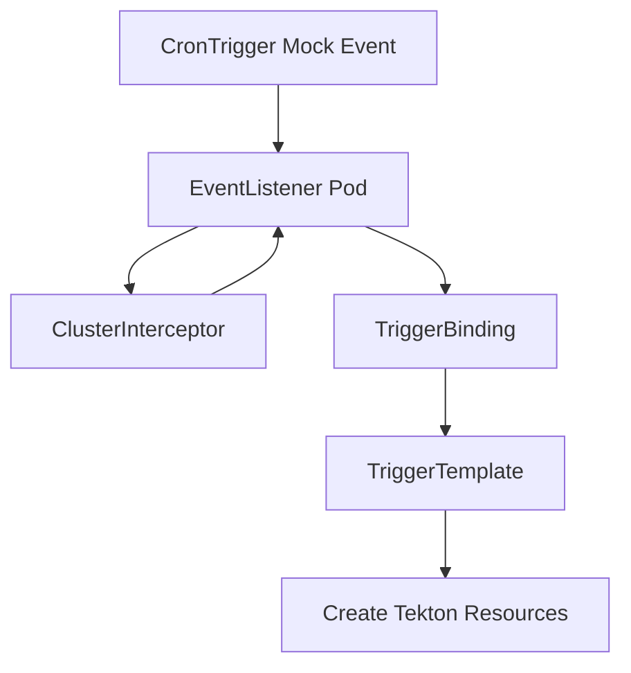
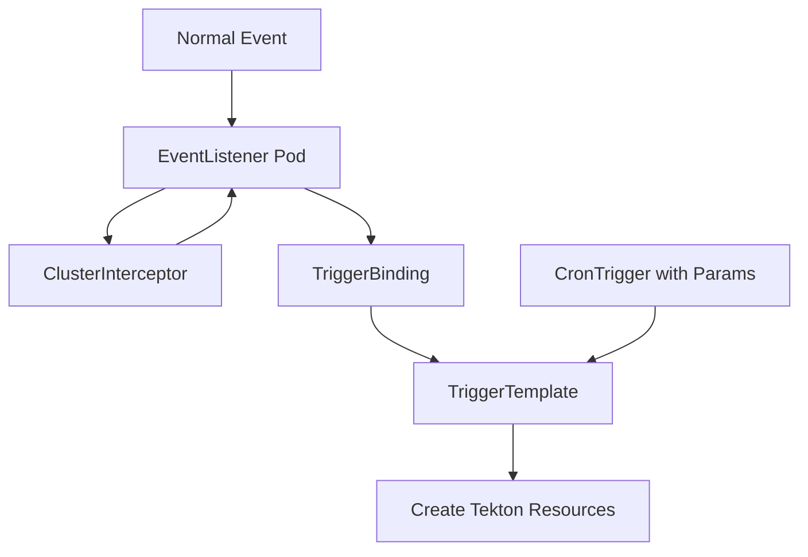
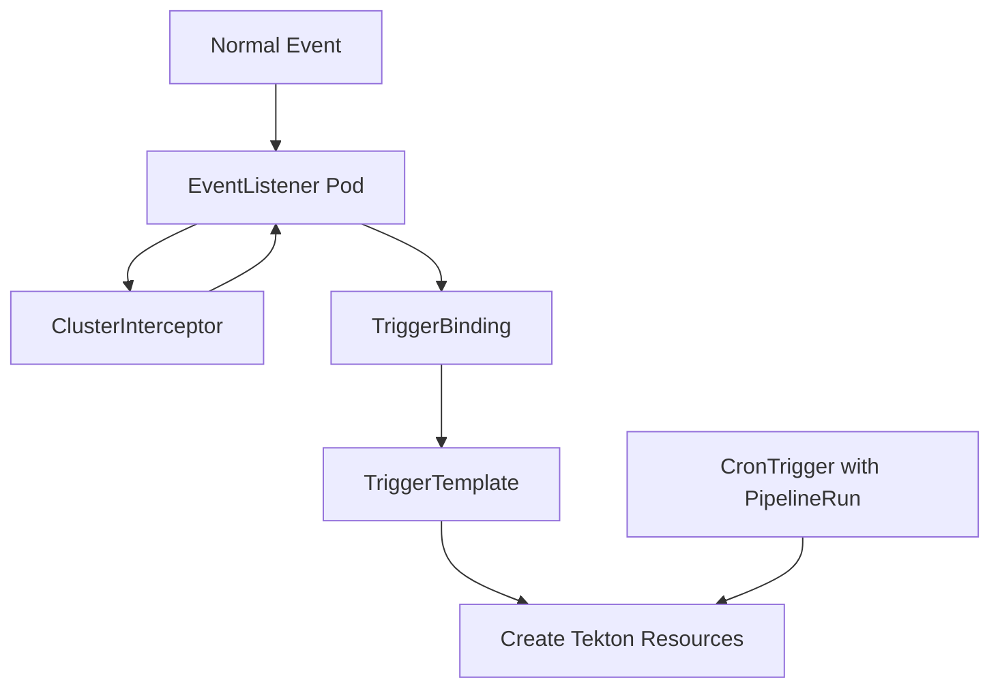

# TEP-0004: Tekton Cron Triggers

## Summary

This document surveys and compares the current state and alternative approaches in the Tekton community regarding “scheduled triggers.” Building on Tekton's foundational capabilities, it explores which design can most quickly wire up a scheduled trigger—supporting time‑based PipelineRun execution with minimal dependencies and a clear user experience.

## Motivation

Scheduled triggering is a very common DevOps scenario, but Tekton Triggers only supports event‑based triggering and **does not** natively support schedules. We need to provide a standardized scheduled trigger to satisfy users' needs for triggering pipelines on a schedule.

### Goals

* Build on Tekton's base capabilities.
* Serve both users who only need scheduled triggering and users who already have Triggers configured, providing a **minimal learning curve**.
* Offer core semantics similar to CronJob (time zone, concurrency policy, catch‑up for missed runs, etc.) and integrate deeply with Tekton's runtime.

### Non‑goals

* Modifying core Tekton Triggers functionality;
* No centralized, cross‑cluster scheduling.

### Requirements

* **Do not** introduce CronJob, for the following reasons:
    * Although CronJob has semantics close to what we need, it's not a Tekton resource, so we cannot provide a consistent experience via Tekton's API/CLI/Dashboard.
    * A CronJob's container still needs extra logic/credentials to trigger Tekton, adding security and operations overhead.
    * As the number of triggers/executions increases, CronJobs proliferate. Maintaining them within the DevOps team is not ideal.

## Proposal

### Research

- [Schedule pipelines to be run on a specific time](https://github.com/tektoncd/pipeline/issues/3925)
- [Design for cron triggering](https://github.com/tektoncd/triggers/issues/69)
- [Add simple cron trigger example.](https://github.com/tektoncd/triggers/pull/162)

A common practice in the Tekton community (see the
[example](https://github.com/tektoncd/triggers/blob/main/examples/v1beta1/cron/cronjob.yaml))
is to create a large number of **CronJobs** in the cluster, and within each CronJob's container call
`kubectl`/`tkn`/`curl` to directly create a PipelineRun or send an event to an EventListener.

The community sees Triggers as designed for event‑driven activation, and considers scheduled triggering
as something CronJob can handle instead—so it should not be placed in Tekton's core. Since Tekton runs on
Kubernetes, CronJob is something we can rely on just like we rely on Pods.

```yaml
apiVersion: batch/v1
kind: CronJob
metadata:
  name: hello
spec:
  schedule: "*/1 * * * *"
  jobTemplate:
    spec:
      template:
        spec:
          containers:
          - name: hello
            image: curlimages/curl
            args: ["curl", "-X", "POST", "--data", "{}", "el-cron-listener.default.svc.cluster.local:8080"]
          restartPolicy: Never
```

**Issues with this approach:**

* **Resource ownership**: CronJob is a core Kubernetes resource and not part of Tekton. Tekton cannot offer consistent API management and status aggregation for it.
* **Maintainability**: As scheduled tasks grow, CronJob manifests span namespaces/teams without unified orchestration, audit, or rate‑limit policies.
* **Resource overhead**: CronJob must create Pods to process scheduled events, incurring extra overhead.
* **Observability**: CronJob history is disconnected from Tekton's PipelineRun history, making it hard to stitch together the full “schedule → trigger → run → signature/artifact” chain.
* **Permissions & multi‑tenancy**: CronJobs need credentials inside containers to trigger Tekton resources, which imposes maintenance costs.

### Proposal

Introduce a Tekton **CronTrigger** CustomResourceDefinition (CRD) and a supporting controller:

* **CronTrigger** expresses the author‑time intent of “when to trigger, what to trigger, and under which identity it should run.”
* The controller parses the cron schedule, handles concurrency policy and catch‑up logic, and at the right time **creates a PipelineRun**
  (or renders a PipelineRun via a TriggerTemplate, then creates it).

## Design Details

### How it works

#### Option 1: Simulate a webhook request to trigger an EventListener



* **Flow**: The CronTrigger controller constructs an HTTP request and sends it to the EventListener; the subsequent path goes through the Interceptor,
  TriggerBinding, and TriggerTemplate to render a PipelineRun.
* **Pros**: Fully reuses the existing event path; suitable for scenarios where complex interception/authentication/distribution logic already exists.
* **Cons**:
  * Requires users to **first** configure Trigger‑related objects; users who only want “run on a schedule” may be confused.
  * **Hard to simulate**: If TriggerBinding/Interceptor are used, the request body must look like a real webhook payload with fields such as `revision` and `repo`,
    plus signatures/headers, because TriggerBinding/Interceptor may contain logic that inspects the body. Body formats differ across tools/versions/event types,
    creating construction costs.
  * TriggerBinding/Interceptor are mainly for pre‑processing events, while CronTrigger is itself an event source; coupling them is not ideal.

#### Option 2: Trigger via TriggerTemplate (recommended)



* **Flow**: The CronTrigger controller renders a PipelineRun based on a TriggerTemplate together with `params` on the CronTrigger, and then creates it.
* **Pros**:
  * Users already using Triggers can **seamlessly** adopt the new CronTrigger mechanism.
  * Reuses existing TriggerTemplates.
  * Avoids network calls and interceptor semantics; rendering happens inside the controller—**stable and controllable**.
  * No dependency on the original trigger mechanism: if a user only wants a scheduled trigger, they don't need to learn trigger concepts—low overhead.
* **Cons**:
  * Users must configure a TriggerTemplate, which has a learning curve.

#### Option 3: Trigger based on PipelineRun



* **Flow**: Users declare `pipelineRef/pipelineSpec` and runtime parameters directly in the CronTrigger; the controller periodically creates a PipelineRun.
* **Pros**:
  * **Minimal dependencies**, quickest to adopt; reduces the burden of introducing Triggers “just for scheduling.”
  * Clear semantics; closest to CronJob but fully owned by Tekton.
  * Facilitates unified observability (name patterns, OwnerRef, label/annotation inheritance).
* **Cons**:
  * For users already using Triggers, both a TriggerTemplate and the PipelineRun inside CronTrigger may need to be maintained. When the Pipeline changes,
    multiple places may require edits.
  * CronTrigger becomes a combination of CronJob and PipelineRun, with some redundant functionality.

#### Option selection

The downsides of **Option 1** are significant. It only suits Triggers without dynamic parameters, and there's a configuration cost—poor UX.

Since we're introducing a new **CRD + controller** to handle scheduled triggering, we should prefer **Option 2/3** to further reduce user configuration.
Among them, **Option 2** actually covers Option 3's advantages. In Option 2, if a user doesn't want to maintain a standalone TriggerTemplate, they can
inline the TriggerTemplate **spec** directly in the CronTrigger (and include a PipelineRun there).

### API design

```yaml
apiVersion: tekton.alaudadevops.io/v1alpha1
kind: CronTrigger # Consider renaming this CRD to `ScheduledTrigger` to stay consistent with the community.
metadata:
  name: nightly-build  # All created resources carry the label tekton.alaudadevops.io/cron-trigger-name
spec:
  schedule: "0 2 * * *"           # Cron expression
  triggerTemplate:
    # Option A: reference an existing TriggerTemplate
    # ref: foo-tt
    # apiVersion: triggers.tekton.dev/v1beta1

    # Option B: inline the TriggerTemplate spec
    spec:
      params:
        - name: "text"
          default: "hello world"
      resourcetemplates:
        - apiVersion: "tekton.dev/v1beta1"
          kind: TaskRun
          metadata:
            generateName: "pr-run-"
          spec:
            taskSpec:
              steps:
                - image: ubuntu
                  script: echo "$(tt.params.text)"
  params:                          # Optional; parameters passed to the TriggerTemplate
    - name: text
      value: "hello world"
status:
  lastScheduleTime: "2025-10-27T18:00:00Z"
  lastSuccessfulTime: "2025-10-27T18:02:31Z"
  active:
    - id: nightly-build-20251028-020000  # Created resources carry the label tekton.alaudadevops.io/cron-trigger-id=<id>
```

| Path                                            | Type              | Req | Default                       | Description & Constraints                                                                                                                |
|-------------------------------------------------|-------------------|----:|-------------------------------|------------------------------------------------------------------------------------------------------------------------------------------|
| `spec.schedule`                                 | string            |   ✅ | —                             | Cron expression (standard 5‑field form, e.g., `0 2 * * *`) indicating the schedule.                                                      |
| `spec.triggerTemplate`                          | object            |   ❌ | —                             | Render/create via TriggerTemplate; supports **reference** or **inline spec** (choose one).                                               |
| `spec.triggerTemplate.ref`                      | string            |   ❌ | —                             | Name of an existing TriggerTemplate (same namespace).                                                                                    |
| `spec.triggerTemplate.apiVersion`               | string            |   ❌ | `triggers.tekton.dev/v1beta1` | API version of the referenced TriggerTemplate.                                                                                           |
| `spec.triggerTemplate.spec`                     | object            |   ❌ | —                             | Inline TriggerTemplate **spec**; mutually exclusive with `ref`.                                                                          |
| `spec.triggerTemplate.spec.params[]`            | array             |   ❌ | —                             | Parameter definitions (`name/default`, etc.), same semantics as Tekton Triggers.                                                         |
| `spec.triggerTemplate.spec.resourcetemplates[]` | array             |   ❌ | —                             | Resource templates to instantiate upon a (scheduled) event; typically `PipelineRun`/`TaskRun`.                                           |
| `spec.params[]`                                 | array             |   ❌ | —                             | **Runtime parameters** passed to the TriggerTemplate for rendering/override.                                                             |
| `status.lastScheduleTime`                       | string(date-time) |   ❌ | —                             | Time of the most recent **successful initiation** of a trigger (parsed per `timezone`).                                                  |
| `status.lastSuccessfulTime`                     | string(date-time) |   ❌ | —                             | Time when the most recent **triggered execution** completed successfully.                                                                |
| `status.active[]`                               | array             |   ❌ | —                             | Currently running instances (typically created `PipelineRun/TaskRun`).                                                                   |
| `status.active[].id`                            | string            |   ❌ | —                             | Run identifier; created instances carry label `tekton.alaudadevops.io/cron-trigger-id=<id>`.                                             |

In the future, we may consider adding the following fields to enhance the capabilities of CronTrigger. 
Since these fields are not included in the current community TEP, they are not provided for now to avoid increasing future migration costs.

| Path                           | Type    | Req | Default                      | Description & Constraints                                                                                                                |
|--------------------------------|---------|----:|------------------------------|------------------------------------------------------------------------------------------------------------------------------------------|
| `spec.timezone`                | string  |   ❌ | Controller/cluster time zone | Time zone used when parsing the cron, e.g., `Asia/Shanghai`.                                                                             |
| `spec.concurrencyPolicy`       | string  |   ❌ | `Allow`                      | Concurrency strategy: `Allow` (permit overlap), `Forbid` (skip if previous still running), `Replace` (terminate previous and start new). |
| `spec.suspend`                 | boolean |   ❌ | `false`                      | Whether to pause scheduling; when `true`, no new triggers occur (existing runs unaffected).                                              |
| `spec.startingDeadlineSeconds` | integer |   ❌ | —                            | Deadline window (seconds) for compensating missed triggers.                                                                              |

### Controller responsibilities & key points

* **Scheduling engine**: Parse `schedule + timezone` to compute the next fire time.
* **HA / de‑duplication**: Multiple controller replicas avoid duplicate triggering via **Lease/LeaderElection** or optimistic concurrency based on resource keys.
* **Concurrency policy**:
  * `Allow`: no restriction;
  * `Forbid`: skip if the last run is still in progress;
  * `Replace`: if the last run is still in progress, send a delete signal and immediately create a new one.
* **Catch‑up for missed triggers**: When the controller recovers or a cron expression changes, use `startingDeadlineSeconds` to decide whether to compensate.
* **Naming & OwnerRef**:
  * Created resources carry the label `tekton.alaudadevops.io/cron-trigger-name`, and set an OwnerReference pointing back to the CronTrigger to couple lifecycles.
  * Created resources carry the label `tekton.alaudadevops.io/cron-trigger-id`, which is newly generated for each fire.
* **Supported resources**: Keep parity with TriggerTemplate—Pipeline, PipelineRun, Task, TaskRun, ClusterTask.
* **Troubleshooting**: If the CronTrigger fails to create resources, create an **Event** to record the reason for easier debugging.
* **Dynamic values**: `params` supports contextual time variables:
  * `$(context.date)`: creation date in RFC 3339 format;
  * `$(context.datetime)`: creation timestamp in RFC 3339 format.

### New community proposal

Triggers has a new proposal: [TEP‑0128](https://github.com/tektoncd/community/blob/main/teps/0128-scheduled-runs.md).

It discusses the following options, with **Option 1** as the primary direction. A
[PR](https://github.com/tektoncd/triggers/pull/1774) has been submitted to create the corresponding CRD, but the controller logic has not yet been written:

1. (**Community's primary option**) Introduce a `ScheduledTemplate` CRD containing both `resourcetemplates` and `schedule`. The trigger logic is folded into the original Triggers reconciler.
2. Add a `ScheduledTrigger` CRD at the same level as `EventListener`, directly referencing a `Trigger` resource; parameters are written directly into the request body.
3. Add a `ScheduledTrigger` CRD that references a `TriggerTemplate`, rendering it via `params`.
4. Add a `schedule` field directly to `PipelineRun` (the pipeline controller must skip auto‑running such resources upon import).
5. Add a `schedule` field directly to `Trigger`.
6. Add a `schedule` field directly to `EventListener`.
7. Introduce a `PingSource` resource similar to Knative's capability.

#### Analysis

- Regardless of the option, the community's implementation uses CronJobs to create resources; new resources/fields mostly serve as syntactic sugar over the existing CronJob approach.
- Options **4–6** are highly intrusive to existing functionality and are not considered for now.
- Options **2** and **7** do not solve the problem of constructing the request body.
- Focus on **Options 1 and 3**.

**Option 3** is close to our approach, with the main difference being:

- In the community proposal, the controller's permission to create resources is determined by the **ServiceAccount** configured in the custom resource; in our design,
  we grant the controller the necessary permissions directly.

In my view, EventListener needs a user‑configured ServiceAccount primarily to support `namespaceSelector` (cross‑namespace) scenarios. The community's scheduled trigger design
relies on CronJobs, which also need a ServiceAccount. Our scheduled trigger design only supports triggering resources **within the current namespace**, so we don't need users to
configure a ServiceAccount; we can grant the controller the required permissions directly.

**Option 1** differs from our design mainly in that:

- The community's CRD **embeds** both `params` and the TriggerTemplate **spec**, which means you cannot associate an **existing** TriggerTemplate as flexibly as in our design.
- The community CRD also has a `cloudEventSink` field for sending CloudEvents.

#### Summary

At present, the community's primary option is similar to our thinking, with the main differences in CRD field design and implementation (the community depends on CronJobs).

We can consider sharing our thinking with the community to gather further feedback (I've opened an issue: https://github.com/tektoncd/triggers/issues/1903).
In the meantime, we will proceed with our approach and prioritize implementing the `schedule`, `triggerTemplate`, and `params` fields.
For the CRD name, we might align with the community and use **`ScheduledTrigger`**.

We'll continue to track community progress:

- If the community adopts our approach, users who wish to migrate to the community's CRD in the future would only need to update the `apiVersion`.
- If not, we can provide a migration path. Migrating from our CRD to the community's CRD would mainly involve embedding the TriggerTemplate spec, which is not difficult.

## Design Evaluation

### Reusability

* Reuse TriggerTemplate to reduce duplication.

### Simplicity

* For users who only need scheduling, an inline TriggerTemplate is sufficient—low learning and configuration cost.
* For Triggers users, you can simply reference an existing TriggerTemplate.

### Flexibility

* Not strongly coupled to EventListener.

### Conformance

* Tekton‑style CRD/Condition/OwnerRef; consistent with Pipelines/Triggers API conventions.
* No additional dependency chain on core Kubernetes resources (as compared with CronJob).

### User Experience

* A **single CRD** defines the schedule, the target to trigger, and the runtime identity/parameters.
* Consistent CLI/Dashboard presentation.

### Performance

* Scheduling overhead is minimal; the main cost is creating PipelineRuns at firing times.
* The controller should employ batch scheduling optimizations (time wheel/bucketing) and rate‑limited creation for large numbers of CronTriggers.

### Risks and Mitigations

* **Duplicate firing**: avoid via HA locking and idempotent creation.
* **Parameter drift**: record a snapshot of rendered parameters in **Status** to support audit and traceability.
* **History bloat**: support a max history retention and automatic GC.

### Drawbacks

* Compared with “just use CronJob,” we must implement and maintain an additional controller.

## Alternatives

* Continue using **CronJob** + in‑container scripts/credentials to trigger Tekton.

## Implementation Plan

1. Define the v1alpha1 CRD and OpenAPI validation.
2. Controller skeleton: Informers, queues, scheduler, de‑duplication.
3. Create PipelineRun; concurrency policy; compensation; status & events.
4. Documentation and examples.
5. Milestone acceptance and Beta plan.

### Test Plan

* **Unit**: cron parsing; next‑fire time calculation; concurrency policies; compensation logic.
* **Integration**: multi‑replica controller de‑dup; namespace/permission boundaries; history & GC.
* **End‑to‑end**:
  * Pipeline mode: scheduled creation & parameter passing;
  * TriggerTemplate mode: rendering, overriding, and runtime identity;
  * Failure/recovery scenarios and `startingDeadlineSeconds`.
* Coverage and stability baseline requirements.

### Infrastructure Needed

* New CRD and controller image publishing pipeline.
