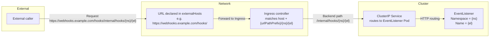

# Configure trigger-wrapper export rules

## Feature overview

The `trigger-wrapper` controller reads the `trigger-wrapper-config` ConfigMap in the Tekton system namespace (default: `tekton-pipelines`). The `export-rules` defined in that ConfigMap determine which EventListeners should be exposed externally (Service, Ingress, etc.) and populate the EventListener/Trigger status with the generated endpoints.

## Configuration entry point

On Alauda Tekton, it is recommended to manage this configuration through the `TektonConfig` custom resource. Embed the rule definitions under `spec.pipeline.options.configMaps.trigger-wrapper-config.data.config`, for example:

```yaml
apiVersion: operator.tekton.dev/v1alpha1
kind: TektonConfig
metadata:
  name: config
spec:
  pipeline:
    options:
      configMaps:
        trigger-wrapper-config:
          data:
            config: |
              export-rules:
                - name: test-webhooks
                  host: webhooks.example.com
                  ingressClass: nginx
                  urlPathPrefix: /triggers
                  externalHosts:
                    - "https://webhooks.example.com"
                    - "https://backup.webhooks.example.com"
                  namespaceSelector:
                    matchNames:
                      - "*"
```

The Operator synchronises this spec into the `trigger-wrapper-config` ConfigMap inside Tekton system namespace (default: `tekton-pipelines`). Once updated, the `trigger-wrapper` controller refreshes its cache and reconciles resources according to the new rules.

## Field reference

Each entry in `export-rules` represents a publishing strategy. Important fields:

- **name** – rule name, also used when generating Service/Ingress names.
- **ingressClass** (optional) – the Ingress controller to use, e.g. `nginx`, `traefik`.
- **host** (optional) – hostname matched by the Ingress. Leave empty to accept all hosts.
- **externalHosts** (optional) – additional public endpoints, typically when an upstream gateway/LB already owns the hostname, when multiple endpoints must be published, or when you want to record the complete base URL. The controller concatenates each value with the generated path. For instance, `https://edge.example.com/hooks` becomes `https://edge.example.com/hooks<trigger-path>`, so add trailing slashes or prefixes explicitly as needed.
- **urlPathPrefix** (optional) – path prefix; defaults to `/triggers`. The final path rendered in the Ingress is `${urlPathPrefix}/${eventlistener-namespace}/${eventlistener-name}`. Always start with `/` and avoid trailing slashes.
- **namespaceSelector.matchNames** (optional) – namespaces allowed by this rule. Use `"*"` to target all namespaces.
- **labelSelector** (optional) – Kubernetes LabelSelector used to filter EventListeners.
- **tls** (optional) – TLS configuration for Ingress. Each entry specifies `hosts` (list of hostnames) and `secretName` (name of the TLS Secret containing the certificate).
- **annotations** (optional) – additional annotations for Ingress. Useful for cert-manager, nginx-specific settings, etc. Controller-managed annotations (like `nginx.ingress.kubernetes.io/rewrite-target`) will be merged with user-provided annotations.

> Namespace matching currently supports `matchNames` only. If you need label-based namespace selection, enumerate the namespaces explicitly.

### Field Mapping to Ingress Resources

The following table shows how export rule fields map to the generated Ingress resource:

| Export Rule Field | Ingress Resource Field | Description |
|------------------|------------------------|-------------|
| `name` | `metadata.name` | The Ingress resource name is set to the rule name |
| `ingressClass` | `spec.ingressClassName` | Specifies which Ingress controller should handle this Ingress |
| `host` | `spec.rules[].host` | Hostname for the Ingress rule. If empty or `"*"`, matches all hosts. **Note:** IP addresses are not supported as host values. If using an IP, leave `host` empty or configure a domain name that resolves to the IP. |
| `urlPathPrefix` | `spec.rules[].http.paths[].path` | Combined with namespace and EventListener name to form the path: `${urlPathPrefix}/${namespace}/${eventlistener-name}` |
| `tls` | `spec.tls` | TLS configuration for HTTPS. Each entry maps to `spec.tls[].hosts` and `spec.tls[].secretName` |
| `annotations` | `metadata.annotations` | User-provided annotations are merged with controller-managed annotations |
| `namespaceSelector` | N/A | Used to filter EventListeners, not directly mapped to Ingress |
| `labelSelector` | N/A | Used to filter EventListeners, not directly mapped to Ingress |
| `externalHosts` | N/A | Used to populate EventListener `status.addresses`, not directly mapped to Ingress |

**Example Mapping:**

Given this export rule:
```yaml
export-rules:
  - name: test-webhooks
    host: webhooks.example.com
    ingressClass: nginx
    urlPathPrefix: /triggers
    tls:
      - hosts:
          - webhooks.example.com
        secretName: webhooks-tls-secret
    annotations:
      cert-manager.io/cluster-issuer: "letsencrypt-prod"
```

The generated Ingress will have:
- `metadata.name`: `test-webhooks`
- `spec.ingressClassName`: `nginx`
- `spec.rules[0].host`: `webhooks.example.com`
- `spec.rules[0].http.paths[].path`: `/triggers/${namespace}/${eventlistener-name}` (for each matching EventListener)
- `spec.tls[0].hosts`: `["webhooks.example.com"]`
- `spec.tls[0].secretName`: `webhooks-tls-secret`
- `metadata.annotations`: Includes `cert-manager.io/cluster-issuer` and controller-managed annotations

## Request flow diagram



> `externalHosts` tells external clients which URL to call. The Ingress still matches requests by `host` and `${urlPathPrefix}/${namespace}/${eventlistener}`, and the backend Service receives exactly that path.

## Configuration examples

### Example 1: wildcard host with custom prefix

```yaml
export-rules:
  - name: wildcard-host
    urlPathPrefix: /hooks/default
    ingressClass: nginx
    namespaceSelector:
      matchNames:
        - cicd
```

Result: the Ingress exposes `/hooks/default/${namespace}/${eventlistener}`. Because `host` is empty, any hostname will be accepted—ideal when an external gateway assigns the public domain.

### Example 2: shared hostname and prefix

```yaml
export-rules:
  - name: all-listeners
    host: webhooks.example.com
    urlPathPrefix: /triggers
    ingressClass: nginx
    namespaceSelector:
      matchNames:
        - "*"
```

Result: every EventListener appears at `https://webhooks.example.com/triggers/${namespace}/${eventlistener}`; the backend sees the same path.

### Example 3: environment-specific rules

```yaml
export-rules:
  - name: staging-gitlab
    host: gitlab-staging.example.com
    urlPathPrefix: /staging/gitlab
    namespaceSelector:
      matchNames:
        - staging-tools
    labelSelector:
      matchLabels:
        webhook-type: gitlab

  - name: prod-github
    host: github-prod.example.com
    urlPathPrefix: /prod/github
    ingressClass: traefik
    namespaceSelector:
      matchNames:
        - prod-tools
    labelSelector:
      matchLabels:
        webhook-type: github
```

Result:
- GitLab webhooks: `https://gitlab-staging.example.com/staging/gitlab/${namespace}/${eventlistener}`
- GitHub webhooks: `https://github-prod.example.com/prod/github/${namespace}/${eventlistener}`

### Example 4: team-scoped publishing with default prefix

```yaml
export-rules:
  - name: team-a
    urlPathPrefix: /triggers
    namespaceSelector:
      matchNames:
        - team-a
```

Result: only EventListeners in `team-a` are exposed, at `/triggers/team-a/${eventlistener}`.

### Example 5: multiple external endpoints and adjusted prefix

```yaml
export-rules:
  - name: multi-endpoints
    host: webhook.internal.local
    urlPathPrefix: /internal/hooks
    externalHosts:
      - https://webhooks.example.com/hooks/
      - https://backup.example.com/api/hooks
    namespaceSelector:
      matchNames:
        - ci-tools
```

Result:
- Ingress serves `webhook.internal.local/internal/hooks/${namespace}/${eventlistener}` internally.
- Externally you can publish `https://webhooks.example.com/hooks/internal/hooks/${namespace}/${eventlistener}` and `https://backup.example.com/api/hooks/internal/hooks/${namespace}/${eventlistener}`.
- The backend Service always receives `/internal/hooks/${namespace}/${eventlistener}`.

### Example 6: Configuring TLS/HTTPS

#### Option A: Manual TLS with pre-created Secret

1. Create a TLS Secret containing your certificate:

    ```bash
    kubectl create secret tls webhooks-tls-secret \
      --cert=path/to/cert.pem \
      --key=path/to/key.pem \
      -n tekton-pipelines
    ```

2. Configure your export rule with TLS:

    ```yaml
    export-rules:
      - name: secure-webhooks
        host: webhooks.example.com
        urlPathPrefix: /triggers
        ingressClass: nginx
        tls:
          - hosts:
              - webhooks.example.com
            secretName: webhooks-tls-secret
        namespaceSelector:
          matchNames:
            - "*"
    ```

The controller will automatically configure the Ingress with TLS using the specified Secret.

#### Option B: Using cert-manager for automatic certificate management

Configure your export rule with cert-manager annotations:

```yaml
export-rules:
  - name: cert-manager-webhooks
    host: webhooks.example.com
    urlPathPrefix: /triggers
    ingressClass: nginx
    annotations:
      cert-manager.io/cluster-issuer: "letsencrypt-prod"
      # Optional: additional nginx SSL settings
      nginx.ingress.kubernetes.io/ssl-protocols: "TLSv1.2 TLSv1.3"
    namespaceSelector:
      matchNames:
        - "*"
```

cert-manager will automatically:
- Create a Certificate resource
- Obtain a certificate from Let's Encrypt (or your configured issuer)
- Create a TLS Secret
- Update the Ingress with TLS configuration

#### Option C: Combined TLS and annotations

You can combine manual TLS configuration with additional annotations:

```yaml
export-rules:
  - name: custom-tls-with-annotations
    host: webhooks.example.com
    urlPathPrefix: /triggers
    ingressClass: nginx
    tls:
      - hosts:
          - webhooks.example.com
        secretName: custom-tls-secret
    annotations:
      nginx.ingress.kubernetes.io/ssl-protocols: "TLSv1.2 TLSv1.3"
      nginx.ingress.kubernetes.io/ssl-ciphers: "HIGH:!aNULL:!MD5"
    namespaceSelector:
      matchNames:
        - "*"
```

> **Note:** When both `tls` and cert-manager annotations are configured, the `tls` configuration takes precedence. For automatic certificate management, use cert-manager annotations without `tls` configuration.

## Configuration workflow

1. Edit the `TektonConfig` resource (see **Configuration entry point**).
2. Apply the changes: `kubectl apply -f tektonconfig.yaml`.
3. Wait for the Operator to propagate the ConfigMap; the `trigger-wrapper` controller will then reconcile new resources automatically.

## Verification and troubleshooting

### Verify ConfigMap content

Check that the ConfigMap contains the expected configuration:

```bash
kubectl get configmap trigger-wrapper-config -n tekton-pipelines -o yaml
```

**Expected output (normal):**
```yaml
apiVersion: v1
kind: ConfigMap
metadata:
  name: trigger-wrapper-config
  namespace: tekton-pipelines
data:
  config: |
    export-rules:
      - name: test-webhooks
        host: webhooks.example.com
        ingressClass: nginx
        urlPathPrefix: /triggers
        externalHosts:
          - "https://webhooks.example.com"
          - "https://backup.webhooks.example.com"
        namespaceSelector:
          matchNames:
            - "*"
```

**What to check:**
- The ConfigMap exists and contains the `config` key
- The `export-rules` array matches your TektonConfig specification
- YAML syntax is valid (no parsing errors)

### Verify Ingress objects

Check that Ingress resources are created for matching EventListeners:

```bash
kubectl get ingress -n <namespace>
```

**Expected output (normal):**
```
NAME                              CLASS   HOSTS                    ADDRESS   PORTS   AGE
el-<eventlistener-name>           nginx   webhooks.example.com     ...        80      5m
```

**What to check:**
- Ingress objects exist for EventListeners that match export rules
- The `HOSTS` field matches the `host` specified in the export rule
- The Ingress has an `ADDRESS` assigned (may take a few minutes)
- If no Ingress appears, verify the namespace matches `matchNames` and EventListener labels match `labelSelector`

### Check EventListener addresses

Verify that EventListener status contains the generated webhook addresses:

```bash
kubectl get eventlistener <el-name> -n <namespace> \
  -o jsonpath='{.status.addresses}' | jq
```

**Expected output (normal):**
```json
[
  {
    "url": "https://webhooks.example.com/triggers/<namespace>/<el-name>"
  },
  {
    "url": "https://backup.webhooks.example.com/triggers/<namespace>/<el-name>"
  }
]
```

**What to check:**
- The `addresses` array contains URLs matching your `externalHosts` configuration
- URLs follow the pattern: `<externalHost>/<urlPathPrefix>/<namespace>/<eventlistener-name>`
- If `addresses` is empty or missing, the EventListener may not match any export rule

### Inspect Trigger annotations

Check the export metadata stored in Trigger annotations:

```bash
kubectl get trigger <trigger-name> -n <namespace> \
  -o jsonpath='{.metadata.annotations.triggers\.tekton\.dev/eventlistener-info}' | jq
```

**Expected output (normal):**
```json
[
  {
    "name": "my-eventlistener",
    "namespace": "my-namespace",
    "endpoints": [
      "https://webhooks.example.com/triggers/my-namespace/my-eventlistener",
      "https://backup.webhooks.example.com/triggers/my-namespace/my-eventlistener"
    ],
    "relevance": {
      "score": 1000,
      "namespaceScore": 1000,
      "labelScore": 1000,
      "namespaceSelector": {
        "matchNames": ["my-namespace"]
      },
      "matchType": "direct"
    }
  }
]
```

**What to check:**
- The annotation contains an array of EventListener information
- Each entry includes `name`, `namespace`, `endpoints`, and `relevance` fields
- The `endpoints` array matches the EventListener's `status.addresses`
- The `relevance.score` indicates how well the EventListener matches the Trigger (higher is better)
- If the annotation is missing, the Trigger may not have found any matching EventListeners

### Troubleshooting tips

- **If a rule does not apply:**
  - Verify that the namespace is listed in `matchNames` (or use `"*"` for all namespaces)
  - Check that EventListener labels satisfy the `labelSelector` requirements
  - Ensure the EventListener is in `Ready` state

- **Misconfigured label selectors:**
  - Appear in controller logs as parsing errors
  - Check controller logs: `kubectl logs -n tekton-pipelines -l app=tektoncd-enhancement-controller`

- **Removing a rule:**
  - Cascades deletion of the generated resources (Ingress, Service, etc.)
  - Setting `export-rules` to an empty array disables all external exposure
  - EventListener `status.addresses` will be cleared when no rules match

- **Using IP addresses instead of domain names:**
  - **Problem**: Kubernetes Ingress resources do not support IP addresses as `host` values. If you configure `host` with an IP address (e.g., `host: 192.168.1.100`), the Ingress will fail to be created or will not work correctly.
  - **Solution 1**: Leave `host` empty or set it to `"*"` to accept all hosts. The Ingress will match requests regardless of the host header:
    ```yaml
    export-rules:
      - name: ip-based-webhooks
        host: ""  # or omit the host field entirely
        urlPathPrefix: /triggers
        externalHosts:
          - "http://192.168.1.100"  # Use IP in externalHosts for client reference
        namespaceSelector:
          matchNames:
            - "*"
    ```
  - **Solution 2**: Configure a domain name that resolves to your IP address, then use that domain in the `host` field:
    1. Set up DNS resolution: Add an A record pointing your domain to the IP address (e.g., `webhooks.example.com` → `192.168.1.100`)
    2. Configure the export rule with the domain name:

        ```yaml
        export-rules:
          - name: domain-webhooks
            host: webhooks.example.com  # Domain that resolves to your IP
            urlPathPrefix: /triggers
            externalHosts:
              - "http://192.168.1.100"  # Or use the domain: "http://webhooks.example.com"
            namespaceSelector:
              matchNames:
                - "*"
        ```
        
  - **Note**: `externalHosts` can contain IP addresses or URLs, as it's only used to populate EventListener `status.addresses` and doesn't affect Ingress creation. However, the Ingress itself must use a valid hostname (or be empty) in the `host` field.

By maintaining the ConfigMap through `TektonConfig`, you can flexibly control how Tekton EventListeners are exposed to external systems. Keep an eye on controller logs during updates to confirm that reconciliations complete successfully.
