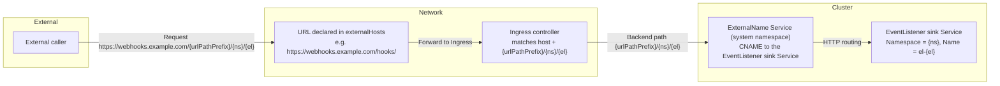

# Configure EventListener automatic exposure rules

## What This Document Helps You Do

This document helps you configure automatic external exposure of EventListeners through the automatic exposure feature. You will learn:

- How to configure export rules to automatically expose EventListeners via Ingress or the Gateway API (HTTPRoute)
- How to set up webhook URLs that will be displayed in the UI
- How to configure different exposure strategies for different namespaces or environments
- How to verify that EventListeners are properly exposed

**When to use this**: Use this feature when you want the system to automatically create Ingress resources for your EventListeners, eliminating the need to manually create and manage Ingress resources. This is especially useful in production environments where you need consistent webhook URL patterns.

**Prerequisites**: You should have cluster administrator privileges to configure `TektonConfig` resources, and you should have a basic understanding of Kubernetes Ingress and networking concepts.

## Feature overview

The automatic exposure controller (internally named `trigger-wrapper`) reads the `trigger-wrapper-config` ConfigMap in the Tekton system namespace (default: `tekton-pipelines`). The `export-rules` defined in that ConfigMap determine which EventListeners should be exposed externally (Service, Ingress, etc.) and populate the EventListener/Trigger status with the generated endpoints.

:::info
**Technical Note**: The internal component name is `trigger-wrapper`, but you don't need to remember this. You only need to configure the export rules through `TektonConfig`, and the system will handle the rest automatically.
:::

## Configuration entry point

On Alauda Tekton, it is recommended to manage this configuration through the `TektonConfig` custom resource. Embed the rule definitions under `spec.pipeline.options.configMaps.trigger-wrapper-config.data.config`, for example:

```yaml
apiVersion: operator.tekton.dev/v1alpha1
kind: TektonConfig
metadata:
  name: config
spec:
  pipeline:
    options:
      configMaps:
        trigger-wrapper-config:
          data:
            config: |
              export-rules:
                - name: test-webhooks
                  host: webhooks.example.com  # Ensure DNS resolution is configured (or add to /etc/hosts for testing)
                  ingressClass: nginx
                  urlPathPrefix: /triggers
                  externalHosts:
                    - "https://webhooks.example.com"
                    - "https://backup.webhooks.example.com"
                  namespaceSelector:
                    matchNames:
                      - "*"
```

The Operator synchronises this spec into the `trigger-wrapper-config` ConfigMap inside Tekton system namespace (default: `tekton-pipelines`). Once updated, the automatic exposure controller refreshes its cache and reconciles resources according to the new rules.

:::info
**Note**: The ConfigMap name `trigger-wrapper-config` is an internal technical name. You manage the configuration through `TektonConfig` as shown above, and don't need to directly interact with the ConfigMap.
:::

## Field reference

Each entry in `export-rules` represents a publishing strategy. Important fields:

- **name** – rule name, also used when generating Service/Ingress names.
  **Avoid name collisions**: the shared Ingress name is the rule name normalized
  to a valid DNS-1123 subdomain (lower-cased, characters outside `[a-z0-9-]`
  replaced with `-`, repeated `-` collapsed). This normalization is lossy, so rule
  names that differ **only** by such characters resolve to the same Ingress and
  overwrite each other — for example `a_b`, `a.b`, and `A-B` all become `a-b`.
  Give each rule a name that is already a distinct, valid DNS-1123 subdomain
  (lower-case letters, digits, and `-`); do not rely on `_`, `.`, or letter case
  to distinguish two rules.
- **ingressClass** (optional) – the Ingress controller to use, e.g. `nginx`, `traefik`.
- **host** (optional) – hostname matched by the Ingress. Leave empty to accept all hosts. **Important**: When configuring a domain name, ensure DNS resolution is properly configured (or add to `/etc/hosts` for local testing). The domain must be resolvable from systems that will send webhooks.
- **externalHosts** (optional) – **What it does**: Defines the webhook URLs that will be displayed to users in the UI and populated in EventListener's `status.addresses` field.

  **Think of it as**: The "public address" that external systems (like GitHub, GitLab) will use to send webhooks to your EventListener.

  **How it works**:
  - The controller combines each `externalHosts` URL with the generated path: `${externalHost}/<urlPathPrefix>/<eventlistener-namespace>/<eventlistener-name>`
  - For example: `externalHosts: ["https://webhooks.example.com"]` + `urlPathPrefix: /triggers` → Final URL: `https://webhooks.example.com/triggers/my-namespace/my-listener`
  - These URLs appear in EventListener's `status.addresses` field, making it easy to copy and paste into GitHub/GitLab webhook configuration

  **Common scenarios**:
  
  | Scenario | What to fill in `externalHosts` | Example |
  |----------|----------------------------------|----------|
  | Standard domain with HTTPS | Your public domain with https:// | `"https://webhooks.example.com"` |
  | LoadBalancer with custom port | Domain/IP with port number | `"https://webhooks.example.com:8443"` |
  | Multiple access points | Array of backup URLs | `["https://primary.com", "https://backup.com"]` |
  | IP-based access (no domain) | HTTP with IP address | `"http://192.168.1.100"` (but leave `host` field empty) |
  | ACP platform | Platform URL + cluster path | `"https://192.168.1.100/clusters-rewrite/test"` |

  **What happens if you fill it wrong?**
  - ✅ Ingress will still work correctly (this field doesn't affect Ingress creation)
  - ❌ Users will see incorrect webhook URLs in the UI
  - ❌ Copying the URL from `status.addresses` to GitHub/GitLab will fail
  - 🔧 Fix: Update the `externalHosts` value in TektonConfig and the controller will refresh EventListener status

  **Key differences from `host` field**:
  
  | Field | Purpose | Used by | Example |
  |-------|---------|---------|----------|
  | `host` | Ingress routing rule (HTTP Host header matching) | Kubernetes Ingress | `webhooks.example.com` (domain only, no protocol) |
  | `externalHosts` | User-facing webhook URL for UI display | EventListener status.addresses | `https://webhooks.example.com` (full URL with protocol) |
  
  **Rule of thumb**: 
  - If you can access your webhook at `https://webhooks.example.com:8443/triggers/ns/el`, then fill: `externalHosts: ["https://webhooks.example.com:8443"]`
  - The controller will append the path automatically

  **Important notes**:
  - Always include the protocol (`http://` or `https://`)
  - Include custom ports if your LoadBalancer uses non-standard ports
  - Don't include the path in `urlPathPrefix` (like `/triggers`) - the controller appends it to the end of the `externalHosts` automatically
  - If unsure, leave it empty and check the actual accessible URL first, then update the configuration
- **urlPathPrefix** (optional) – path prefix; defaults to `/triggers`. The final path rendered in the Ingress is `${urlPathPrefix}/${eventlistener-namespace}/${eventlistener-name}`. Always start with `/` and avoid trailing slashes.
- **namespaceSelector.matchNames** (optional) – namespaces allowed by this rule. Use `"*"` to target all namespaces.
- **labelSelector** (optional) – Kubernetes LabelSelector used to filter EventListeners.
- **tls** (optional) – TLS configuration for Ingress. Each entry specifies `hosts` (list of hostnames) and `secretName` (name of the TLS Secret containing the certificate).
- **annotations** (optional) – additional annotations for Ingress. Useful for cert-manager, nginx-specific settings, etc. Only your annotations are applied; the controller no longer injects any controller-specific annotation (such as `nginx.ingress.kubernetes.io/rewrite-target`). The generated Ingress path uses `pathType: Exact` and no rewrite, so exposure works with any Ingress controller (nginx, traefik, ALB, …), not just nginx.
- **type** (optional) – exposure resource: `Ingress` (default) or `HTTPRoute` (Gateway API). Empty defaults to `Ingress` for backward compatibility. See [Gateway API (HTTPRoute) mode](#gateway-api-httproute-mode).
- **gateway** (optional) – required when `type: HTTPRoute`. References the parent Gateway the HTTPRoute attaches to: `name` (required), `namespace` (defaults to the Tekton system namespace), optional `sectionName` and `port`.

> Namespace matching currently supports `matchNames` only. If you need label-based namespace selection, enumerate the namespaces explicitly.

### Field Mapping to Ingress Resources

The following table shows how export rule fields map to the generated Ingress resource:

| Export Rule Field | Ingress Resource Field | Description |
|------------------|------------------------|-------------|
| `name` | `metadata.name` | The Ingress resource name is set to the rule name |
| `ingressClass` | `spec.ingressClassName` | Specifies which Ingress controller should handle this Ingress |
| `host` | `spec.rules[].host` | Hostname for the Ingress rule. If empty or `"*"`, matches all hosts. **Note:** IP addresses are not supported as host values. If using an IP, leave `host` empty or configure a domain name that resolves to the IP. |
| `urlPathPrefix` | `spec.rules[].http.paths[].path` (with `pathType: Exact`) | Combined with namespace and EventListener name to form the exact path: `${urlPathPrefix}/${namespace}/${eventlistener-name}` |
| `tls` | `spec.tls` | TLS configuration for HTTPS. Each entry maps to `spec.tls[].hosts` and `spec.tls[].secretName` |
| `annotations` | `metadata.annotations` | Only your annotations are applied; no controller-managed annotations are injected |
| `namespaceSelector` | N/A | Used to filter EventListeners, not directly mapped to Ingress |
| `labelSelector` | N/A | Used to filter EventListeners, not directly mapped to Ingress |
| `externalHosts` | N/A | Used to populate EventListener `status.addresses`, not directly mapped to Ingress |

**Example Mapping:**

Given this export rule:
```yaml
export-rules:
  - name: test-webhooks
    host: webhooks.example.com  # Ensure DNS resolution is configured (or add to /etc/hosts for testing)
    ingressClass: nginx
    urlPathPrefix: /triggers
    tls:
      - hosts:
          - webhooks.example.com
        secretName: webhooks-tls-secret
    annotations:
      cert-manager.io/cluster-issuer: "letsencrypt-prod"
```

:::warning
**DNS Configuration**: When using a domain name in the `host` field, ensure DNS records are configured to resolve the domain to your Ingress controller's IP. For local testing, you can add entries to `/etc/hosts` (Linux/Mac) or `C:\Windows\System32\drivers\etc\hosts` (Windows).
:::

The generated Ingress will have:
- `metadata.name`: `test-webhooks`
- `spec.ingressClassName`: `nginx`
- `spec.rules[0].host`: `webhooks.example.com`
- `spec.rules[0].http.paths[].path`: `/triggers/${namespace}/${eventlistener-name}` (for each matching EventListener)
- `spec.tls[0].hosts`: `["webhooks.example.com"]`
- `spec.tls[0].secretName`: `webhooks-tls-secret`
- `metadata.annotations`: Includes `cert-manager.io/cluster-issuer` and controller-managed annotations

## Request flow diagram



> `externalHosts` tells external clients which URL to call. The Ingress matches requests by `host` and the exact path `${urlPathPrefix}/${namespace}/${eventlistener}`, and forwards to an ExternalName Service in the Tekton system namespace that resolves to the EventListener sink Service. Because the sink accepts any path, the backend receives the full path unchanged (no rewrite).

## Configuration examples

### Example 1: wildcard host with custom prefix

```yaml
export-rules:
  - name: wildcard-host
    urlPathPrefix: /hooks/default
    ingressClass: nginx
    namespaceSelector:
      matchNames:
        - cicd
```

Result: the Ingress exposes `/hooks/default/${namespace}/${eventlistener}`. Because `host` is empty, any hostname will be accepted—ideal when an external gateway assigns the public domain.

### Example 2: shared hostname and prefix

```yaml
export-rules:
  - name: all-listeners
    host: webhooks.example.com  # Ensure DNS resolution is configured (or add to /etc/hosts for testing)
    urlPathPrefix: /triggers
    ingressClass: nginx
    namespaceSelector:
      matchNames:
        - "*"
```

Result: every EventListener appears at `https://webhooks.example.com/triggers/${namespace}/${eventlistener}`; the backend sees the same path.

### Example 3: environment-specific rules

```yaml
export-rules:
  - name: staging-gitlab
    host: gitlab-staging.example.com  # Ensure DNS resolution is configured (or add to /etc/hosts for testing)
    urlPathPrefix: /staging/gitlab
    namespaceSelector:
      matchNames:
        - staging-tools
    labelSelector:
      matchLabels:
        webhook-type: gitlab

  - name: prod-github
    host: github-prod.example.com  # Ensure DNS resolution is configured (or add to /etc/hosts for testing)
    urlPathPrefix: /prod/github
    ingressClass: traefik
    namespaceSelector:
      matchNames:
        - prod-tools
    labelSelector:
      matchLabels:
        webhook-type: github
```

Result:
- GitLab webhooks: `https://gitlab-staging.example.com/staging/gitlab/${namespace}/${eventlistener}`
- GitHub webhooks: `https://github-prod.example.com/prod/github/${namespace}/${eventlistener}`

### Example 4: team-scoped publishing with default prefix

```yaml
export-rules:
  - name: team-a
    urlPathPrefix: /triggers
    namespaceSelector:
      matchNames:
        - team-a
```

Result: only EventListeners in `team-a` are exposed, at `/triggers/team-a/${eventlistener}`.

### Example 5: multiple external endpoints and adjusted prefix

```yaml
export-rules:
  - name: multi-endpoints
    host: webhook.internal.local  # Ensure DNS resolution is configured (or add to /etc/hosts for testing)
    urlPathPrefix: /internal/hooks
    externalHosts:
      - https://webhooks.example.com/hooks/
      - https://backup.example.com/api/hooks
    namespaceSelector:
      matchNames:
        - ci-tools
```

Result:
- Ingress serves `webhook.internal.local/internal/hooks/${namespace}/${eventlistener}` internally.
- Externally you can publish `https://webhooks.example.com/hooks/internal/hooks/${namespace}/${eventlistener}` and `https://backup.example.com/api/hooks/internal/hooks/${namespace}/${eventlistener}`.
- The backend Service always receives `/internal/hooks/${namespace}/${eventlistener}`.

### Example 6: Configuring TLS/HTTPS

#### Option A: Manual TLS with pre-created Secret

1. Create a TLS Secret containing your certificate:

    ```bash
    kubectl create secret tls webhooks-tls-secret \
      --cert=path/to/cert.pem \
      --key=path/to/key.pem \
      -n tekton-pipelines
    ```

2. Configure your export rule with TLS:

    ```yaml
    export-rules:
      - name: secure-webhooks
        host: webhooks.example.com  # Ensure DNS resolution is configured (or add to /etc/hosts for testing)
        urlPathPrefix: /triggers
        ingressClass: nginx
        tls:
          - hosts:
              - webhooks.example.com
            secretName: webhooks-tls-secret
        namespaceSelector:
          matchNames:
            - "*"
    ```

The controller will automatically configure the Ingress with TLS using the specified Secret.

#### Option B: Using cert-manager for automatic certificate management

Configure your export rule with cert-manager annotations:

```yaml
export-rules:
  - name: cert-manager-webhooks
    host: webhooks.example.com  # Ensure DNS resolution is configured (or add to /etc/hosts for testing)
    urlPathPrefix: /triggers
    ingressClass: nginx
    annotations:
      cert-manager.io/cluster-issuer: "letsencrypt-prod"
      # Optional: additional nginx SSL settings
      nginx.ingress.kubernetes.io/ssl-protocols: "TLSv1.2 TLSv1.3"
    namespaceSelector:
      matchNames:
        - "*"
```

cert-manager will automatically:
- Create a Certificate resource
- Obtain a certificate from Let's Encrypt (or your configured issuer)
- Create a TLS Secret
- Update the Ingress with TLS configuration

#### Option C: Combined TLS and annotations

You can combine manual TLS configuration with additional annotations:

```yaml
export-rules:
  - name: custom-tls-with-annotations
    host: webhooks.example.com  # Ensure DNS resolution is configured (or add to /etc/hosts for testing)
    urlPathPrefix: /triggers
    ingressClass: nginx
    tls:
      - hosts:
          - webhooks.example.com
        secretName: custom-tls-secret
    annotations:
      nginx.ingress.kubernetes.io/ssl-protocols: "TLSv1.2 TLSv1.3"
      nginx.ingress.kubernetes.io/ssl-ciphers: "HIGH:!aNULL:!MD5"
    namespaceSelector:
      matchNames:
        - "*"
```

> **Note:** When both `tls` and cert-manager annotations are configured, the `tls` configuration takes precedence. For automatic certificate management, use cert-manager annotations without `tls` configuration.

## Gateway API (HTTPRoute) mode \{#gateway-api-httproute-mode}

In addition to Ingress, an export rule can expose EventListeners through the
[Gateway API](https://gateway-api.sigs.k8s.io/) by setting `type: HTTPRoute`.
This is the recommended mode for clusters that have no Ingress controller (or no
usable `ingressClass`) but do run a Gateway implementation such as Envoy Gateway.
The existing Ingress behaviour is unchanged, and Gateway mode also keeps
`status.addresses` populated so the UI and Git webhook registration keep working.

**Prerequisites**:

- The Gateway API CRDs and a Gateway implementation (e.g. Envoy Gateway) are
  installed. If the CRDs are absent, the controller stays in Ingress-only mode
  and records a warning event on any `type: HTTPRoute` rule.
- A parent `Gateway` already exists. Its listener `allowedRoutes.namespaces` must
  permit the Tekton system namespace (default `tekton-pipelines`), because the
  generated HTTPRoute is created there. The controller does not modify the
  Gateway; it only reads the HTTPRoute's `Accepted` condition.
- `externalHosts` is **required** in this mode — it is the source of
  `status.addresses`.

**Example**:

```yaml
apiVersion: operator.tekton.dev/v1alpha1
kind: TektonConfig
metadata:
  name: config
spec:
  pipeline:
    options:
      configMaps:
        trigger-wrapper-config:
          data:
            config: |
              export-rules:
                - name: gateway-webhooks
                  type: HTTPRoute
                  host: webhooks.example.com
                  urlPathPrefix: /triggers
                  externalHosts:
                    - "https://webhooks.example.com"
                  gateway:
                    name: eg
                    namespace: envoy-gateway-system
                  namespaceSelector:
                    matchNames:
                      - "*"
```

**What the controller creates**:

- One `HTTPRoute` per matching EventListener in the system namespace, with a
  single `path.type: Exact` match (`${urlPathPrefix}/${namespace}/${eventlistener}`),
  a `parentRefs` entry pointing at your Gateway, and a cross-namespace
  `backendRefs` entry that targets the EventListener sink Service (`el-<name>`,
  port 8080) directly. No `URLRewrite` filter is used — the sink accepts the full
  path.
- One `ReferenceGrant` per EventListener in the EventListener's namespace,
  scoped by `to.name` to that single sink Service, so the system-namespace
  HTTPRoute may reference it across the namespace boundary (least privilege).

**Mode-specific field behaviour**: `ingressClass`, `tls` and `annotations` apply
to Ingress mode only and are ignored when `type: HTTPRoute`. For HTTPS in Gateway
mode, terminate TLS on the Gateway listener instead — see
[HTTPS in Gateway API mode](#https-in-gateway-api-mode) below.

**Verification**:

```bash
# HTTPRoutes are created in the system namespace, named per (EventListener, rule).
kubectl get httproute -n tekton-pipelines

# ReferenceGrants are created in each EventListener's namespace.
kubectl get referencegrant -n <eventlistener-namespace>
```

`status.addresses` (and the Trigger annotation endpoints) are published only once
the HTTPRoute is `Accepted` by its Gateway. If an address does not appear, check
`kubectl get httproute <name> -n tekton-pipelines -o yaml` for
`status.parents[].conditions` — an `Accepted: False` or `ResolvedRefs: False`
condition usually means the Gateway listener does not allow the system namespace,
or the sink Service is not reachable.

### HTTPS in Gateway API mode \{#https-in-gateway-api-mode}

In the Gateway API, TLS is terminated on the **Gateway listener**, not on the
HTTPRoute — trigger-wrapper never manages certificates in this mode (the `tls`
field applies to Ingress mode only). To serve an EventListener over HTTPS, attach
the export rule to a Gateway that has an HTTPS listener whose `tls.certificateRefs`
points at your certificate `Secret`, and pin the rule to that listener with
`gateway.sectionName` (or `gateway.port`).

**1. A Gateway with an HTTPS listener** (managed by the platform / cluster admin):

```yaml
apiVersion: gateway.networking.k8s.io/v1
kind: Gateway
metadata:
  name: eg
  namespace: envoy-gateway-system
spec:
  gatewayClassName: eg
  listeners:
    - name: https
      protocol: HTTPS
      port: 443
      hostname: webhooks.example.com
      tls:
        mode: Terminate
        certificateRefs:
          - kind: Secret
            name: webhooks-tls
      allowedRoutes:
        namespaces:
          from: All
```

The certificate `Secret` (`webhooks-tls` above, holding `tls.crt` / `tls.key`)
and the Gateway are cluster/platform-managed. `allowedRoutes.namespaces.from`
must permit the Tekton system namespace, because the generated HTTPRoute is
created there.

**2. The export rule, pinned to that HTTPS listener** via `gateway.sectionName`:

```yaml
apiVersion: operator.tekton.dev/v1alpha1
kind: TektonConfig
metadata:
  name: config
spec:
  pipeline:
    options:
      configMaps:
        trigger-wrapper-config:
          data:
            config: |
              export-rules:
                - name: gateway-webhooks-https
                  type: HTTPRoute
                  host: webhooks.example.com
                  urlPathPrefix: /triggers
                  externalHosts:
                    - "https://webhooks.example.com"
                  gateway:
                    name: eg
                    namespace: envoy-gateway-system
                    sectionName: https
                  namespaceSelector:
                    matchNames:
                      - "*"
```

Notes:

- Set the rule's `host` to the listener `hostname` so the HTTPRoute hostname
  matches the TLS SNI, and use the `https://` scheme in `externalHosts` so the
  published `status.addresses` advertise HTTPS.
- `gateway.sectionName` pins the HTTPRoute to a named listener; use
  `gateway.port` instead (or as well) when listeners are distinguished by port.
  Omitting both lets the Gateway attach the route to any compatible listener.
- trigger-wrapper only creates the HTTPRoute (and its `ReferenceGrant`); it does
  not create or modify the Gateway, the listener, or the certificate `Secret`.

## Configuration workflow

1. Edit the `TektonConfig` resource (see **Configuration entry point**).
2. Apply the changes: `kubectl apply -f tektonconfig.yaml`.
3. Wait for the Operator to propagate the ConfigMap; the automatic exposure controller will then reconcile new resources automatically.

## Verification and troubleshooting

### Verify ConfigMap content

Check that the ConfigMap contains the expected configuration:

```bash
kubectl get configmap trigger-wrapper-config -n tekton-pipelines -o yaml
```

**Expected output (normal):**
```yaml
apiVersion: v1
kind: ConfigMap
metadata:
  name: trigger-wrapper-config
  namespace: tekton-pipelines
data:
  config: |
    export-rules:
      - name: test-webhooks
        host: webhooks.example.com  # Ensure DNS resolution is configured (or add to /etc/hosts for testing)
        ingressClass: nginx
        urlPathPrefix: /triggers
        externalHosts:
          - "https://webhooks.example.com"
          - "https://backup.webhooks.example.com"
        namespaceSelector:
          matchNames:
            - "*"
```

**What to check:**
- The ConfigMap exists and contains the `config` key
- The `export-rules` array matches your TektonConfig specification
- YAML syntax is valid (no parsing errors)

### Verify Ingress objects

Check that Ingress resources are created for matching export rules:

```bash
# The shared Ingress is created in the Tekton system namespace (default:
# tekton-pipelines), NOT in the EventListener's namespace, and it is named
# after the export rule (not after the EventListener).
kubectl get ingress -n tekton-pipelines
```

**Important**: One shared Ingress is created per export rule in the system namespace. Its name is the rule `name`, and it carries one `pathType: Exact` path per matching EventListener (`${urlPathPrefix}/${namespace}/${eventlistener}`). There is no per-EventListener Ingress in the EventListener's own namespace.

**Expected output (normal):**
```
NAME                CLASS   HOSTS                    ADDRESS   PORTS   AGE
<export-rule-name>  nginx   webhooks.example.com     ...        80      5m
```

**What to check:**
- A shared Ingress exists for each export rule that matches at least one EventListener
- The `HOSTS` field matches the `host` specified in the export rule (empty/`*` means all hosts)
- The Ingress has an `ADDRESS` assigned (may take a few minutes)
- Inspect `kubectl get ingress <rule-name> -n tekton-pipelines -o yaml` and confirm each matching EventListener has a `pathType: Exact` path
- If no Ingress appears, verify the namespace matches `matchNames` and EventListener labels match `labelSelector`

### Check EventListener addresses

Verify that EventListener status contains the generated webhook addresses:

```bash
# Replace <el-name> with your EventListener name and <namespace> with the namespace where it's deployed
# For example, if your EventListener is named 'hello-listener' in the 'tekton-triggers-demo' namespace:
kubectl get eventlistener hello-listener -n tekton-triggers-demo \
  -o jsonpath='{.status.addresses}' | jq
```

**Expected output (normal):**
```json
[
  {
    "url": "https://webhooks.example.com/triggers/<namespace>/<el-name>"
  },
  {
    "url": "https://backup.webhooks.example.com/triggers/<namespace>/<el-name>"
  }
]
```

**What to check:**
- The `addresses` array contains URLs matching your `externalHosts` configuration
- URLs follow the pattern: `<externalHost>/<urlPathPrefix>/<eventlistener-namespace>/<eventlistener-name>`
- If `addresses` is empty or missing, the EventListener may not match any export rule

### Inspect Trigger annotations

Check the export metadata stored in Trigger annotations:

```bash
# Replace <trigger-name> with your Trigger name and <namespace> with the namespace where it's deployed
# For example, if your Trigger is named 'my-trigger' in the 'tekton-triggers-demo' namespace:
kubectl get trigger my-trigger -n tekton-triggers-demo \
  -o jsonpath='{.metadata.annotations.triggers\.tekton\.dev/eventlistener-info}' | jq
```

**Expected output (normal):**
```json
[
  {
    "name": "my-eventlistener",
    "namespace": "my-namespace",
    "endpoints": [
      "https://webhooks.example.com/triggers/my-namespace/my-eventlistener",
      "https://backup.webhooks.example.com/triggers/my-namespace/my-eventlistener"
    ],
    "relevance": {
      "score": 1000,
      "namespaceScore": 1000,
      "labelScore": 1000,
      "namespaceSelector": {
        "matchNames": ["my-namespace"]
      },
      "matchType": "direct"
    }
  }
]
```

**What to check:**
- The annotation contains an array of EventListener information
- Each entry includes `name`, `namespace`, `endpoints`, and `relevance` fields
- The `endpoints` array matches the EventListener's `status.addresses`
- The `relevance.score` indicates how well the EventListener matches the Trigger (higher is better)
- If the annotation is missing, the Trigger may not have found any matching EventListeners

### Troubleshooting tips

- **If a rule does not apply:**
  - Verify that the namespace is listed in `matchNames` (or use `"*"` for all namespaces)
  - Check that EventListener labels satisfy the `labelSelector` requirements
  - Ensure the EventListener is in `Ready` state

- **Misconfigured label selectors:**
  - Appear in controller logs as parsing errors
  - Check controller logs: `kubectl logs -n tekton-pipelines -l app=tektoncd-enhancement-controller`

- **Removing a rule (or switching its `type`):**
  - Cascades deletion of the generated resources for that rule (Ingress + ExternalName Service, or HTTPRoute + ReferenceGrant)
  - Switching a rule between `Ingress` and `HTTPRoute` prunes the old mode's resources and creates the new ones
  - Setting `export-rules` to an empty array disables all external exposure
  - EventListener `status.addresses` will be cleared when no rules match

- **Using IP addresses instead of domain names:**
  - **Problem**: Kubernetes Ingress resources do not support IP addresses as `host` values. If you configure `host` with an IP address (e.g., `host: 192.168.1.100`), the Ingress will fail to be created or will not work correctly.
  - **Solution 1**: Leave `host` empty or set it to `"*"` to accept all hosts. The Ingress will match requests regardless of the host header:
    ```yaml
    export-rules:
      - name: ip-based-webhooks
        host: ""  # or omit the host field entirely
        urlPathPrefix: /triggers
        externalHosts:
          - "http://192.168.1.100"  # Use IP in externalHosts for client reference
        namespaceSelector:
          matchNames:
            - "*"
    ```
  - **Solution 2**: Configure a domain name that resolves to your IP address, then use that domain in the `host` field:
    1. Set up DNS resolution: Add an A record pointing your domain to the IP address (e.g., `webhooks.example.com` → `192.168.1.100`)
    2. Configure the export rule with the domain name:

        ```yaml
        export-rules:
          - name: domain-webhooks
            host: webhooks.example.com  # Domain that resolves to your IP. Ensure DNS resolution is configured (or add to /etc/hosts for testing)
            urlPathPrefix: /triggers
            externalHosts:
              - "http://192.168.1.100"  # Or use the domain: "http://webhooks.example.com"
            namespaceSelector:
              matchNames:
                - "*"
        ```
        
  - **Note**: `externalHosts` can contain IP addresses or URLs, as it's only used to populate EventListener `status.addresses` and doesn't affect Ingress creation. However, the Ingress itself must use a valid hostname (or be empty) in the `host` field.

By maintaining the ConfigMap through `TektonConfig`, you can flexibly control how Tekton EventListeners are exposed to external systems. Keep an eye on controller logs during updates to confirm that reconciliations complete successfully.
